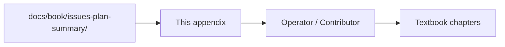

# Appendix F — Issues & Changelog Index

| Field | Value |
|-------|-------|
| **Package** | vinu-features |
| **Module** | — |
| **Status** | REVIEW |
| **Verified** | 2026-07-06 |
| **Prerequisites** | None |

## Learning objectives

- View all identified issues, implementation plans, and delivery summaries by date.
- Track the evolution of vinu-features through structured changelog entries.
- Add new issue dates using the provided template.

## 1. Problem this module solves

Issues, plans, and summaries are stored as date-prefixed markdown files in `docs/book/issues-plan-summary/`. This appendix indexes them chronologically so operators and contributors can see what was identified, planned, and delivered on each date.

## 2. Position in pipeline



| Step | Input | Output |
|------|-------|--------|
| Read this appendix | search by date | Link to issue/plan/summary files |

## 3. Changelog

### 2026-07-06 — Dashboard Phase 1

**Issue:** [`20260706-issue.md`](../issues-plan-summary/20260706-issue.md)
**Plan:** [`20260706-plan.md`](../issues-plan-summary/20260706-plan.md)
**Summary:** [`20260706-summary.md`](../issues-plan-summary/20260706-summary.md)

| Scope | Files changed | Tests |
|-------|---------------|-------|
| Dashboard health fields (`db_size_bytes`, `total_request_count`) | `sqlite_backend.py`, `service.py` | 35/35 pass |
| 8 new Dashboard sections (stat cards, top symbols, presets, activity trend, failures) | `Dashboard.jsx` | Frontend build passes |

**Related chapters:** [ch13-web-ui.md](../part-4-operations/ch13-web-ui.md)

### 2026-07-03 — Code Audit & 37 Fixes

**Issue:** [`20260703-issue.md`](../issues-plan-summary/20260703-issue.md)
**Plan:** [`20260703-plan.md`](../issues-plan-summary/20260703-plan.md)
**Summary:** [`20260703-summary.md`](../issues-plan-summary/20260703-summary.md)

| Scope | Issues | Tests |
|-------|--------|-------|
| Storage concurrency & safety | #1, #2, #9, #31 | 35/35 pass |
| Type safety & silent bugs | #5, #24, #27 | 35/35 pass |
| Performance (rolling, alpha, lazy-load) | #3, #6, #7, #8, #9, #10, #11, #18, #35 | 35/35 pass |
| Design & maintainability | #4, #14, #16, #17, #19, #20, #21, #23, #25, #26, #27 | 35/35 pass |
| Worker & runner fixes | #1, #32, #37 | 35/35 pass |
| Configuration & misc | #34, #36, #12 | 35/35 pass |

**Related chapters:** [ch06](../part-2-engine/ch06-worker-and-oom-safe-load.md), [ch08](../part-3-data/ch08-sqlite-registry.md), [ch11](../part-4-operations/ch11-cli-reference.md), [ch12](../part-4-operations/ch12-config-env.md)

## 4. Template for new entries

When adding a new date entry, create three files in `issues-plan-summary/`:

```
YYYYMMDD-issue.md     — What was found (symptoms, root cause, files affected)
YYYYMMDD-plan.md      — How it will be fixed (phases, files, code snippets)
YYYYMMDD-summary.md   — What was delivered (scope, verification, test results)
```

Then add a row to the changelog table above. All three files follow the same section structure as the existing 20260703 entries.

## 5. Related chapters

- [Appendix D — Roadmap & Gaps](apx-d-roadmap-gaps.md)
- [INDEX.md](../INDEX.md)
