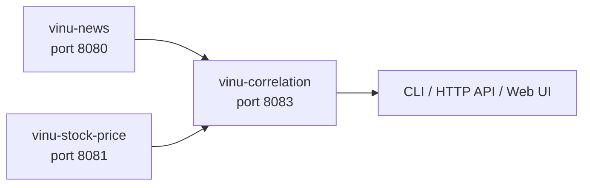
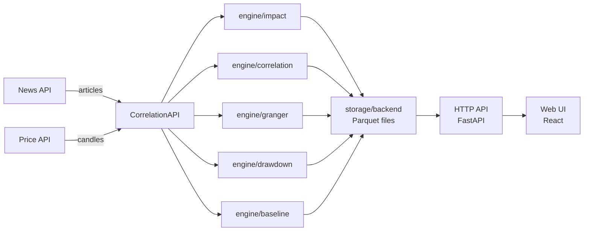

# Vinu Correlation — System Architecture

## Position in the stack

vinu-correlation is the **statistical bridge** between vinu-news and vinu-stock-price. It consumes output from both systems and produces mathematical evidence of news impact on price movements.

## Parts overview

| Part | Sections | What it covers |
|------|----------|----------------|
| **0 — Getting started** | ch00–ch02 | Install, glossary, reading paths |
| **1 — Data sources** | ch03–ch06 | News client, price client, net layer |
| **2 — Engine** | ch07–ch14 | Impact, correlation, lag, granger, event study, drawdown, baseline, market hours |
| **3 — Storage** | ch15–ch18 | Parquet layout, arrow schemas, read/write, compaction |
| **4 — Compute** | ch19–ch21 | Compute pipeline, incremental mode, continuous loop |
| **5 — Operations** | ch22–ch28 | HTTP API, CLI, web UI, Docker, config, cache, service facade |
| **6 — Appendices** | apx-a–f | Fincept mapping, troubleshooting, test map, roadmap, issues |

## Data flow

## CLI entry points

| Command | Function | Description |
|---------|----------|-------------|
| `vinu-correlation-serve` | `cli.serve_main` | Start HTTP API server |
| `vinu-correlation-compute` | `cli.compute_main` | Compute correlation data |
| `vinu-correlation-compact` | `cli.compact_main` | Compact Parquet files |
| `vinu-correlation-query` | `cli.query_main` | Query stored results |

## Env vars by layer

| Layer | Key variables | Default |
|-------|--------------|---------|
| **Source URLs** | `VINU_NEWS_API_URL`, `VINU_STOCK_API_URL` | `http://127.0.0.1:8080/1` |
| **Server** | `VINU_CORRELATION_HOST`, `VINU_CORRELATION_PORT` | 127.0.0.1:8083 |
| **Engine** | `VINU_CORRELATION_IMPACT_HIGH_THRESHOLD`, `_MEDIUM_THRESHOLD` | 2.0 / 0.5 |
| **Drawdown** | `VINU_CORRELATION_DRAWDOWN_MIN_PCT`, `_LOOKBACK_HOURS` | -3.0 / 24 |
| **Baseline** | `VINU_CORRELATION_BASELINE_WINDOW_DAYS` | 7 |
| **Cache** | `VINU_CORRELATION_CACHE_MAXSIZE`, `_TTL_SEC` | 128 / 300 |
| **Compute** | `VINU_CORRELATION_COMPUTE_POLL_INTERVAL_SEC`, `_COMPACT_THRESHOLD` | 3600 / 50 |
| **Market** | `VINU_CORRELATION_MARKET_HOURS_ONLY`, `_SESSION_BREAK_ON_CLOSE` | true / true |

## Related packages

| Package | Repo | Role |
|---------|------|------|
| vinu-news | `../../vinu-news/` | Provides news articles with sentiment, impact, tickers |
| vinu-stock-price | `../../vinu-stock-price/` | Provides price candles (1m bars) |
| vinu_infra | `../../vinu-infra/` | Shared DB utilities |
