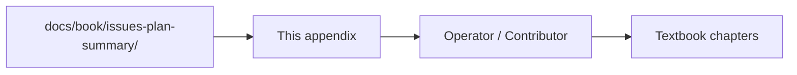

# Appendix F — Issues & Changelog Index

| Field | Value |
|-------|-------|
| **Package** | vinu-news |
| **Module** | — |
| **Status** | REVIEW |
| **Verified** | 2026-07-04 |
| **Prerequisites** | None |

## Learning objectives

- View all identified issues, implementation plans, and delivery summaries by date.
- Track the evolution of vinu-news through structured changelog entries.
- Add new issue dates using the provided template.

## 1. Problem this module solves

Issues, plans, and summaries are stored as date-prefixed markdown files in `docs/book/issues-plan-summary/`. This appendix indexes them chronologically so operators and contributors can see what was identified, planned, and delivered on each date.

## 2. Position in pipeline



| Step | Input | Output |
|------|-------|--------|
| Identify | Code review / bug report | `*-issue.md` |
| Plan | Issue analysis | `*-plan.md` |
| Deliver | Implementation | `*-summary.md` |
| Index | All three files | This appendix |

## 3. File map

| File | Responsibility |
|------|----------------|
| `docs/book/issues-plan-summary/*-issue.md` | Identified issues per date |
| `docs/book/issues-plan-summary/*-plan.md` | Implementation plan per date |
| `docs/book/issues-plan-summary/*-summary.md` | Delivery summary per date |
| `docs/book/part-5-appendices/apx-f-issues-index.md` | This appendix — date-wise index |

## 4. Data contracts

### Input

| Field | Type | Required | Example |
|-------|------|----------|---------|
| Date | YYYY-MM-DD | yes | `2026-07-03` |
| Issue file | path | yes | `20260703-issue.md` |
| Plan file | path | yes | `20260703-plan.md` |
| Summary file | path | yes | `20260703-summary.md` |

### Output

| Field | Type | Example |
|-------|------|---------|
| Date group | heading | `## 2026-07-03` |
| File links | table row | `[20260703-issue.md](../issues-plan-summary/20260703-issue.md)` |
| Changes delivered | bullet list | `- Configurable enrichment stages` |

## 5. Logic (step by step)

1. When new issues are identified, create `YYYYMMDD-issue.md`, `YYYYMMDD-plan.md`, `YYYYMMDD-summary.md` in `docs/book/issues-plan-summary/`.
2. Copy the template block below and append it to this appendix in chronological order.
3. Update `docs/INDEX.md` Part 5 catalog if needed.

---

## Issue entries

### 2026-07-03

| Type | File | Description |
|------|------|-------------|
| Issue | [20260703-issue.md](../issues-plan-summary/20260703-issue.md) | 9 identified issues (overkill, gaps, minor) |
| Plan | [20260703-plan.md](../issues-plan-summary/20260703-plan.md) | Priority-based implementation order (P0–P3) |
| Summary | [20260703-summary.md](../issues-plan-summary/20260703-summary.md) | 8/8 tasks completed, 55/55 tests passing |

#### Changes delivered

- **Configurable enrichment stages:** Per-stage toggles in `analysis.yaml` with `EnrichmentSettings` dataclass; disabled stages return sensible defaults
- **Rate-limited auto-analysis worker:** Fixed `ThreadPoolExecutor` with `queue.Queue(maxsize=1000)` for backpressure; graceful shutdown; runtime mode switch via `PATCH /settings`
- **Clean ticker extraction:** Removed stale `DEFAULT_MAJOR_TICKERS`; alias resolution uses watchlist + already-extracted tickers
- **Single source of truth for settings:** `.env` seeds first-run defaults; DB is authoritative after first init; `settings_env_defaults()`; `patch_settings()` handles auto↔manual switch
- **Configurable parallelism:** `VINU_NEWS_MAX_WORKERS` env var (default 8); `get_max_workers()` function
- **Consolidated ingestion methods:** Single `run_ingestion_cycle(source="rss"/"ticker_news")`; `run_ticker_news_ingest()` kept as thin backward-compatible wrapper
- **Always-run post-process:** `skip_post_process` flag fully removed; NER, cosine dedup, and lead selection always execute
- **Hash collision guard:** Article ID now hashes `link:headline:sort_ts` instead of plain URL

---

## Template for future entries

Copy this block when adding a new issue date:

```markdown
### YYYY-MM-DD

| Type | File | Description |
|------|------|-------------|
| Issue | [YYYYMMDD-issue.md](../issues-plan-summary/YYYYMMDD-issue.md) | ... |
| Plan | [YYYYMMDD-plan.md](../issues-plan-summary/YYYYMMDD-plan.md) | ... |
| Summary | [YYYYMMDD-summary.md](../issues-plan-summary/YYYYMMDD-summary.md) | ... |

#### Changes delivered
- ...
```

## 6. Configuration

| Key | YAML/env | Default | Effect |
|-----|----------|---------|--------|
| — | — | — | Reference appendix only |

## 7. Worked examples

### Example A — add a new issue date

1. Create `20260801-issue.md`, `20260801-plan.md`, `20260801-summary.md` in `docs/book/issues-plan-summary/`.
2. Copy the template block above and paste it before the template section.
3. Replace `YYYY-MM-DD` with `2026-08-01` and fill in descriptions.

## 8. API / CLI (if applicable)

| Method | Path / Command | Params | Response |
|--------|----------------|--------|----------|
| — | — | — | Documentation only |

## 9. SQL / queries (if applicable)

None — this index references markdown files, not database tables.

## 10. Tests

| Test file | Asserts |
|-----------|---------|
| — | No automated tests for issue tracking |

## 11. Troubleshooting

| Symptom | Likely cause | Action |
|---------|--------------|--------|
| Missing issue entry | Not yet indexed | Add entry using template |
| Stale description | Issue updated but appendix not | Update the changes list |
| Wrong file link | Path changed | Use relative path from `apx-f-issues-index.md` |

## 12. Fincept / reference repo mapping

| Reference | This appendix |
|-----------|---------------|
| `news_componete_still_missing.md` | Legacy gap tracking superseded by issue entries |
| `enhancement-doc1.md` | Cross-service task specs referenced in issue plans |

## 13. Related chapters

- [docs/INDEX.md](../../INDEX.md) — master catalog
- [Appendix D — Roadmap & Gaps](apx-d-roadmap-gaps.md)
- [Appendix E — Yet to Build](apx-e-yet-to-build.md)
- [Chapter 00 — Preface](../part-0-getting-started/ch00-preface.md)
