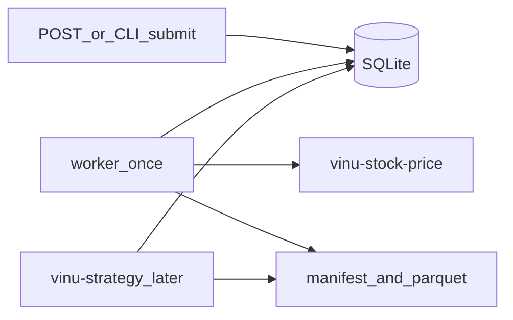

# vinu-features — Architecture Book

| Field | Value |
|-------|-------|
| **Package** | vinu-features |
| **Version** | 0.1.0 |
| **Status** | v1 |

## Parts

| Part | Chapters | Topic |
|------|----------|-------|
| 0 | ch00–ch02 | Getting started, concepts |
| 1 | ch03–ch04 | Preset blueprints, indicator catalog |
| 2 | ch05–ch07 | Request lifecycle, worker, artifacts |
| 3 | ch08–ch09 | SQLite registry, run folders |
| 4 | ch10–ch12 | HTTP API, CLI, config |
| 5 | apx-a–apx-b | Fincept mapping, test map |

## Pipeline

## Related packages

- [vinu-stock-price](../../vinu-stock-price/README.md) — OHLCV source
- [understanding-1](../../vinu_advanced_understanding/understanding-1.md) — architecture map
