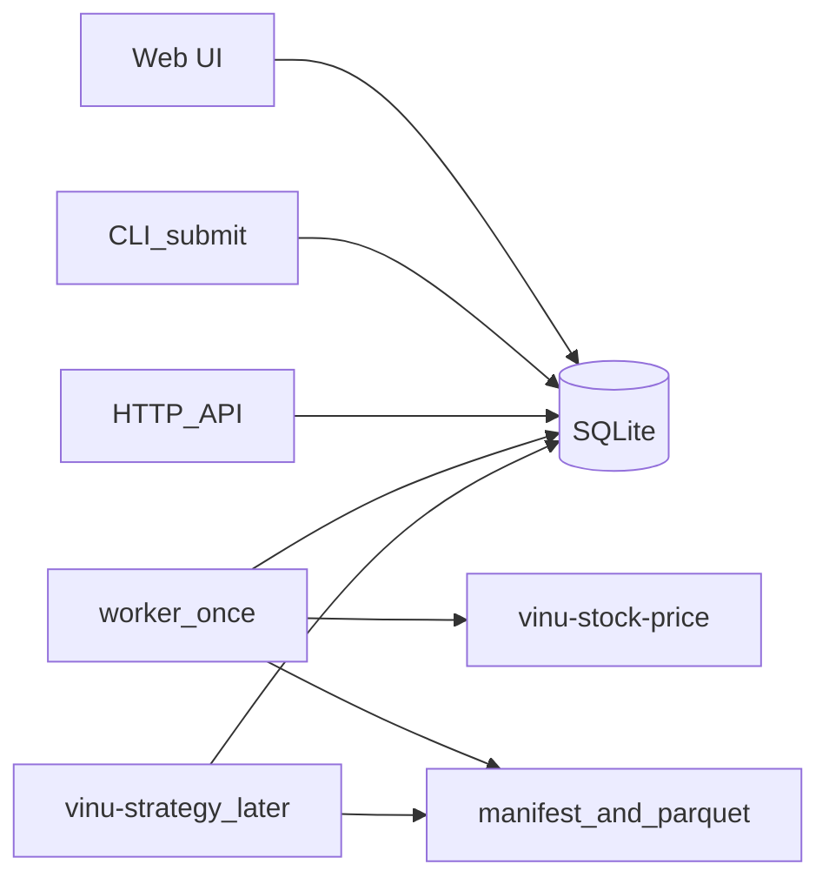

# vinu-features — Architecture Book

| Field | Value |
|-------|-------|
| **Package** | vinu-features |
| **Version** | 0.1.0 |
| **Status** | v1 |

## Parts

| Part | Chapters | Topic |
|------|----------|-------|
| 0 | ch00–ch02 | Getting started, concepts |
| 1 | ch03–ch07 | Preset blueprints, indicators, alpha factors, ML models |
| 2 | ch05–ch07 | Request lifecycle, worker, parallel processing, artifacts |
| 3 | ch08–ch09 | Thread-safe SQLite, run folders |
| 4 | ch10–ch13 | HTTP API, CLI, config, web UI |
| 5 | apx-a–apx-f | Fincept mapping, test map, out-of-scope, roadmap, yet-to-build, issues |

## Pipeline

```mermaid
flowchart LR
  WebUI[Web UI] --> Registry[(SQLite)]
  CLI[CLI_submit] --> Registry
  API[HTTP_API] --> Registry
  Worker[worker_once] --> Registry
  Worker --> Stock[vinu-stock-price]
  Worker --> Parquet[manifest_and_parquet]
  Strategy[vinu-strategy_later] --> Registry
  Strategy --> Parquet
```

## Related packages

- [vinu-stock-price](../../vinu-stock-price/README.md) — OHLCV source
- [understanding-1](../../personal-important/understanding-1.md) — architecture map
