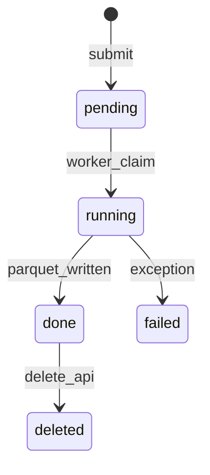

# Chapter 5 — Request Lifecycle

| Field | Value |
|-------|-------|
| **Package** | vinu-features |
| **Module** | `vinu_features/service.py` |
| **Status** | v1 |
| **Prerequisites** | ch03 |

## Flow

## Dedup

Identical symbols, dates, interval, and features return an existing `done` row instead of creating duplicate work.
