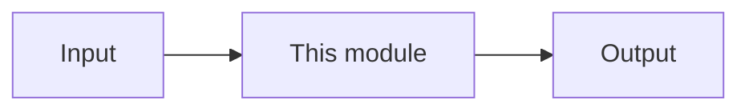

I'm in **Ask mode**, so I can't write files to the repo. Below is a full **agent implementation plan** you can save as:

`vinu-news-stock-price-enhancement/textbook-docs-plan.md`

Or switch to **Agent mode** and ask me to create it.

---

# Textbook Documentation Plan — vinu-news & vinu-stock-price

**Audience:** AI coding agents implementing documentation  
**Goal:** Replace scattered guides with a **chapter-based textbook** per package: master index, granular tables, worked examples, code-path links  
**Scope:** Documentation only — no feature code unless a chapter documents missing enhancement tasks  
**Do not:** Delete old docs until redirects exist; do not invent schema columns not in `schema.sql`

---

## Agent instructions (read first)

1. Implement **one chapter per PR/session** unless doing scaffold-only (INDEX + template).
2. **Source of truth for facts:** code + `schema.sql` + existing `complete_guide_*.md` — read before writing.
3. Every chapter MUST use the [Chapter template](#chapter-template).
4. Every chapter MUST include at least **one runnable example** (curl, SQL, or Python).
5. Mark chapter status: `DRAFT` | `REVIEW` | `COMPLETE` in `INDEX.md`.
6. After each chapter: update `docs/README.md` link; add “Related chapters” backlinks.
7. Run examples against local Docker or pytest fixtures; note `verified: YYYY-MM-DD` on examples.
8. **vinu-news Volume 1** and **vinu-stock-price Volume 2** share the same part/chapter numbering style.

---

## Deliverables overview

| Deliverable | Path |
|-------------|------|
| Master index (news) | `vinu-news/docs/INDEX.md` |
| Master index (stock) | `vinu-stock-price/docs/INDEX.md` |
| Chapter files | `{package}/docs/book/part-*/ch*.md` |
| Chapter template | `vinu-news/docs/book/_TEMPLATE.md` (copy to stock-price) |
| Legacy redirects | Keep `complete_guide_*.md` with banner → INDEX |

---

## Shared chapter template

Save as `vinu-news/docs/book/_TEMPLATE.md` (duplicate for stock-price).

```markdown
# Chapter NN — {Title}

| Field | Value |
|-------|-------|
| **Package** | vinu-news \| vinu-stock-price |
| **Module** | `vinu_news/...` \| `vinu_stock/...` |
| **Status** | DRAFT \| REVIEW \| COMPLETE |
| **Verified** | YYYY-MM-DD |
| **Prerequisites** | Ch XX, YY |

## Learning objectives
- …

## 1. Problem this module solves

## 2. Position in pipeline


| Step | Input | Output |
|------|-------|--------|

## 3. File map
| File | Responsibility |

## 4. Data contracts
### Input
| Field | Type | Required | Example |
### Output
| Field | Type | Example |

## 5. Logic (step by step)

## 6. Configuration
| Key | YAML/env | Default | Effect |

## 7. Worked examples
### Example A — happy path
### Example B — edge case

## 8. API / CLI (if applicable)
| Method | Path / Command | Params | Response |

## 9. SQL / queries (if applicable)

## 10. Tests
| Test file | Asserts |

## 11. Troubleshooting

## 12. Fincept / reference repo mapping

## 13. Related chapters
```

---

# VOLUME 1 — vinu-news

## Current docs to migrate

| Source | Action |
|--------|--------|
| `docs/complete_guide_news_analysis.md` | Split into ch03–ch12, ch18–ch20, apx-* |
| `docs/news_derived_tables.md` | Split into ch14–ch17 |
| `docs/news_componete_still_missing.md` | → `apx-d-roadmap.md` + status in INDEX |
| `README.md` | Short quick start → link INDEX |
| `enhancement-doc1.md` TASK-N* | New/updated chapters when features exist |

## Folder tree

```
vinu-news/docs/
├── INDEX.md
├── README.md                 → "Start at INDEX.md"
├── book/
│   ├── _TEMPLATE.md
│   ├── part-0-getting-started/
│   ├── part-1-ingestion/
│   ├── part-2-analysis/
│   ├── part-3-data/
│   ├── part-4-operations/
│   └── part-5-appendices/
├── complete_guide_news_analysis.md   → legacy banner + TOC links
└── news_derived_tables.md            → legacy banner + TOC links
```

## Chapter catalog (implement in order)

### Part 0 — Getting started

| ID | File | Title | Source / code | Priority |
|----|------|-------|---------------|----------|
| DOC-N00 | `ch00-preface.md` | Preface & how to read | New | P1 |
| DOC-N01 | `ch01-install-first-run.md` | Install, Docker, first ingest | README | P1 |
| DOC-N02 | `ch02-concepts-glossary.md` | Lead, thread, tier, FTS, … | complete_guide §1 | P1 |

### Part 1 — Ingestion (`vinu_news/rss/`, `providers/`)

| ID | File | Title | Code paths | Priority |
|----|------|-------|------------|----------|
| DOC-N03 | `ch03-rss-architecture.md` | RSS package overview | `rss/` | P1 |
| DOC-N04 | `ch04-feeds-yaml.md` | `feeds.yaml` full table | `rss/config/feeds.yaml` | P1 |
| DOC-N05 | `ch05-fetch-parse.md` | HTTP fetch + RSS parse | `fetch/`, `parse/` | P1 |
| DOC-N06 | `ch06-ingestion-orchestration.md` | Poll → pipeline | `orchestration/` | P1 |
| DOC-N07 | `ch07-feed-health.md` | Feed health table | `rss/storage/feed_health.py` | P2 |
| DOC-N08 | `ch08-ticker-news-providers.md` | Ticker news providers | `providers/`, `ticker_news.yaml` | P2 |
| DOC-N09 | `ch09-collection-filter.md` | Ticker vs all mode | `collection/` | P2 |

### Part 2 — Analysis (`vinu_news/analysis/`)

| ID | File | Title | Code paths | Priority |
|----|------|-------|------------|----------|
| DOC-N10 | `ch10-pipeline-overview.md` | `process_batch()` flow | `pipeline.py` | P1 |
| DOC-N11 | `ch11-pre-enrichment.md` | Validate + URL dedup | `pre_enrichment/` | P1 |
| DOC-N12 | `ch12-enrichment-overview.md` | 9 stages overview | `enrichment/enrich.py` | P1 |
| DOC-N12a | `ch12a-priority-sentiment-impact.md` | Priority, sentiment, impact | `priority.py`, `sentiment.py`, `impact.py` | P1 |
| DOC-N12b | `ch12b-category-tickers-threat.md` | Category, tickers, threat | `category.py`, `ticker_extractor.py`, `threat.py` | P1 |
| DOC-N12c | `ch12c-credibility-language.md` | Credibility, language, summary | `source_credibility.py`, `language.py`, `summary_cleaner.py` | P2 |
| DOC-N13 | `ch13-post-enrichment.md` | NER, synonyms, dedup, lead | `post_enrichment/` | P1 |
| DOC-N14 | `ch14-story-threads-persist.md` | Threading + persist | `storage/persist.py`, `threading/` | P1 |
| DOC-N15 | `ch15-llm-layer.md` | LLM analyze, digest, cache | `analysis/llm/` | P2 |
| DOC-N16 | `ch16-price-reaction.md` | News ↔ stock price join | `post_enrichment/price_reaction.py`, `integrations/` | P2 |

### Part 3 — Data

| ID | File | Title | Source | Priority |
|----|------|-------|--------|----------|
| DOC-N17 | `ch17-schema-catalog.md` | All tables index + ER diagram | `schema.sql` | P1 |
| DOC-N18 | `ch18-table-articles-threads.md` | `articles`, `story_threads`, junction | `news_derived_tables` §4 | P1 |
| DOC-N19 | `ch19-table-analytics-fts.md` | Snapshots, stats, FTS | `news_derived_tables` §4,7 | P1 |
| DOC-N20 | `ch20-sql-cookbook.md` | Research SQL recipes | `news_derived_tables` §6–7 | P1 |
| DOC-N21 | `ch21-python-repository-api.md` | `NewsRepository` | `storage/repository.py` | P1 |

### Part 4 — Operations

| ID | File | Title | Code paths | Priority |
|----|------|-------|------------|----------|
| DOC-N22 | `ch22-http-api.md` | Full route reference | `server/` | P1 |
| DOC-N23 | `ch23-cli-docker.md` | CLI + compose | `cli.py`, `docker-compose.yml` | P1 |
| DOC-N24 | `ch24-config-env.md` | Env vars + `analysis.yaml` | `config.py`, `analysis/config/` | P1 |
| DOC-N25 | `ch25-watchlist-settings.md` | Watchlist + shared sync | `watchlist/`, `settings/` | P2 |
| DOC-N26 | `ch26-service-facade.md` | `NewsService` | `service.py` | P2 |

### Part 5 — Appendices

| ID | File | Title | Priority |
|----|------|-------|----------|
| DOC-N-A1 | `apx-a-fincept-mapping.md` | Fincept step → Vinu module | P2 |
| DOC-N-A2 | `apx-b-troubleshooting.md` | complete_guide §14 | P2 |
| DOC-N-A3 | `apx-c-test-map.md` | Test file → module map | P2 |
| DOC-N-A4 | `apx-d-roadmap-gaps.md` | still_missing + enhancement-doc1 | P2 |

## DOC-N INDEX.md structure

Must contain:
- Title: **Vinu News — Textbook (Volume 1)**
- Full chapter table: Ch | Title | Status | Module | Est. time
- Reading paths: **Operator** | **Researcher** | **Contributor**
- Link to Volume 2 (stock-price INDEX)
- Enhancement task → chapter map (TASK-N01 → ch15, etc.)

---

# VOLUME 2 — vinu-stock-price

## Current docs to migrate

| Source | Action |
|--------|--------|
| `docs/complete_guide_stock_price.md` | Split into all parts below |
| `how-to/README.md` | Merge examples into ch01, ch23 |
| `README.md` | Quick start → INDEX |
| `enhancement-doc1.md` TASK-S* | ch11, ch12, ch13, etc. |

## Folder tree

```
vinu-stock-price/docs/
├── INDEX.md
├── README.md
├── book/
│   ├── _TEMPLATE.md          ← copy from vinu-news
│   ├── part-0-getting-started/
│   ├── part-1-providers/
│   ├── part-2-storage/
│   ├── part-3-ingest/
│   ├── part-4-query/
│   ├── part-5-operations/
│   └── part-6-appendices/
└── complete_guide_stock_price.md   → legacy banner
```

## Chapter catalog

### Part 0 — Getting started

| ID | File | Title | Priority |
|----|------|-------|----------|
| DOC-S00 | `ch00-preface.md` | Preface & relation to vinu-news | P1 |
| DOC-S01 | `ch01-install-first-run.md` | Install, backfill, first query | P1 |
| DOC-S02 | `ch02-concepts-glossary.md` | Bar, archive, live, catalog, interval | P1 |

### Part 1 — Providers (`vinu_stock/providers/`)

| ID | File | Title | Code | Priority |
|----|------|-------|------|----------|
| DOC-S03 | `ch03-provider-architecture.md` | Registry + roles | `registry.py` | P1 |
| DOC-S04 | `ch04-providers-yaml.md` | Full `providers.yaml` table | `providers.yaml` | P1 |
| DOC-S05 | `ch05-polygon-provider.md` | Polygon adapter | `polygon.py` | P2 |
| DOC-S06 | `ch06-alpaca-provider.md` | Alpaca adapter | `alpaca.py` | P2 |
| DOC-S07 | `ch07-yahoo-fmp-fallback.md` | Yahoo + FMP if present | `yahoo.py`, `fmp.py` | P2 |

### Part 2 — Storage (`storage/`, `catalog/`)

| ID | File | Title | Code | Priority |
|----|------|-------|------|----------|
| DOC-S08 | `ch08-data-layout.md` | Parquet tree + meta.db | `storage/paths.py` | P1 |
| DOC-S09 | `ch09-bar-record-model.md` | `BarRecord` fields + dedup key | `models.py` | P1 |
| DOC-S10 | `ch10-catalog-schema.md` | `symbol_catalog`, jobs, ingest_log | `catalog/schema.sql` | P1 |
| DOC-S11 | `ch11-parquet-io.md` | Read/write/dedupe | `parquet.py` | P1 |
| DOC-S12 | `ch12-adjusted-close.md` | Adj factor / splits | enhancement TASK-S02 | P2 |

### Part 3 — Ingest (`backfill/`, `live/`)

| ID | File | Title | Code | Priority |
|----|------|-------|------|----------|
| DOC-S13 | `ch13-backfill-flow.md` | Year jobs orchestrator | `backfill/` | P1 |
| DOC-S14 | `ch14-live-ingest.md` | Live cycle, closed bars | `live/ingest_cycle.py` | P1 |
| DOC-S15 | `ch15-market-calendar.md` | NYSE hours skip | TASK-S04 | P2 |
| DOC-S16 | `ch16-retry-gap-validation.md` | Retry + gap_count | TASK-S03 | P2 |

### Part 4 — Query (`query/`)

| ID | File | Title | Code | Priority |
|----|------|-------|------|----------|
| DOC-S17 | `ch17-query-engine.md` | DuckDB over parquet | `engine.py` | P1 |
| DOC-S18 | `ch18-aggregation.md` | 1m → 5m/1h/1d | `aggregate.py` | P1 |
| DOC-S19 | `ch19-indicators.md` | RSI, MACD, SMA on read | TASK-S01 | P2 |
| DOC-S20 | `ch20-sql-cookbook.md` | DuckDB research recipes | New | P2 |

### Part 5 — Operations

| ID | File | Title | Code | Priority |
|----|------|-------|------|----------|
| DOC-S21 | `ch21-http-api.md` | Routes + `/ui` | `server/` | P1 |
| DOC-S22 | `ch22-cli-reference.md` | All `vinu-stock-*` commands | `cli.py` | P1 |
| DOC-S23 | `ch23-docker.md` | Compose volumes | `docker-compose.yml` | P1 |
| DOC-S24 | `ch24-service-facade.md` | `StockService` | `service.py` | P2 |
| DOC-S25 | `ch25-watchlist-shared.md` | Shared watchlist with news | `watchlist/shared.py` | P2 |
| DOC-S26 | `ch26-config-env.md` | `VINU_STOCK_*` vars | `config.py` | P1 |

### Part 6 — Appendices

| ID | File | Title | Priority |
|----|------|-------|----------|
| DOC-S-A1 | `apx-a-out-of-scope.md` | v1 exclusions | P2 |
| DOC-S-A2 | `apx-b-troubleshooting.md` | Common failures | P2 |
| DOC-S-A3 | `apx-c-test-map.md` | tests/ → module | P2 |
| DOC-S-A4 | `apx-d-roadmap.md` | enhancement TASK-S* | P2 |

---

# Cross-volume integration chapters

| Chapter | Package | Content |
|---------|---------|---------|
| DOC-N16 | vinu-news | `integrations/stock_price.py`, `VINU_STOCK_API_URL` |
| DOC-S25 | vinu-stock-price | Shared watchlist, consumer of news |
| Both INDEX | — | “Sister volume” link at top |

---

# Implementation phases (agent task list)

## Phase DOC-1 — Scaffold (do first)

| Task | Action | Done when |
|------|--------|-----------|
| DOC-1a | Create `book/` folders + `_TEMPLATE.md` in both packages | Folders exist |
| DOC-1b | Create `INDEX.md` in both packages with full chapter tables, all status `DRAFT` | INDEX complete |
| DOC-1c | Add legacy banner to `complete_guide_*.md` pointing to INDEX | Banner + link |
| DOC-1d | Update both `docs/README.md` | Points to INDEX |

## Phase DOC-2 — P1 chapters (core textbook)

**vinu-news (12 chapters):** DOC-N01, N02, N03, N04, N05, N06, N10, N11, N12, N13, N14, N17, N18, N20, N22, N23, N24  
**vinu-stock-price (14 chapters):** DOC-S01–S04, S08–S11, S13, S14, S17, S18, S21–S23, S26  

## Phase DOC-3 — P2 granular + enhancements

Remaining chapters; mark COMPLETE only when code + examples verified.

## Phase DOC-4 — Audit

| Check | Rule |
|-------|------|
| Module coverage | Every `vinu_news/**/*.py` and `vinu_stock/**/*.py` (non-`__pycache__`) linked from ≥1 chapter |
| Schema accuracy | Column tables match `schema.sql` |
| API accuracy | Route table matches `routes_*.py` |
| No orphan examples | All curl/SQL/Python tested |
| Enhancement sync | TASK-* done in code → chapter status COMPLETE |

---

# Agent prompt template (per chapter)

```
Implement {DOC-ID}: {chapter title}

Read first:
- vinu-news-stock-price-enhancement/textbook-docs-plan.md
- {package}/docs/book/_TEMPLATE.md
- Source modules: {list paths}
- Legacy: {complete_guide section}

Write:
- {package}/docs/book/{part}/{filename}

Rules:
- Use chapter template exactly
- Include ≥2 tables + ≥2 worked examples
- Link prerequisites and related chapters
- Set status REVIEW in INDEX.md

Definition of done:
- Chapter follows template
- Examples marked verified: {date}
- INDEX row updated
- docs/README.md unchanged unless new part added
```

---

# Acceptance criteria (whole project)

Documentation textbook is **COMPLETE** when:

1. Both `INDEX.md` files list all chapters with ≥90% status `COMPLETE`
2. Legacy guides have redirect banners only (or thin TOC pointing to chapters)
3. Operator path readable in <30 min (ch01 + ch22/ch21 API)
4. Contributor can find any module from INDEX in ≤2 clicks
5. Cross-volume integration documented (watchlist + price reaction)
6. `enhancement-doc1.md` tasks map 1:1 to chapters (N/S/X series)

---

# Suggested agent execution order

```
DOC-1 scaffold both packages
  → DOC-N01, DOC-S01 (install chapters)
  → DOC-N10, DOC-S17 (pipeline/query hubs)
  → DOC-N12a/b, DOC-N13, DOC-N14 (news analysis core)
  → DOC-S08–S11, DOC-S13–S14 (stock storage + ingest)
  → DOC-N17–N21, DOC-S21–S23 (data + API)
  → remaining P2 chapters
  → DOC-4 audit
```

---
