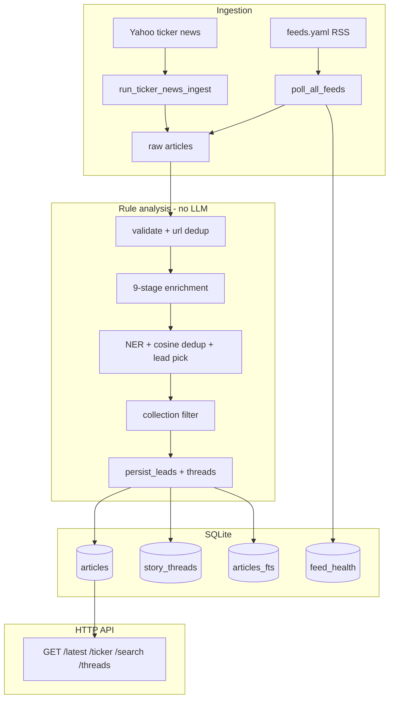
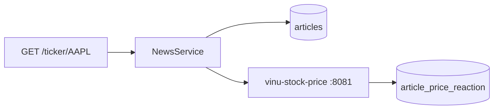
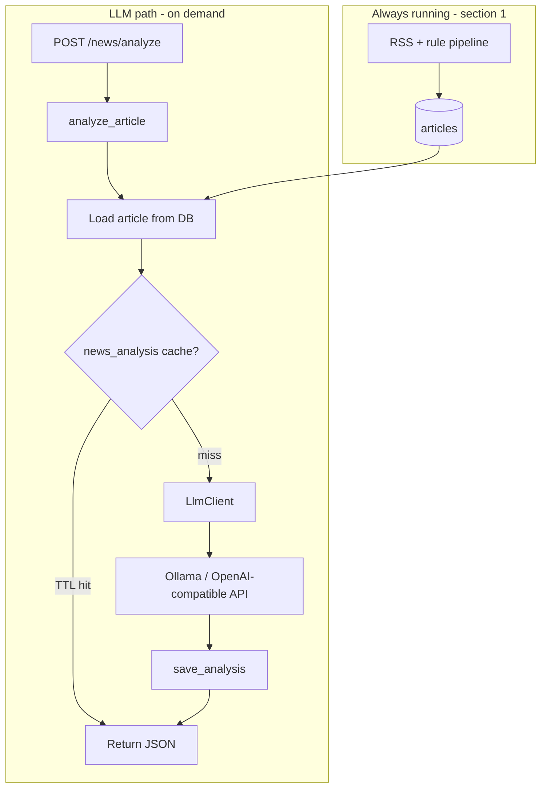
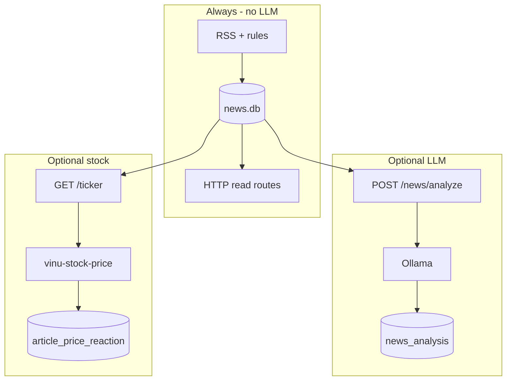

# System Architecture — LLM vs Rules

| Field | Value |
|-------|-------|
| **Package** | vinu-news |
| **Module** | — (whole system) |
| **Status** | REVIEW |
| **Verified** | 2026-07-01 |
| **Prerequisites** | None |

**Single-page reference:** with LLM, without LLM, dependencies, and links to detail chapters.

| | |
|---|---|
| **Textbook index** | [INDEX.md](../INDEX.md) |
| **Prompts** | [ch15b — LLM prompts](part-2-analysis/ch15b-llm-prompts.md) |
| **Yet to build** | [Appendix E](part-5-appendices/apx-e-yet-to-build.md) |
| **Stock prices** | [vinu-stock-price INDEX](../../../vinu-stock-price/docs/INDEX.md) |

---

## Quick dependency table

| Capability | LLM required? | Stock API required? | Detail chapter |
|------------|---------------|---------------------|----------------|
| RSS ingest + rule enrichment | No | No | [ch10](part-2-analysis/ch10-pipeline-overview.md) |
| FTS search, threads | No | No | [ch19](part-3-data/ch19-table-analytics-fts.md) |
| `POST /news/analyze` | **Yes** | No | [ch15](part-2-analysis/ch15-llm-layer.md) |
| Price reaction on `/ticker/{sym}` | No | **Yes** | [ch16](part-2-analysis/ch16-price-reaction.md) |
| Shared watchlist sync | No | No (file only) | [ch25](part-4-operations/ch25-watchlist-settings.md) |

**Rule of thumb:** Ingest always uses **rules only**. LLM is **on-demand**. Price reaction uses **vinu-stock-price**, not LLM.

---

## 1. Without LLM (default — always on)

No Ollama, no OpenAI key, no `VINU_LLM_*` required. Every poll uses **deterministic rule enrichment**.

| Component | Depends on | Chapter |
|-----------|------------|---------|
| RSS ingest | Internet, `feeds.yaml`, SQLite | [ch03](part-1-ingestion/ch03-rss-architecture.md)–[ch06](part-1-ingestion/ch06-ingestion-orchestration.md) |
| Rule enrichment | Python + `analysis.yaml` | [ch10](part-2-analysis/ch10-pipeline-overview.md)–[ch14](part-2-analysis/ch14-story-threads-persist.md) |
| Persist / threads | `schema.sql` | [ch14](part-2-analysis/ch14-story-threads-persist.md), [ch17](part-3-data/ch17-schema-catalog.md) |
| HTTP API | `NewsService` + DB | [ch22](part-4-operations/ch22-http-api.md), [ch26](part-4-operations/ch26-service-facade.md) |
| Ticker news | Yahoo provider | [ch08](part-1-ingestion/ch08-ticker-news-providers.md) |

**Works when LLM is down:** yes — ingest, search, threads, rule sentiment all continue.

**Code entry:** `process_batch()` in `vinu_news/analysis/pipeline.py` — no LLM imports.

---

## 2. Price reaction (optional — not LLM)

Adds `price_change_1h` / `price_change_1d` on ticker queries via **candles API**.

| Dependency | Env | If missing |
|------------|-----|------------|
| Stock API | `VINU_STOCK_API_URL` | News works; price fields empty |

Detail: [ch16 — Price Reaction](part-2-analysis/ch16-price-reaction.md).

---

## 3. With LLM (optional add-on)

LLM runs **only on demand** via `POST /news/analyze`. Ingest **never** calls the LLM.

| Dependency | Env | If missing |
|------------|-----|------------|
| LLM server | `VINU_LLM_BASE_URL`, `VINU_LLM_MODEL` | `/news/analyze` → 503; ingest OK |
| API key | `VINU_LLM_API_KEY` | Optional for local Ollama |
| Article in DB | prior ingest | 404 |
| Prompts | `analysis/llm/prompts.py` | [ch15b](part-2-analysis/ch15b-llm-prompts.md) |

**Future:** TASK-N05 digest — [Appendix E](part-5-appendices/apx-e-yet-to-build.md).

Detail: [ch15 — LLM Layer](part-2-analysis/ch15-llm-layer.md).

---

## 4. Combined view

---

## 5. Environment variables by layer

| Layer | Variables |
|-------|-----------|
| Base | `VINU_NEWS_DB_PATH`, `VINU_NEWS_MODE`, watchlist settings |
| LLM | `VINU_LLM_BASE_URL`, `VINU_LLM_MODEL`, `VINU_LLM_API_KEY`, `VINU_LLM_TTL_SEC` |
| Stock | `VINU_STOCK_API_URL` |
| Shared watchlist | `VINU_SHARED_WATCHLIST_PATH` |

Full list: [ch24 — Config & Env](part-4-operations/ch24-config-env.md).

---

## 6. Related chapters

| Topic | Chapter |
|-------|---------|
| Preface & reading paths | [ch00](part-0-getting-started/ch00-preface.md) |
| Rule pipeline detail | [ch10](part-2-analysis/ch10-pipeline-overview.md) |
| LLM API & cache | [ch15](part-2-analysis/ch15-llm-layer.md) |
| Prompt text | [ch15b](part-2-analysis/ch15b-llm-prompts.md) |
| Price reaction | [ch16](part-2-analysis/ch16-price-reaction.md) |
| Open work | [apx-e](part-5-appendices/apx-e-yet-to-build.md) |
