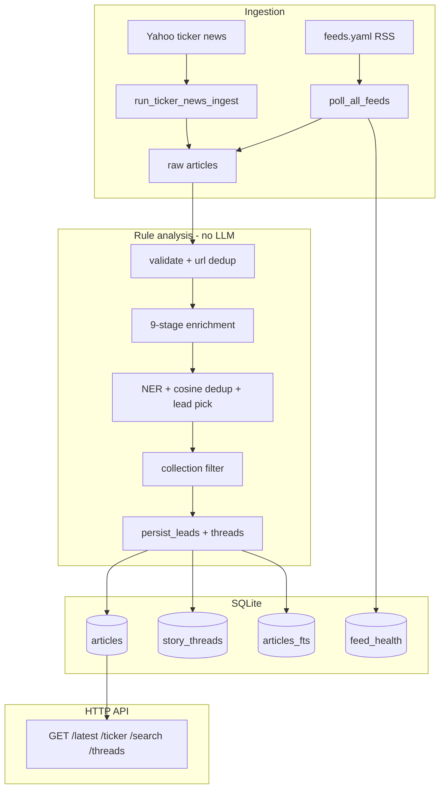
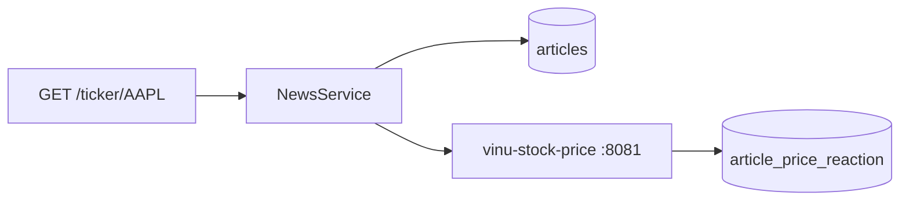
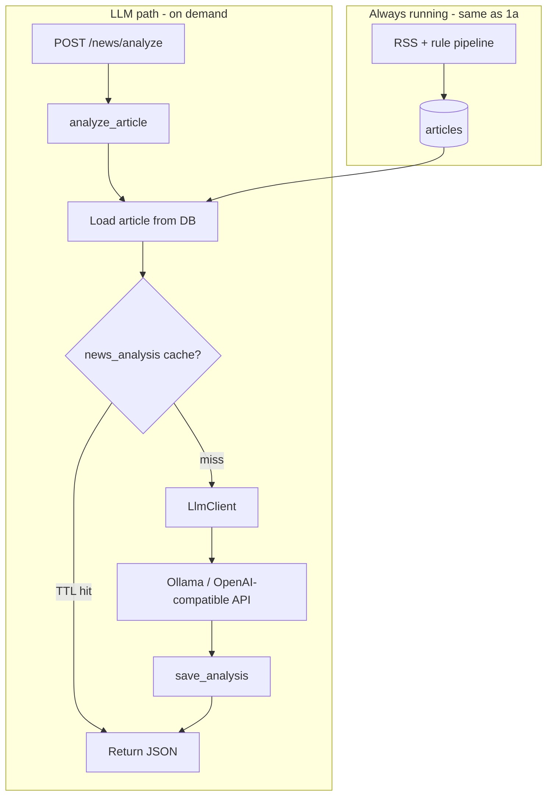
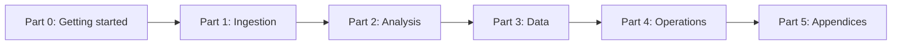

# Chapter 00 — Preface & How to Read

| Field | Value |
|-------|-------|
| **Package** | vinu-news |
| **Module** | — |
| **Status** | REVIEW |
| **Verified** | 2026-07-01 |
| **Prerequisites** | None |

## Learning objectives

- Choose a reading path (operator, researcher, or contributor) that matches your goal.
- **See the full system architecture with vs without LLM** (and where price reaction fits).
- Understand how this textbook relates to legacy guides and the sister volume on stock prices.
- Know what each part covers and when to skip ahead.

## 1. Problem this module solves

vinu-news spans RSS ingestion, rule-based enrichment, SQLite persistence, HTTP APIs, and optional LLM/price integrations. Without a structured guide, newcomers face a large monolithic codebase. This textbook splits the system into **chapter-sized modules** with consistent sections: pipeline position, data contracts, worked examples, tests, and troubleshooting.

## 1a. System architecture — without LLM (default)

This is the **always-on** path. No Ollama, no OpenAI key, no `VINU_LLM_*` required. Every poll uses **deterministic rule enrichment** only.



| Component | Depends on | Chapter |
|-----------|------------|---------|
| RSS ingest | Internet, `feeds.yaml`, SQLite | ch03–ch06 |
| Rule enrichment | Python + `analysis.yaml` only | ch10–ch14 |
| Persist / threads | `schema.sql` | ch14, ch17 |
| HTTP API | `NewsService` + DB | ch22, ch26 |
| Ticker news | Yahoo provider | ch08 |

**Works when LLM is down:** yes — ingest, search, threads, rule sentiment all continue.

## 1b. Optional layers (not LLM)

### Price reaction (vinu-stock-price)

Adds `price_change_1h` / `price_change_1d` on ticker queries by calling **candles API** — not an LLM.



| Dependency | Env | If missing |
|------------|-----|------------|
| Stock API | `VINU_STOCK_API_URL` | News works; price fields empty |

See [Chapter 16 — Price Reaction](../part-2-analysis/ch16-price-reaction.md) and **Volume 2** vinu-stock-price.

## 1c. System architecture — with LLM (optional add-on)

LLM runs **only on demand** via `POST /news/analyze`. Ingest **never** calls the LLM.



| Dependency | Env | If missing |
|------------|-----|------------|
| LLM server | `VINU_LLM_BASE_URL`, `VINU_LLM_MODEL` | `/news/analyze` → 503; ingest unaffected |
| API key | `VINU_LLM_API_KEY` | Optional for local Ollama |
| Article in DB | prior ingest | 404 |
| Prompts | `analysis/llm/prompts.py` | See [Chapter 15b](../part-2-analysis/ch15b-llm-prompts.md) |

**Future (not built):** TASK-N05 market/ticker **digest** would reuse the same LLM client — see [Appendix E](../part-5-appendices/apx-e-yet-to-build.md).

## 1d. Dependency summary

| Capability | LLM required? | Stock API required? |
|------------|---------------|---------------------|
| RSS ingest + rule enrichment | No | No |
| FTS search, threads | No | No |
| `POST /news/analyze` | **Yes** | No |
| Price reaction on `/ticker/{sym}` | No | **Yes** |
| Shared watchlist sync | No | No (file path only) |

## 2. Position in pipeline



| Step | Input | Output |
|------|-------|--------|
| Part 0 | Your role + goal | Install path or deep-dive path |
| Parts 1–2 | Source code + schema | Mental model of ingest → enrich → persist |
| Part 3 | `schema.sql` | Query patterns for research |
| Part 4 | `.env`, CLI, API | Running and operating the service |
| Part 5 | Fincept refs, tests | Cross-reference and gap tracking |

## 3. File map

| File | Responsibility |
|------|----------------|
| [docs/INDEX.md](../../INDEX.md) | Master catalog, reading paths, task map |
| `docs/book/_TEMPLATE.md` | Chapter structure all authors follow |
| `docs/book/part-*/ch*.md` | One chapter per major module |
| `docs/complete_guide_news_analysis.md` | Legacy monolith (redirect banner) |
| [vinu-stock-price/docs/INDEX.md](../../../../vinu-stock-price/docs/INDEX.md) | Sister volume (Volume 2) |

## 4. Data contracts

### Input

| Field | Type | Required | Example |
|-------|------|----------|---------|
| Reader goal | string | yes | `operator`, `researcher`, `contributor` |
| Python version | semver | for local dev | `3.11+` |
| Optional services | URLs | no | `VINU_STOCK_API_URL`, `VINU_LLM_BASE_URL` |

### Output

| Field | Type | Example |
|-------|------|---------|
| Chapter sequence | ordered list | ch01 → ch22 → ch23 |
| Verified modules | markdown | Status `REVIEW`, date `2026-07-01` |
| Cross-links | relative paths | `../part-1-ingestion/ch03-rss-architecture.md` |

## 5. Logic (step by step)

1. **Start at [INDEX.md](../../INDEX.md)** — pick a reading path below.
2. **New to the stack?** Read **§1a–§1d** above for with/without LLM dependencies before Ch 01.
3. **Operators** need ingest + API only: Ch 01 → Ch 22 → Ch 23 → Ch 24.
4. **Researchers** need SQL: Ch 01 → Ch 17 → Ch 18 → Ch 20 (add Ch 19 for FTS/analytics).
5. **Contributors** trace code: Ch 02 → Ch 03 → Ch 10 → Ch 12 → Ch 13 → Ch 14 → [Appendix C](../part-5-appendices/apx-c-test-map.md).
6. Each chapter header lists **Prerequisites** — follow those links before deep dives.
7. **Status `REVIEW`** means verified against code on the **Verified** date; treat `DRAFT` as work-in-progress.
8. For price candles and reaction tagging, continue in **Volume 2** after Ch 16.
9. **LLM prompts** (exact text): [Chapter 15b](../part-2-analysis/ch15b-llm-prompts.md).

## 6. Configuration

| Key | YAML/env | Default | Effect |
|-----|----------|---------|--------|
| Reading path | — | Operator | See table in §7 Example A |
| `VINU_NEWS_DB_PATH` | env | `./data/news.db` | Where research SQL runs |
| `VINU_NEWS_MODE` | env | `ticker` | Affects Ch 09 filter behavior |
| Sister volume URL | link | vinu-stock-price INDEX | Price API + candle schema |

## 7. Worked examples

### Example A — operator path (~30 min)

1. Read [Chapter 01 — Install & First Run](ch01-install-first-run.md).
2. Skim [Chapter 02 — Concepts Glossary](ch02-concepts-glossary.md) for *lead*, *thread*, *tier*.
3. Jump to [Chapter 22 — HTTP API](../part-4-operations/ch22-http-api.md) for route reference.
4. Use [Chapter 23 — CLI & Docker](../part-4-operations/ch23-cli-docker.md) for `docker compose up`.
5. Bookmark [Appendix B — Troubleshooting](../part-5-appendices/apx-b-troubleshooting.md).

### Example B — contributor path (first module)

Goal: understand feed health after a poll cycle.

1. Read [Chapter 03 — RSS Architecture](../part-1-ingestion/ch03-rss-architecture.md) (overview).
2. Read [Chapter 07 — Feed Health](../part-1-ingestion/ch07-feed-health.md) (this module).
3. Run `pytest vinu-news/tests/rss/test_feed_health.py -v`.
4. Query `feed_health` per Ch 07 §9.

## 8. API / CLI (if applicable)

This chapter is documentation-only. Entry points for hands-on work:

| Method | Path / Command | Params | Response |
|--------|----------------|--------|----------|
| — | Open `docs/INDEX.md` | — | Chapter catalog |
| GET | `/health` | — | Confirms API up (Ch 01) |
| CLI | `vinu-news-ingest --once --verbose` | — | Per-feed poll lines |

## 9. SQL / queries (if applicable)

Confirm the textbook matches a live database:

```sql
SELECT name FROM sqlite_master WHERE type='table' ORDER BY name;
-- Expect: articles, feed_health, story_threads, articles_fts, ...
```

## 10. Tests

| Test file | Asserts |
|-----------|---------|
| `tests/test_api.py` | Smoke test for documented HTTP routes |
| `tests/rss/test_ingestion_pipeline.py` | End-to-end ingest matches Part 1 narrative |

See [Appendix C — Test Map](../part-5-appendices/apx-c-test-map.md) for the full matrix.

## 11. Troubleshooting

| Symptom | Likely cause | Action |
|---------|--------------|--------|
| Chapter contradicts code | Stale `Verified` date | Check git history; file an issue |
| Overwhelmed by scope | Wrong path | Use Operator path first |
| Need price data | Wrong volume | Switch to vinu-stock-price Ch 01 |
| `/news/analyze` 503 but ingest OK | LLM optional layer | See §1c; base stack in §1a still works |
| Legacy doc conflicts | Old complete_guide | Prefer textbook; see INDEX banner |

## 12. Fincept / reference repo mapping

| Fincept reference | Textbook location |
|-------------------|-------------------|
| Full Step 1 news stack | Parts 1–2, Appendix A |
| SQLite + FTS | Part 3 (Ch 17–21) |
| Operations / API | Part 4 |
| Gaps & roadmap | Appendix D |

## 13. Related chapters

- [Chapter 01 — Install & First Run](ch01-install-first-run.md)
- [Chapter 02 — Concepts Glossary](ch02-concepts-glossary.md)
- [Chapter 10 — Pipeline Overview](../part-2-analysis/ch10-pipeline-overview.md) — rule path detail
- [Chapter 15 — LLM Layer](../part-2-analysis/ch15-llm-layer.md) — optional LLM API
- [Chapter 15b — LLM Prompts](../part-2-analysis/ch15b-llm-prompts.md) — prompt text + source files
- [Chapter 16 — Price Reaction](../part-2-analysis/ch16-price-reaction.md) — stock API layer
- [docs/INDEX.md](../../INDEX.md) — master catalog
- [vinu-stock-price Textbook (Volume 2)](../../../../vinu-stock-price/docs/INDEX.md) — sister volume
- [Appendix E — Yet to Build](../part-5-appendices/apx-e-yet-to-build.md)
- [Appendix A — Fincept Mapping](../part-5-appendices/apx-a-fincept-mapping.md)
