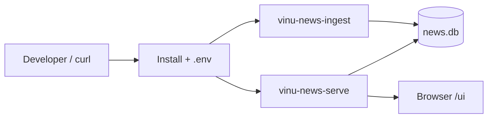

# Chapter 01 — Install & First Run

| Field | Value |
|-------|-------|
| **Package** | vinu-news |
| **Module** | `vinu_news/` (full package) |
| **Status** | REVIEW |
| **Verified** | 2026-07-01 |
| **Prerequisites** | Python 3.11+, Docker optional |

## Learning objectives

- Install vinu-news locally or via Docker and confirm the API responds on port 8080.
- Add watchlist tickers, trigger ingestion, and verify articles appear in SQLite.
- Distinguish **ticker** mode (default) from **all** mode and know when to switch.

## 1. Problem this module solves

vinu-news is an installable financial news ingestion service. It polls Tier 1–4 RSS feeds, enriches headlines with rule-based analysis, deduplicates syndicated stories, and stores **lead** articles in SQLite with an HTTP API for search and watchlist queries. This chapter gets you from zero to a working ingest + API stack.

## 2. Position in pipeline



| Step | Input | Output |
|------|-------|--------|
| Install | `pip install -e ".[dev]"` or `docker compose up` | CLI entry points + containers |
| Configure | `.env` from `.env.example` | DB path, mode, poll interval |
| First ingest | Watchlist tickers + `POST /ingest/trigger` | Rows in `articles` |
| Query | `GET /latest`, `/ticker/{symbol}` | JSON article list |

## 3. File map

| File | Responsibility |
|------|----------------|
| `pyproject.toml` | Package metadata; defines `vinu-news-ingest`, `vinu-news-serve`, `vinu-news-query` |
| `.env.example` | Environment template |
| `docker-compose.yml` | `ingest` + `api` services sharing `vinu_data` volume |
| `vinu_news/cli.py` | CLI entry points for ingest, serve, query |
| `vinu_news/config.py` | Loads `.env` via `load_config()` |
| `vinu_news/server/app.py` | FastAPI factory; mounts `/ui` static UI |

## 4. Data contracts

### Input

| Field | Type | Required | Example |
|-------|------|----------|---------|
| `VINU_NEWS_DB_PATH` | path | no | `./data/news.db` |
| `VINU_NEWS_MODE` | string | no | `ticker` |
| Watchlist tickers | JSON array | yes (ticker mode) | `["AAPL","NVDA"]` |

### Output

| Field | Type | Example |
|-------|------|---------|
| SQLite DB | file | `./data/news.db` |
| API health | JSON | `{"status":"ok","db_path":"..."}` |
| Ingest summary | JSON | `{"inserted":3,"raw_count":120,...}` |

## 5. Logic (step by step)

1. Copy `.env.example` to `.env` in the `vinu-news` directory.
2. **Docker (recommended):** `docker compose up --build` starts ingest (continuous poll) and API on `:8080`.
3. **Local Python:** `pip install -e ".[dev]"` from `vinu-news/`.
4. Fresh DB starts in **ticker** mode — nothing is persisted until watchlist tickers match article mentions.
5. Add tickers via code POST `/watchlist/tickers`, then POST `/ingest/trigger` for an immediate poll.
6. Query results via HTTP or `vinu-news-query latest`.
7. Switch to **all** mode with PATCH `/settings` when you want every lead article saved.

## 6. Configuration

| Key | YAML/env | Default | Effect |
|-----|----------|---------|--------|
| `VINU_NEWS_DB_PATH` | env | `./data/news.db` | SQLite file location |
| `VINU_NEWS_STORAGE` | env | `sqlite` | Storage backend (`postgres` stubbed v1.1) |
| `VINU_NEWS_MODE` | env | `ticker` | Initial mode when DB is first created |
| `VINU_NEWS_POLL_INTERVAL_SEC` | env | `600` | Default poll interval (10 min) |
| `VINU_NEWS_HOST` | env | `127.0.0.1` | API bind host (`0.0.0.0` in Docker) |
| `VINU_NEWS_PORT` | env | `8080` | API port |

**Note:** After first run, `mode` and `poll_interval_sec` live in the DB (`vinu_settings` table). Env vars seed defaults only.

## 7. Worked examples

### Example A — happy path (Docker)

```bash
cd vinu-news
cp .env.example .env
docker compose up --build

curl -X POST http://localhost:8080/watchlist/tickers \
  -H "Content-Type: application/json" \
  -d '{"tickers":["AAPL","NVDA"]}'

curl -X POST http://localhost:8080/ingest/trigger

curl http://localhost:8080/latest?limit=5
```

Expected: `inserted` > 0 after trigger if RSS feeds return articles mentioning AAPL or NVDA; `/latest` returns JSON with `count` and `data` array.

### Example B — edge case (empty watchlist in ticker mode)

```bash
curl http://localhost:8080/settings
# mode: "ticker", watchlist: []

curl -X POST http://localhost:8080/ingest/trigger
# summary: inserted=0, leads_after_filter=0 (articles filtered out)
```

Fix: add tickers or switch mode:

```bash
curl -X PATCH http://localhost:8080/settings \
  -H "Content-Type: application/json" \
  -d '{"mode":"all"}'
```

## 8. API / CLI (if applicable)

| Method | Path / Command | Params | Response |
|--------|----------------|--------|----------|
| GET | `/health` | — | Service health + DB path |
| POST | `/ingest/trigger` | — | `IngestTriggerResponse` with summary |
| POST | `/watchlist/tickers` | body: `{"tickers":[...]}` | Updated watchlist |
| GET | `/latest` | `limit` (1–500) | Latest lead articles |
| CLI | `vinu-news-ingest --once` | optional `--db`, `--feeds` | Terminal ingest report |
| CLI | `vinu-news-serve` | optional `--host`, `--port` | Uvicorn on configured port |
| CLI | `vinu-news-query latest --limit 10` | — | JSON to stdout |

## 9. SQL / queries (if applicable)

After first successful ingest, confirm rows exist:

```sql
SELECT COUNT(*) AS article_count FROM articles;

SELECT headline, source, datetime(sort_ts, 'unixepoch') AS pub
FROM articles
ORDER BY sort_ts DESC
LIMIT 5;
```

## 10. Tests

| Test file | Asserts |
|-----------|---------|
| `tests/test_service.py` | End-to-end service + ingest cycle |
| `vinu_news/rss/tests/test_ingestion_pipeline.py` | Mocked HTTP ingestion |
| `vinu_news/analysis/tests/test_persist.py` | DB insert after pipeline |

Run all tests:

```bash
pytest tests/ -v
```

## 11. Troubleshooting

| Symptom | Likely cause | Action |
|---------|--------------|--------|
| `inserted=0` after trigger | Ticker mode + empty watchlist or no ticker match | Add tickers or set `mode=all` |
| API unreachable | Wrong host/port or container not up | Check `docker compose ps`; use `:8080` |
| Empty `/latest` | No ingest yet or filtered out | Run trigger; verify watchlist |
| Mode won't reset | Stored in DB volume | PATCH `/settings` or delete Docker volume |
| Windows DB locked in tests | Open repository handle | Close `NewsRepository` before temp dir cleanup |

## 12. Fincept / reference repo mapping

| Fincept reference | vinu-news implementation |
|-------------------|--------------------------|
| Step 1 ingestion streaming | `vinu_news/rss/` + Docker ingest service |
| SQLite persistence | `vinu_news/analysis/storage/` |
| Runtime settings bridge | `vinu_news/settings/` + PATCH `/settings` |
| Steps 2–5 (trading, LLM UI) | Partial: LLM analyze endpoint exists; full UI/trading hooks planned |

## 13. Related chapters

- [Chapter 02 — Concepts & Glossary](ch02-concepts-glossary.md)
- [Chapter 06 — Ingestion Orchestration](../part-1-ingestion/ch06-ingestion-orchestration.md)
- [Chapter 22 — HTTP API](../part-4-operations/ch22-http-api.md)
- [Chapter 23 — CLI & Docker](../part-4-operations/ch23-cli-docker.md)
- [Chapter 24 — Config & Environment](../part-4-operations/ch24-config-env.md)
