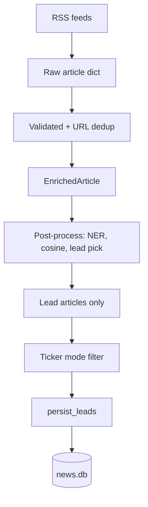

# Chapter 02 — Concepts & Glossary

| Field | Value |
|-------|-------|
| **Package** | vinu-news |
| **Module** | cross-cutting |
| **Status** | REVIEW |
| **Verified** | 2026-07-01 |
| **Prerequisites** | Ch 01 |

## Learning objectives

- Define core pipeline terms: raw article, enriched article, lead, cluster, thread.
- Explain collection modes (`ticker` vs `all`) and when syndicated duplicates are dropped.
- Navigate the package layout and know which module owns each concern.

## 1. Problem this module solves

The vinu-news codebase spans RSS fetch, rule enrichment, deduplication, threading, HTTP API, and watchlist filtering. Shared vocabulary prevents confusion when reading logs (`url_skipped`, `thread_matched_skipped`) or tuning `analysis.yaml`.

## 2. Position in pipeline



| Step | Input | Output |
|------|-------|--------|
| Poll | `feeds.yaml` configs | Raw dicts (7+ fields) |
| Pre-enrich | Raw batch | Valid, URL-deduped batch |
| Enrich | Raw dict | `EnrichedArticle` with 9 rule stages |
| Post-process | Enriched batch | Leads only (non-leads dropped in memory) |
| Persist | Leads | SQLite rows + thread rollups |

## 3. File map

| File | Responsibility |
|------|----------------|
| `vinu_news/rss/` | Fetch, parse, feed health, ingestion orchestration |
| `vinu_news/analysis/` | Pre/post enrichment, pipeline, storage, threading |
| `vinu_news/server/` | HTTP API and web UI |
| `vinu_news/collection/filter.py` | Ticker-mode persist filter |
| `vinu_news/settings/` | Runtime mode + poll interval in DB |
| `vinu_news/watchlist/` | Watchlist ticker storage |

## 4. Data contracts

### Input

| Field | Type | Required | Example |
|-------|------|----------|---------|
| Raw article | dict | yes | `headline`, `link`, `source`, `summary`, `pubDate`, `region`, `tier` |
| Feed config | YAML row | yes | `id`, `url`, `source`, `tier`, `enabled` |

### Output

| Field | Type | Example |
|-------|------|---------|
| `EnrichedArticle` | dataclass | `article: ArticleRecord`, `mentions: list[TickerMention]`, `norm_text: str` |
| `IngestionSummary` | dataclass | `inserted`, `url_skipped`, `thread_matched_skipped` |
| `PersistResult` | dataclass | `threads_created`, `threads_updated` |

## 5. Logic (step by step)

### Glossary (alphabetical)

| Term | Definition |
|------|------------|
| **Cluster** | In-batch duplicate group from cosine similarity; one lead per cluster |
| **Cross-batch dedup** | Thread matcher at persist time (48h lookback, threshold 0.30) |
| **Feed tier** | 1 (best wire/regulator) through 4 (lower priority) from `feeds.yaml` |
| **Lead article** | Winner of lead-pick scoring; only leads reach `persist_leads` |
| **norm_text** | Synonym-normalized headline+summary for dedup/thread matching (not stored on `articles`) |
| **Post-process** | DB-free in-memory: NER, synonyms, cosine dedup, lead pick |
| **Raw article** | Dict from RSS parser before enrichment |
| **Story thread** | Cross-poll narrative identity in `story_threads` |
| **Ticker mode** | Persist only if article mentions a watchlist ticker |
| **URL dedup** | In-batch: first normalized link wins |

### Article ID

`SHA256(link)` when link present; else `SHA256(headline:sort_ts)`.

### Priority waterfall (first match wins)

| Level | Trigger keywords |
|-------|------------------|
| FLASH | breaking, alert |
| URGENT | urgent, emergency |
| BREAKING | announce, report |
| ROUTINE | default |

### Impact rules

| Impact | Condition |
|--------|-----------|
| HIGH | priority FLASH/URGENT or \|sentiment_score\| ≥ 6 |
| MEDIUM | priority BREAKING or \|sentiment_score\| ≥ 3 |
| LOW | otherwise |

## 6. Configuration

| Key | YAML/env | Default | Effect |
|-----|----------|---------|--------|
| `mode` | DB / `VINU_NEWS_MODE` | `ticker` | `ticker` = watchlist filter; `all` = save every lead |
| `dedup.similarity_threshold` | `analysis.yaml` | `0.25` | In-batch cosine merge threshold |
| `dedup.thread_match_threshold` | `analysis.yaml` | `0.30` | Cross-batch thread match (stricter) |
| `dedup.lookback_hours` | `analysis.yaml` | `48` | Thread matcher window |
| `threads.headline_cleanup` | `analysis.yaml` | `true` | Strip `BREAKING:` before vectorize |

## 7. Worked examples

### Example A — happy path (Python pipeline terms)

```python
from vinu_news.analysis.pipeline import process_batch

raw = [{
    "headline": "Apple beats earnings expectations",
    "summary": "AAPL reported strong iPhone sales.",
    "link": "https://example.com/aapl-earnings",
    "pubDate": "Mon, 30 Jun 2026 12:00:00 GMT",
    "source": "REUTERS",
    "region": "US",
    "tier": 1,
}]

result = process_batch(raw)
print(result.enriched_count, result.clusters_found, result.duplicates_dropped)
# enriched_count=1, clusters_found=0, duplicates_dropped=0 (single article)
```

### Example B — edge case (syndicated duplicate in one poll)

Two raw articles with nearly identical headlines from different feeds enter post-process. Cosine clustering groups them; lead pick keeps the higher-tier source. `result.duplicates_dropped == 1`; only one lead reaches persist.

```python
raw = [
    {"headline": "Fed holds rates steady", "link": "https://a.com/1", ...},
    {"headline": "Federal Reserve keeps rates unchanged", "link": "https://b.com/2", ...},
]
result = process_batch(raw)
# clusters_found >= 1, duplicates_dropped >= 1, len(result.articles) == 1
```

## 8. API / CLI (if applicable)

| Method | Path / Command | Params | Response |
|--------|----------------|--------|----------|
| GET | `/settings` | — | `mode`, `poll_interval_sec` |
| GET | `/threads/active` | `hours`, `limit` | Active story threads |
| CLI | `vinu-news-query search "Fed rates"` | query string | FTS hits |

## 9. SQL / queries (if applicable)

Persist event outcomes (see Ch 14):

```sql
-- Three persist cases
-- 1. New story → INSERT articles
-- 2. Thread match → skip insert, bump story_threads.article_count
-- 3. Duplicate URL → skip insert, update last_seen_at + snapshots
SELECT thread_id, article_count, lead_headline
FROM story_threads
ORDER BY last_seen_at DESC
LIMIT 10;
```

## 10. Tests

| Test file | Asserts |
|-----------|---------|
| `test_enrichment.py` | All 9 rule stages |
| `test_cosine_dedup.py` | Cluster formation |
| `test_thread_matcher.py` | Cross-batch match |
| `test_url_dedup.py` | In-batch URL normalization |

## 11. Troubleshooting

| Symptom | Term to check | Action |
|---------|---------------|--------|
| High `duplicates_dropped` | In-batch cluster | Expected for syndicated feeds |
| High `thread_matched_skipped` | Cross-batch thread | Expected; snapshots still update |
| High `url_skipped` | Duplicate link in DB | Re-poll of same URLs is normal |
| Beat/miss wrongly merged | Merge gates | Keep `require_ticker_or_entity_overlap: true` |

## 12. Fincept / reference repo mapping

| Fincept concept | vinu-news term |
|-----------------|----------------|
| Rule enrichment (9 stages) | `vinu_news/analysis/enrichment/` |
| Cosine dedup §5 | `post_enrichment/cosine_dedup/` |
| NER + synonyms §4 | `post_enrichment/ner/`, `synonyms/` |
| FTS5 search §7 | `articles_fts` virtual table |
| LLM analyze §8 | `POST /news/analyze` (optional local LLM) |

Extensions beyond Fincept: `ticker_dominance`, `article_ticker_mentions`, `story_threads`, cross-batch threading.

## 13. Related chapters

- [Chapter 01 — Install & First Run](ch01-install-first-run.md)
- [Chapter 10 — Pipeline Overview](../part-2-analysis/ch10-pipeline-overview.md)
- [Chapter 12 — Enrichment Overview](../part-2-analysis/ch12-enrichment-overview.md)
- [Chapter 14 — Story Threads & Persist](../part-2-analysis/ch14-story-threads-persist.md)
- [Chapter 17 — Schema Catalog](../part-3-data/ch17-schema-catalog.md)
