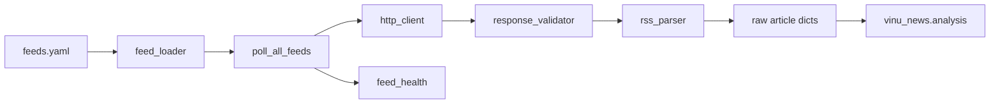

# Chapter 03 — RSS Architecture

| Field | Value |
|-------|-------|
| **Package** | vinu-news |
| **Module** | `vinu_news/rss/` |
| **Status** | REVIEW |
| **Verified** | 2026-07-01 |
| **Prerequisites** | Ch 01, Ch 02 |

## Learning objectives

- Describe the RSS package layers: config, fetch, parse, orchestration, feed health.
- Explain fail-soft parallel polling and response validation (cloaking, timeouts).
- Trace a single feed from `feeds.yaml` to raw article dicts.

## 1. Problem this module solves

Financial news arrives as RSS/Atom XML from dozens of sources with varying reliability, latency, and HTML cloaking. The `vinu_news/rss/` package fetches feeds in parallel, validates responses, parses entries into a uniform raw dict, and records per-feed health — without blocking the full poll when one feed fails.

## 2. Position in pipeline



| Step | Input | Output |
|------|-------|--------|
| Load feeds | `feeds.yaml` + optional `--feeds` filter | List of enabled feed configs |
| Parallel poll | Feed configs | Raw dicts + `FeedPollResult` per feed |
| Feed health | Poll results | `feed_health` table updates |
| Handoff | Raw batch | `process_batch()` in analysis |

## 3. File map

| File | Responsibility |
|------|----------------|
| `rss/config/feeds.yaml` | Feed registry (id, url, tier, region) |
| `rss/config/feed_loader.py` | Load and filter feeds by id |
| `rss/config/settings.py` | Timeouts, workers, body size limits |
| `rss/fetch/http_client.py` | `fetch_url()` → `FetchResult` |
| `rss/fetch/response_validator.py` | Reject empty, short, HTML-cloaked bodies |
| `rss/fetch/parallel_fetcher.py` | `poll_all_feeds()` — ThreadPoolExecutor |
| `rss/orchestration/feed_poller.py` | Single-feed fetch + parse |
| `rss/parse/rss_parser.py` | `feedparser` → raw dicts |
| `rss/storage/feed_health.py` | Upsert poll metrics |
| `rss/orchestration/ingestion_pipeline.py` | Full fetch → analysis → persist |

## 4. Data contracts

### Input

| Field | Type | Required | Example |
|-------|------|----------|---------|
| Feed config | dict | yes | `id`, `url`, `source`, `region`, `tier`, `enabled` |
| HTTP response | bytes | yes | Valid RSS/XML body |

### Output

| Field | Type | Example |
|-------|------|---------|
| Raw article dict | dict | See Ch 05 |
| `FeedPollResult` | dataclass | `feed_id`, `article_count`, `error`, `duration_ms` |
| `FetchResult` | dataclass | `status`, `body`, `error`, `duration_ms` |

## 5. Logic (step by step)

1. `load_feeds(feed_ids)` reads `feeds.yaml`, skips `enabled: false`.
2. `poll_all_feeds(feeds)` submits each feed to a thread pool (`MAX_WORKERS=8`).
3. Per feed, `poll_feed()`: `fetch_url` → validate → `parse_feed`.
4. **Fail-soft:** one feed timeout or parse error does not stop others.
5. Aggregated raw articles passed to analysis; `update_feed_health()` records streaks and latency.
6. Errors include: `timeout`, `body_too_short`, `html_cloaking_detected`, `empty_feed`.

## 6. Configuration

| Key | YAML/env | Default | Effect |
|-----|----------|---------|--------|
| `REQUEST_TIMEOUT_SEC` | `settings.py` | `4` | HTTP timeout per feed |
| `MAX_WORKERS` | `settings.py` | `8` | Parallel fetch pool size |
| `HTML_CLOAK_PREFIX_LEN` | `settings.py` | `20` | Bytes checked for `<html` cloaking |
| `MIN_BODY_BYTES` | `settings.py` | `50` | Minimum valid body size |
| `DEFAULT_POLL_INTERVAL_SEC` | `settings.py` | `900` | Legacy CLI default (15 min) |
| `VINU_NEWS_POLL_INTERVAL_SEC` | env | `600` | Runtime poll interval (DB-backed) |

## 7. Worked examples

### Example A — happy path (dry-run fetch)

```bash
vinu-news-ingest --once --dry-run --verbose
```

Expected output includes per-feed lines like `federal_reserve: 12 articles [OK]` and `Raw articles: N` without DB writes.

### Example B — edge case (single feed filter)

```bash
vinu-news-ingest --once --feeds federal_reserve,ap_top_news --verbose
```

Only two feeds polled; others skipped. Useful when debugging one broken URL.

## 8. API / CLI (if applicable)

| Method | Path / Command | Params | Response |
|--------|----------------|--------|----------|
| POST | `/ingest/trigger` | — | Runs full RSS cycle via `NewsService` |
| CLI | `vinu-news-ingest --once` | — | Terminal `IngestionSummary` report |
| CLI | `vinu-news-ingest --continuous` | — | Loop with DB poll interval |
| CLI | `vinu-news-ingest --dry-run` | — | Fetch only, no persist |

## 9. SQL / queries (if applicable)

Check feed reliability after polls:

```sql
SELECT feed_id, fail_streak, total_failures, total_polls,
       ROUND(avg_latency_ms, 0) AS avg_ms, last_error
FROM feed_health
ORDER BY fail_streak DESC;
```

## 10. Tests

| Test file | Asserts |
|-----------|---------|
| `rss/tests/test_ingestion_pipeline.py` | Mocked HTTP full pipeline |
| `rss/tests/test_response_validator.py` | HTML cloaking rejection |
| `rss/tests/test_rss_parser.py` | Entry parsing, link required |
| `rss/tests/test_feed_health.py` | Streak and latency upsert |

## 11. Troubleshooting

| Symptom | Likely cause | Action |
|---------|--------------|--------|
| Feed always `FAIL(timeout)` | Slow or blocked URL | Check URL; increase timeout only if needed |
| `html_cloaking_detected` | CDN returns HTML error page | Fix URL or disable feed |
| `empty_feed` | Valid XML, zero entries | Source may be down; check `feed_health` |
| All feeds fail in Docker | Network egress blocked | Verify container network |

## 12. Fincept / reference repo mapping

| Fincept reference | Implementation |
|-------------------|----------------|
| `step1_ingestion_streaming.md` — RSS fetch | `rss/fetch/` |
| Feed stability / timeout | `REQUEST_TIMEOUT_SEC=4` |
| Parallel poll | `parallel_fetcher.py` |
| Feed health monitoring | `feed_health` table |

## 13. Related chapters

- [Chapter 04 — feeds.yaml](../part-1-ingestion/ch04-feeds-yaml.md)
- [Chapter 05 — Fetch & Parse](../part-1-ingestion/ch05-fetch-parse.md)
- [Chapter 06 — Ingestion Orchestration](../part-1-ingestion/ch06-ingestion-orchestration.md)
- [Chapter 17 — Schema Catalog](../part-3-data/ch17-schema-catalog.md) (`feed_health`)
