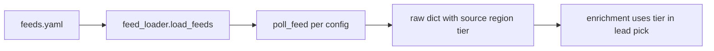

# Chapter 04 — feeds.yaml

| Field | Value |
|-------|-------|
| **Package** | vinu-news |
| **Module** | `vinu_news/rss/config/feeds.yaml` |
| **Status** | REVIEW |
| **Verified** | 2026-07-01 |
| **Prerequisites** | Ch 03 |

## Learning objectives

- Edit `feeds.yaml` to add, disable, or tier a feed without code changes.
- Understand how feed metadata flows onto stored `articles` rows.
- Use `--feeds` CLI filter to poll a subset of feed ids.

## 1. Problem this module solves

RSS sources differ by quality, region, and category. `feeds.yaml` is the single registry of poll targets. Each entry defines URL, display source, geographic region, quality tier, default category, and enable flag. The loader skips disabled feeds; enrichment may override category but tier and source come from config.

## 2. Position in pipeline



| Step | Input | Output |
|------|-------|--------|
| Load | YAML file | List of feed dicts |
| Filter | `--feeds id1,id2` | Subset of enabled feeds |
| Parse | RSS entries | Raw dicts tagged with config metadata |

## 3. File map

| File | Responsibility |
|------|----------------|
| `rss/config/feeds.yaml` | Feed definitions |
| `rss/config/feed_loader.py` | Parse YAML, filter by id, skip disabled |
| `rss/orchestration/feed_poller.py` | Attach config fields to each article |

## 4. Data contracts

### Input

| Field | Type | Required | Example |
|-------|------|----------|---------|
| `id` | string | yes | `federal_reserve` |
| `url` | string | yes | `https://www.federalreserve.gov/feeds/press_all.xml` |
| `source` | string | yes | `FEDERAL RESERVE` |
| `region` | string | yes | `US`, `EU`, `GLOBAL` |
| `tier` | int | yes | `1` (best) – `4` |
| `category` | string | no | `ECONOMIC`, `MARKETS`, `REGULATORY` |
| `enabled` | bool | no | `true` (default poll) |

### Output

| Field | Type | Example |
|-------|------|---------|
| Feed config dict | dict | Passed to `poll_feed()` |
| Article `source` | string | `FEDERAL RESERVE` |
| Article `region` | string | `US` |
| Article `tier` | int | `1` |
| Article `category` | string | Default until enrichment overrides |

## 5. Logic (step by step)

1. `feeds.yaml` top-level key `feeds:` holds a list of feed objects.
2. `load_feeds(feed_ids=None)` returns all enabled feeds, or intersection with `feed_ids`.
3. Tier 1 examples: AP, SEC, Federal Reserve, ECB, Bank of England, UN News.
4. Tier 2 examples: Bloomberg, WSJ, CNBC.
5. `enabled: false` excludes feed from default polls (no code deploy needed).
6. `feed_health.feed_id` matches `feeds.yaml` `id` for ops queries.

## 6. Configuration

| Key | YAML/env | Default | Effect |
|-----|----------|---------|--------|
| Feed `tier` | `feeds.yaml` | per feed | Lead pick tie-break (tier 1 beats tier 4) |
| Feed `enabled` | `feeds.yaml` | `true` | Skip when `false` |
| Feed `category` | `feeds.yaml` | `MARKETS` | Default until keyword category overrides |
| `--feeds` | CLI | all enabled | Comma-separated id filter |

### Tier reference (from feeds.yaml)

| Tier | Role | Example sources |
|------|------|-----------------|
| 1 | Wire services & regulators | AP, SEC, Fed, ECB, BoE, UN |
| 2 | Global & financial media | Bloomberg, WSJ, CNBC |
| 3 | Regional / specialty | Various |
| 4 | Lower priority / aggregators | Various |

## 7. Worked examples

### Example A — happy path (inspect loaded feeds)

```python
from vinu_news.rss.config.feed_loader import load_feeds

feeds = load_feeds()
print(len(feeds), feeds[0]["id"], feeds[0]["tier"])

subset = load_feeds(feed_ids=["federal_reserve", "sec_press"])
print([f["id"] for f in subset])
# ['federal_reserve', 'sec_press']
```

### Example B — edge case (disable a failing feed)

Edit `feeds.yaml`:

```yaml
  - id: problematic_feed
    url: https://example.com/broken.rss
    source: EXAMPLE
    region: US
    tier: 3
    category: MARKETS
    enabled: false   # skip until URL fixed
```

No restart required on next poll — loader reads file each cycle.

## 8. API / CLI (if applicable)

| Method | Path / Command | Params | Response |
|--------|----------------|--------|----------|
| CLI | `vinu-news-ingest --once --feeds federal_reserve` | feed id | Poll single feed |
| CLI | `vinu-news-ingest --feeds a,b,c --continuous` | ids | Subset loop |

There is no HTTP endpoint to edit `feeds.yaml`; changes are file-based.

## 9. SQL / queries (if applicable)

Articles inherit feed metadata:

```sql
SELECT source, tier, region, COUNT(*) AS cnt
FROM articles
GROUP BY source, tier, region
ORDER BY cnt DESC
LIMIT 20;
```

Correlate with feed health:

```sql
SELECT f.feed_id, f.fail_streak, f.last_error
FROM feed_health f
WHERE f.fail_streak > 0;
```

## 10. Tests

| Test file | Asserts |
|-----------|---------|
| `rss/tests/test_feed_loader.py` | Enabled filter, id subset |
| `rss/tests/test_ingestion_pipeline.py` | Feed id CLI filter |

## 11. Troubleshooting

| Symptom | Likely cause | Action |
|---------|--------------|--------|
| Feed never polled | `enabled: false` or typo in `id` | Check YAML |
| Wrong source on articles | `source` field mismatch | Edit feeds.yaml label |
| `--feeds` finds nothing | Unknown id | Match `id` exactly (snake_case) |
| High fail_streak | Bad URL | Disable feed; fix URL; re-enable |

## 12. Fincept / reference repo mapping

| Fincept reference | feeds.yaml field |
|-------------------|------------------|
| Source credibility | Maps to `source` → `source_flag` in enrichment |
| Feed priority | `tier` used in lead pick scoring |
| Geographic tagging | `region` stored on `articles.region` |

## 13. Related chapters

- [Chapter 03 — RSS Architecture](ch03-rss-architecture.md)
- [Chapter 05 — Fetch & Parse](ch05-fetch-parse.md)
- [Chapter 06 — Ingestion Orchestration](ch06-ingestion-orchestration.md)
- [Chapter 12 — Enrichment Overview](../part-2-analysis/ch12-enrichment-overview.md) (category override)
