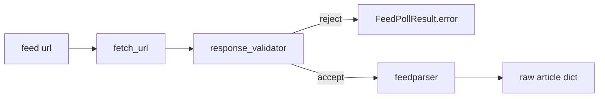

# Chapter 05 — Fetch & Parse

| Field | Value |
|-------|-------|
| **Package** | vinu-news |
| **Module** | `vinu_news/rss/fetch/`, `vinu_news/rss/parse/` |
| **Status** | REVIEW |
| **Verified** | 2026-07-01 |
| **Prerequisites** | Ch 03, Ch 04 |

## Learning objectives

- Trace HTTP fetch → validation → RSS parse for one feed entry.
- List the raw article dict fields produced by `rss_parser.py`.
- Diagnose common fetch failures using `FetchResult` and validator rules.

## 1. Problem this module solves

RSS endpoints return XML with inconsistent date formats, HTML summaries, and occasional error pages disguised as feeds. The fetch layer enforces timeouts and body checks; the parse layer normalizes entries into a fixed dict shape the analysis pipeline expects.

## 2. Position in pipeline



| Step | Input | Output |
|------|-------|--------|
| Fetch | URL string | `FetchResult(status, body, error, duration_ms)` |
| Validate | Response body | Accept or error code |
| Parse | Valid XML | List of raw dicts (entries without link skipped) |

## 3. File map

| File | Responsibility |
|------|----------------|
| `fetch/http_client.py` | HTTP GET with timeout |
| `fetch/fetch_result.py` | `FetchResult`, `FeedPollResult` dataclasses |
| `fetch/response_validator.py` | Body length, HTML cloaking checks |
| `fetch/parallel_fetcher.py` | Thread pool wrapper |
| `parse/rss_parser.py` | `feedparser` → raw dicts |
| `orchestration/feed_poller.py` | Wires fetch + parse for one feed |

## 4. Data contracts

### Input

| Field | Type | Required | Example |
|-------|------|----------|---------|
| `url` | string | yes | Feed URL from config |
| Feed metadata | dict | yes | `source`, `region`, `tier`, `category` |

### Output

Raw article dict from `rss_parser.py`:

| Field | Type | Example |
|-------|------|---------|
| `headline` | str | `"Fed holds rates steady"` |
| `summary` | str | Plain text (HTML stripped downstream) |
| `link` | str | Canonical article URL |
| `pubDate` | str | RSS date string |
| `source` | str | From feeds.yaml |
| `region` | str | `US` |
| `tier` | int | `1` |
| `category` | str | Optional from feed config |

Entries **without** `link` are skipped at parse time.

## 5. Logic (step by step)

1. `fetch_url(url)` performs HTTP GET with `REQUEST_TIMEOUT_SEC` (4s).
2. Timeout → `error="timeout"`, empty body.
3. `validate_response(body)` rejects:
   - empty body
   - `body_too_short` (< 50 bytes)
   - `html_cloaking_detected` (first 20 bytes look like HTML)
4. Valid bodies passed to `feedparser`.
5. For each entry: extract title, summary, link, published date.
6. Merge feed config fields (`source`, `region`, `tier`, `category`).
7. Return list of dicts + `FeedPollResult` with counts and timing.

## 6. Configuration

| Key | YAML/env | Default | Effect |
|-----|----------|---------|--------|
| `REQUEST_TIMEOUT_SEC` | `rss/config/settings.py` | `4` | Per-request timeout |
| `MIN_BODY_BYTES` | `settings.py` | `50` | Minimum response size |
| `HTML_CLOAK_PREFIX_LEN` | `settings.py` | `20` | Cloaking detection window |
| User-Agent | `http_client.py` | library default | HTTP client identity |

## 7. Worked examples

### Example A — happy path (Python unit-style)

```python
from vinu_news.rss.orchestration.feed_poller import poll_feed

config = {
    "id": "federal_reserve",
    "url": "https://www.federalreserve.gov/feeds/press_all.xml",
    "source": "FEDERAL RESERVE",
    "region": "US",
    "tier": 1,
    "category": "ECONOMIC",
}
articles, result = poll_feed(config)
print(result.feed_id, result.article_count, result.error)
print(articles[0]["headline"], articles[0]["link"])
```

### Example B — edge case (validator rejection)

When a CDN returns an HTML login page:

```python
from vinu_news.rss.fetch.response_validator import validate_response

body = b"<html><head><title>403 Forbidden</title>"
err = validate_response(body)
# err == "html_cloaking_detected"
```

Feed poll records `article_count=0`, `error="html_cloaking_detected"` in `FeedPollResult`.

## 8. API / CLI (if applicable)

Fetch/parse run inside ingest; no direct HTTP route. Indirect trigger:

| Method | Path / Command | Params | Response |
|--------|----------------|--------|----------|
| POST | `/ingest/trigger` | — | Includes `raw_count` from all feeds |
| CLI | `vinu-news-ingest --once --dry-run` | — | Per-feed OK/FAIL lines |

## 9. SQL / queries (if applicable)

Correlate parse failures with ops table:

```sql
SELECT feed_id, last_error, last_failure_at, fail_streak
FROM feed_health
WHERE last_error IN ('timeout', 'html_cloaking_detected', 'body_too_short', 'empty_feed');
```

## 10. Tests

| Test file | Asserts |
|-----------|---------|
| `test_response_validator.py` | Empty, short, HTML rejection |
| `test_rss_parser.py` | Link required, field extraction |
| `test_ingestion_pipeline.py` | Mocked fetch → parse chain |

## 11. Troubleshooting

| Symptom | Likely cause | Action |
|---------|--------------|--------|
| `timeout` | Slow feed or network | Retry; check URL in browser |
| `body_too_short` | Empty/error response | Verify feed URL |
| `html_cloaking_detected` | HTML error page | Update URL or disable feed |
| Missing headlines | Entries without link | Source issue; not fixable in parser |
| Duplicate headlines same poll | Multiple feeds same story | Normal; post-process dedup handles |

## 12. Fincept / reference repo mapping

| Fincept reference | Implementation |
|-------------------|----------------|
| `kFeedTransferTimeoutMs` | `REQUEST_TIMEOUT_SEC=4` |
| RSS parse stability | `feedparser` + link guard |
| HTML in summary | Stripped in enrichment `clean_summary` |

## 13. Related chapters

- [Chapter 03 — RSS Architecture](ch03-rss-architecture.md)
- [Chapter 04 — feeds.yaml](ch04-feeds-yaml.md)
- [Chapter 06 — Ingestion Orchestration](ch06-ingestion-orchestration.md)
- [Chapter 11 — Pre-Enrichment](../part-2-analysis/ch11-pre-enrichment.md)
