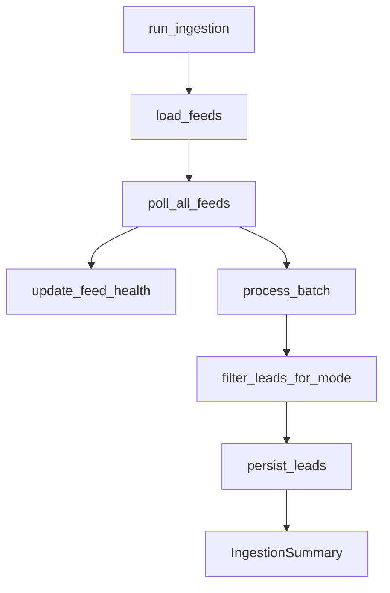

# Chapter 06 — Ingestion Orchestration

| Field | Value |
|-------|-------|
| **Package** | vinu-news |
| **Module** | `vinu_news/rss/orchestration/ingestion_pipeline.py`, `vinu_news/service.py` |
| **Status** | REVIEW |
| **Verified** | 2026-07-01 |
| **Prerequisites** | Ch 03–05, Ch 10 |

## Learning objectives

- Follow `run_ingestion()` from RSS poll through persist and feed health update.
- Interpret every field in `IngestionSummary` logs.
- Explain how ticker-mode filtering fits between post-process and persist.

## 1. Problem this module solves

Individual fetch and analysis modules are useless without a coordinator that polls feeds, runs the analysis pipeline, applies collection-mode filtering, persists leads, and reports operational metrics. `run_ingestion()` is that coordinator; `NewsService.run_ingestion_cycle()` wraps it with runtime settings and watchlist.

## 2. Position in pipeline



| Step | Input | Output |
|------|-------|--------|
| Poll | Feed configs | Raw articles + `FeedPollResult` list |
| Feed health | Poll results | `feed_health` upserts |
| Process | Raw batch | Lead `EnrichedArticle` list |
| Mode filter | Leads + watchlist | Subset to persist (ticker mode) |
| Persist | Filtered leads | DB rows + thread rollups |

## 3. File map

| File | Responsibility |
|------|----------------|
| `rss/orchestration/ingestion_pipeline.py` | `run_ingestion()`, `IngestionSummary` |
| `rss/run_ingestion.py` | Legacy module entry (superseded by CLI) |
| `vinu_news/cli.py` | `vinu-news-ingest` worker |
| `vinu_news/service.py` | `NewsService.run_ingestion_cycle()` |
| `collection/filter.py` | `filter_leads_for_mode()` |
| `server/app.py` | `POST /ingest/trigger` |

## 4. Data contracts

### Input

| Field | Type | Required | Example |
|-------|------|----------|---------|
| `db_path` | path | no | From `VINU_NEWS_DB_PATH` |
| `feed_ids` | list[str] | no | `["federal_reserve"]` |
| `dry_run` | bool | no | `false` |
| `skip_post_process` | bool | no | `false` |
| `mode` | string | yes (runtime) | `ticker` or `all` |
| `watchlist` | set[str] | ticker mode | `{"AAPL","NVDA"}` |

### Output

`IngestionSummary` fields:

| Field | Type | Example |
|-------|------|---------|
| `feeds_polled` | int | `24` |
| `feeds_failed` | int | `2` |
| `raw_count` | int | `350` |
| `url_dedup_dropped` | int | `5` |
| `enriched_count` | int | `120` |
| `clusters_found` | int | `15` |
| `duplicates_dropped` | int | `40` |
| `inserted` | int | `12` |
| `url_skipped` | int | `80` |
| `thread_matched_skipped` | int | `28` |
| `threads_created` | int | `8` |
| `threads_updated` | int | `35` |
| `feed_results` | list | Per-feed status |

## 5. Logic (step by step)

1. `load_feeds(feed_ids)` → enabled feed list.
2. `poll_all_feeds(feeds)` → flat raw article list + per-feed results.
3. If not `dry_run`: `update_feed_health(repo, feed_results)`.
4. If `dry_run`: return early with fetch counts only.
5. `process_batch(raw_articles)` → validate, URL dedup, enrich, post-process.
6. `NewsService` applies `filter_leads_for_mode(leads, mode, watchlist)`.
7. `persist_leads(repo, filtered_leads)` → SQLite + threads.
8. `format_report()` prints human-readable summary.

Continuous ingest (`vinu-news-ingest --continuous`) sleeps `poll_interval_sec` from DB each cycle (not only env default).

## 6. Configuration

| Key | YAML/env | Default | Effect |
|-----|----------|---------|--------|
| `VINU_NEWS_POLL_INTERVAL_SEC` | env | `600` | Initial poll interval seed |
| `poll_interval_sec` | DB `vinu_settings` | from env | Sleep between continuous polls |
| `mode` | DB `vinu_settings` | `ticker` | Persist filter |
| `--dry-run` | CLI | off | Fetch + health only |
| `--skip-post-process` | API internal | off | Enrich without dedup/lead pick |

## 7. Worked examples

### Example A — happy path (CLI once)

```bash
vinu-news-ingest --once --verbose
```

Sample report:

```
Feeds polled: 24
Raw articles: 412
URL dedup dropped (batch): 8
Clusters found: 22
Duplicates dropped (batch): 55
New DB inserts: 15
URL skipped (DB): 90
Thread matched skipped: 30
```

### Example B — edge case (dry-run diagnostic)

```bash
vinu-news-ingest --once --dry-run --feeds bloomberg_markets
```

No `inserted` line matters — confirms fetch works without touching analysis DB writes beyond feed health (dry-run skips health too per pipeline).

```bash
curl -X POST http://localhost:8080/ingest/trigger
```

Response:

```json
{
  "ok": true,
  "summary": {
    "inserted": 3,
    "mode": "ticker",
    "leads_after_filter": 5,
    "raw_count": 280
  }
}
```

`leads_after_filter` < enriched leads when ticker mode filters non-watchlist articles.

## 8. API / CLI (if applicable)

| Method | Path / Command | Params | Response |
|--------|----------------|--------|----------|
| POST | `/ingest/trigger` | — | `IngestTriggerResponse` |
| POST | `/ingest/ticker-news` | `days=7` | Yahoo ticker news ingest |
| CLI | `vinu-news-ingest --once` | `--feeds`, `--db` | Terminal report |
| CLI | `vinu-news-ingest --continuous` | — | Loop until stopped |
| CLI | `vinu-news-ingest --interval 900` | seconds | Fixed sleep override |

## 9. SQL / queries (if applicable)

After ingest cycle, verify growth:

```sql
SELECT datetime(MAX(sort_ts), 'unixepoch') AS latest_article,
       COUNT(*) AS total_articles
FROM articles;

SELECT COUNT(*) AS active_threads
FROM story_threads
WHERE last_seen_at >= strftime('%s', 'now', '-48 hours');
```

## 10. Tests

| Test file | Asserts |
|-----------|---------|
| `rss/tests/test_ingestion_pipeline.py` | Full mocked pipeline |
| `tests/test_service.py` | Mode filter + trigger cycle |
| `analysis/tests/test_persist.py` | Persist counters |

## 11. Troubleshooting

| Symptom | Field to inspect | Action |
|---------|------------------|--------|
| `inserted=0`, high `url_skipped` | Re-poll same URLs | Expected on steady state |
| `inserted=0`, `leads_after_filter=0` | Ticker mode | Add watchlist tickers |
| High `feeds_failed` | `feed_results` | Check `feed_health.last_error` |
| Poll interval ignored | DB settings | PATCH `/settings` poll_interval_sec |
| Docker not ingesting | ingest container | `docker compose logs ingest` |

## 12. Fincept / reference repo mapping

| Fincept reference | Implementation |
|-------------------|----------------|
| End-to-end Step 1 pipeline | `ingestion_pipeline.py` |
| Ingestion metrics | `IngestionSummary` |
| Watchlist-driven collection | Extension via `collection/filter.py` |

## 13. Related chapters

- [Chapter 01 — Install & First Run](../part-0-getting-started/ch01-install-first-run.md)
- [Chapter 05 — Fetch & Parse](ch05-fetch-parse.md)
- [Chapter 10 — Pipeline Overview](../part-2-analysis/ch10-pipeline-overview.md)
- [Chapter 14 — Story Threads & Persist](../part-2-analysis/ch14-story-threads-persist.md)
- [Chapter 22 — HTTP API](../part-4-operations/ch22-http-api.md)
- [Chapter 23 — CLI & Docker](../part-4-operations/ch23-cli-docker.md)
