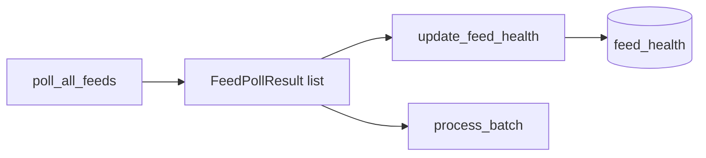

# Chapter 07 — Feed Health

| Field | Value |
|-------|-------|
| **Package** | vinu-news |
| **Module** | `vinu_news/rss/storage/feed_health.py` |
| **Status** | REVIEW |
| **Verified** | 2026-07-01 |
| **Prerequisites** | Ch 03, Ch 06 |

## Learning objectives

- Explain what `feed_health` records after each RSS poll cycle.
- Interpret `fail_streak`, `avg_latency_ms`, and `last_error` for operations.
- Trace the call from `NewsService.run_ingestion_cycle()` to `update_feed_health()`.

## 1. Problem this module solves

RSS feeds fail intermittently: timeouts, HTML cloaking, empty XML. Operators need **per-feed reliability metrics** without digging through logs. `update_feed_health()` upserts one row per feed after every non-dry-run poll, tracking success/failure streaks and rolling average latency.

## 2. Position in pipeline



| Step | Input | Output |
|------|-------|--------|
| Poll | Feed configs | `list[FeedPollResult]` |
| Health upsert | Results + existing row | Updated `feed_health` |
| Skip | `dry_run=True` | No DB writes |

## 3. File map

| File | Responsibility |
|------|----------------|
| `rss/storage/feed_health.py` | `update_feed_health()` |
| `rss/fetch/fetch_result.py` | `FeedPollResult` dataclass |
| `rss/fetch/parallel_fetcher.py` | Produces results per feed |
| `service.py` | Calls health update after poll |
| `analysis/storage/schema.sql` | `feed_health` table DDL |

## 4. Data contracts

### Input

| Field | Type | Required | Example |
|-------|------|----------|---------|
| `FeedPollResult.feed_id` | str | yes | `federal_reserve` |
| `FeedPollResult.success` | bool | yes | `True` if articles fetched |
| `FeedPollResult.duration_ms` | float | yes | `342.5` |
| `FeedPollResult.error` | str \| None | no | `timeout` |

### Output

`feed_health` columns (from `schema.sql`):

| Field | Type | Example |
|-------|------|---------|
| `feed_id` | TEXT PK | `ap_top_news` |
| `last_success_at` | INTEGER | Unix ts |
| `last_failure_at` | INTEGER | Unix ts |
| `fail_streak` | INTEGER | `3` |
| `total_polls` | INTEGER | `120` |
| `total_failures` | INTEGER | `8` |
| `avg_latency_ms` | REAL | `410.2` |
| `last_error` | TEXT | `html_cloaking_detected` |

## 5. Logic (step by step)

1. `NewsService.run_ingestion_cycle()` polls feeds, then calls `update_feed_health(repo, feed_results)` unless `dry_run`.
2. For each `FeedPollResult`, load existing row by `feed_id` (or start counters at zero).
3. Increment `total_polls` always.
4. **On success:** reset `fail_streak` to 0; update rolling `avg_latency_ms`; set `last_success_at`; clear `last_error`.
5. **On failure:** increment `total_failures` and `fail_streak`; set `last_failure_at`; store `error` or default `empty_feed`.
6. Uses `INSERT ... ON CONFLICT(feed_id) DO UPDATE` inside a transaction; commits once per cycle.

Rolling average formula on success:

```
avg_latency_ms = (prev_avg * (total_polls - 1) + duration_ms) / total_polls
```

## 6. Configuration

| Key | YAML/env | Default | Effect |
|-----|----------|---------|--------|
| `REQUEST_TIMEOUT_SEC` | `rss/config/settings.py` | `4` | Drives `timeout` errors |
| `MIN_BODY_BYTES` | settings | `50` | `body_too_short` failures |
| Poll interval | `VINU_NEWS_POLL_INTERVAL_SEC` | `600` | How often health updates |
| Dry run | CLI `--dry-run` | off | Skips health writes |

## 7. Worked examples

### Example A — happy path (query after ingest)

```bash
vinu-news-ingest --once --verbose
```

```sql
SELECT feed_id, fail_streak, total_polls, ROUND(avg_latency_ms, 0) AS avg_ms
FROM feed_health
WHERE fail_streak = 0
ORDER BY avg_latency_ms DESC
LIMIT 5;
```

Expect mostly `fail_streak = 0` for healthy feeds with non-null `last_success_at`.

### Example B — edge case (degraded feed)

A feed returns HTML instead of RSS three polls in a row:

| Poll | `success` | `fail_streak` | `last_error` |
|------|-----------|---------------|--------------|
| 1 | false | 1 | `html_cloaking_detected` |
| 2 | false | 2 | `html_cloaking_detected` |
| 3 | false | 3 | `html_cloaking_detected` |
| 4 | true | 0 | NULL |

Action: check URL in `feeds.yaml` or temporarily disable the feed.

## 8. API / CLI (if applicable)

Feed health is read via SQL or future dashboard; ingest triggers updates:

| Method | Path / Command | Params | Response |
|--------|----------------|--------|----------|
| POST | `/ingest/trigger` | — | Poll + health update |
| CLI | `vinu-news-ingest --once` | — | Per-feed OK/FAIL lines |
| SQL | `SELECT * FROM feed_health` | — | Full metrics |

## 9. SQL / queries (if applicable)

Worst feeds right now:

```sql
SELECT feed_id, fail_streak, total_failures, total_polls,
       ROUND(100.0 * total_failures / total_polls, 1) AS fail_pct,
       last_error
FROM feed_health
WHERE fail_streak > 0
ORDER BY fail_streak DESC, fail_pct DESC;
```

Latency outliers:

```sql
SELECT feed_id, avg_latency_ms, total_polls
FROM feed_health
ORDER BY avg_latency_ms DESC
LIMIT 10;
```

## 10. Tests

| Test file | Asserts |
|-----------|---------|
| `tests/rss/test_feed_health.py` | Success resets streak; failure increments |
| `tests/rss/test_ingestion_pipeline.py` | Full cycle with mocked HTTP |

## 11. Troubleshooting

| Symptom | Likely cause | Action |
|---------|--------------|--------|
| No `feed_health` rows | Only dry-run ingests | Run without `--dry-run` |
| `fail_streak` never resets | Feed permanently broken | Fix URL; check `last_error` |
| High `avg_latency_ms` | Slow source or network | Expected for some Tier 4 feeds |
| Stale metrics | Ingest not running | Check `ingest` container / cron |

## 12. Fincept / reference repo mapping

| Fincept reference | Implementation |
|-------------------|----------------|
| `step1_ingestion_streaming.md` — feed stability | `feed_health` table |
| Parallel poll fail-soft | Health still records per-feed outcome |
| Monitoring | SQL on `fail_streak`, `last_error` |

## 13. Related chapters

- [Chapter 03 — RSS Architecture](ch03-rss-architecture.md)
- [Chapter 05 — Fetch & Parse](ch05-fetch-parse.md)
- [Chapter 06 — Ingestion Orchestration](ch06-ingestion-orchestration.md)
- [Chapter 17 — Schema Catalog](../part-3-data/ch17-schema-catalog.md)
- [Chapter 26 — Service Facade](../part-4-operations/ch26-service-facade.md)
