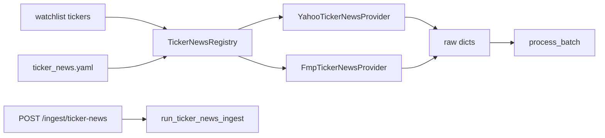

# Chapter 08 — Ticker News Providers

| Field | Value |
|-------|-------|
| **Package** | vinu-news |
| **Module** | `vinu_news/providers/` |
| **Status** | REVIEW |
| **Verified** | 2026-07-01 |
| **Prerequisites** | Ch 06, Ch 09 |

## Learning objectives

- Configure Yahoo and FMP providers via `ticker_news.yaml`.
- Trace `POST /ingest/ticker-news` through `TickerNewsRegistry` to raw article dicts.
- Understand TASK-N02: ticker-specific headlines complementing global RSS.

## 1. Problem this module solves

Global RSS feeds miss **symbol-targeted headlines** (e.g. Yahoo Finance per-ticker RSS). TASK-N02 adds pluggable providers that fetch ticker news for watchlist symbols, normalize to the same raw dict shape as RSS, and run through the standard enrichment pipeline.

## 2. Position in pipeline



| Step | Input | Output |
|------|-------|--------|
| Load config | `ticker_news.yaml` | Enabled provider list |
| Fetch per ticker | symbol + time window | Raw dicts (deduped by link) |
| Ingest | watchlist | Enriched leads in DB |

## 3. File map

| File | Responsibility |
|------|----------------|
| `providers/config/ticker_news.yaml` | Provider enable/priority |
| `providers/config/loader.py` | `load_ticker_news_providers()` |
| `providers/registry.py` | `TickerNewsRegistry` orchestration |
| `providers/yahoo.py` | Yahoo Finance headline RSS (TASK-N02) |
| `providers/fmp.py` | FMP stub (requires `FMP_API_KEY`) |
| `providers/base.py` | `TickerNewsProvider` protocol |
| `service.py` | `run_ticker_news_ingest()` |
| `server/routes_config.py` | `POST /ingest/ticker-news` |

## 4. Data contracts

### Input

| Field | Type | Required | Example |
|-------|------|----------|---------|
| `ticker` | str | yes | `NVDA` |
| `from_ts` / `to_ts` | int | yes | Unix window (default 7 days) |
| `FMP_API_KEY` | env | for FMP | API key string |

### Output

Raw dict (same 7+ fields as RSS parser):

| Field | Type | Example |
|-------|------|---------|
| `headline` | str | `NVIDIA raises guidance` |
| `summary` | str | RSS summary HTML |
| `link` | str | Article URL |
| `pubDate` | str | RSS date string |
| `source` | str | `YAHOO NVDA` |
| `region` | str | `US` |
| `tier` | int | `2` |
| `category` | str | `MARKETS` |

## 5. Logic (step by step)

1. `load_ticker_news_providers()` reads YAML; sorts by `priority` (lower first).
2. `TickerNewsRegistry.list_enabled()` keeps providers where `enabled: true` **and** `is_configured()` passes.
3. `fetch_for_ticker(ticker, from_ts, to_ts)` loops enabled providers; merges results; **dedupes by link** across providers.
4. Provider failures are swallowed (`continue`) — fail-soft like RSS.
5. **Yahoo:** fetches `https://feeds.finance.yahoo.com/rss/2.0/headline?s={SYMBOL}&region=US&lang=en-US`; filters entries outside time window.
6. **FMP:** returns `[]` until stock_news endpoint is implemented; requires non-empty `FMP_API_KEY`.
7. `NewsService.run_ticker_news_ingest()` fetches for each watchlist symbol → `process_batch()` → `filter_leads_for_mode()` → `persist_leads()`.

## 6. Configuration

| Key | YAML/env | Default | Effect |
|-----|----------|---------|--------|
| `providers[].id` | `ticker_news.yaml` | — | `yahoo`, `fmp` |
| `providers[].enabled` | YAML | `true` | Skip if false |
| `providers[].priority` | YAML | `100` | Lower = tried first |
| `FMP_API_KEY` | env | `""` | Required for FMP |
| `days` query param | HTTP | `7` | Lookback for ingest |

Default YAML:

```yaml
providers:
  - id: yahoo
    enabled: true
    priority: 1
  - id: fmp
    enabled: false
    priority: 2
```

## 7. Worked examples

### Example A — happy path (HTTP ingest)

```bash
# Ensure watchlist has tickers
curl -X POST http://127.0.0.1:8080/watchlist/tickers \
  -H "Content-Type: application/json" \
  -d '{"tickers":["AAPL","NVDA"]}'

curl -X POST "http://127.0.0.1:8080/ingest/ticker-news?days=7"
```

Expected JSON: `{"ok":true,"raw_count":N,"inserted":M,"watchlist_size":2}`.

### Example B — edge case (empty watchlist)

```python
from vinu_news.service import NewsService

svc = NewsService()
result = svc.run_ticker_news_ingest()
assert result.raw_count == 0
assert result.watchlist_size == 0
```

No network calls; immediate empty `IngestionCycleResult`.

### Example C — registry dedup (two providers, same link)

If both providers return the same URL, `fetch_for_ticker` keeps the first occurrence only.

## 8. API / CLI (if applicable)

| Method | Path / Command | Params | Response |
|--------|----------------|--------|----------|
| POST | `/ingest/ticker-news` | `days` (default 7) | `ok`, `raw_count`, `inserted`, `watchlist_size` |
| — | `service.run_ticker_news_ingest(tickers=[...])` | optional ticker override | `IngestionCycleResult` |

## 9. SQL / queries (if applicable)

Ticker news articles use source label `YAHOO {SYMBOL}`:

```sql
SELECT headline, source, sort_ts
FROM articles
WHERE source LIKE 'YAHOO %'
ORDER BY sort_ts DESC
LIMIT 20;
```

## 10. Tests

| Test file | Asserts |
|-----------|---------|
| `tests/test_ticker_news_provider.py` | Registry fetch with mocked HTTP |
| `tests/test_ingest_filter.py` | Ticker-mode persist after provider ingest |

## 11. Troubleshooting

| Symptom | Likely cause | Action |
|---------|--------------|--------|
| `raw_count=0` | Empty watchlist | Add tickers via `/watchlist/tickers` |
| Yahoo returns nothing | Symbol invalid or date filter | Widen `days`; verify symbol |
| FMP never used | `enabled: false` or no API key | Enable in YAML; set `FMP_API_KEY` |
| Duplicates in DB | Same story from RSS + Yahoo | Expected; URL dedup on persist |

## 12. Fincept / reference repo mapping

| Fincept reference | Implementation |
|-------------------|----------------|
| Ticker-specific news sources | TASK-N02 → `providers/` |
| Pluggable provider pattern | `TickerNewsRegistry` |
| Same enrichment pipeline | Raw dict → `process_batch()` |

## 13. Related chapters

- [Chapter 06 — Ingestion Orchestration](ch06-ingestion-orchestration.md)
- [Chapter 09 — Collection Filter](ch09-collection-filter.md)
- [Chapter 25 — Watchlist & Settings](../part-4-operations/ch25-watchlist-settings.md)
- [Chapter 26 — Service Facade](../part-4-operations/ch26-service-facade.md)
- [Appendix D — Roadmap & Gaps](../part-5-appendices/apx-d-roadmap-gaps.md) (TASK-N02)
