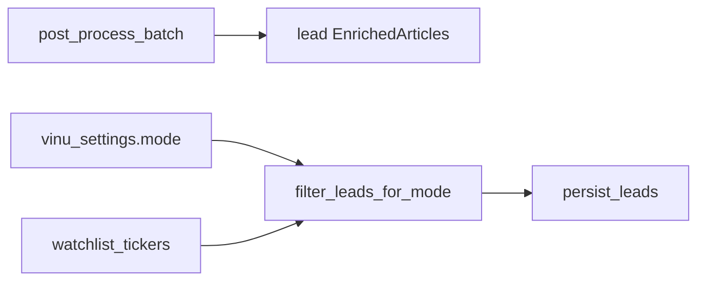

# Chapter 09 — Collection Filter (Ticker vs All Mode)

| Field | Value |
|-------|-------|
| **Package** | vinu-news |
| **Module** | `vinu_news/collection/filter.py` |
| **Status** | REVIEW |
| **Verified** | 2026-07-01 |
| **Prerequisites** | Ch 01, Ch 06 |

## Learning objectives

- Explain **ticker** mode vs **all** mode and when each persists articles.
- Trace `filter_leads_for_mode()` in RSS and ticker-news ingest paths.
- Predict which articles pass when watchlist and mentions disagree.

## 1. Problem this module solves

A full RSS poll can yield hundreds of enriched leads per cycle. Most operators only care about **watchlist symbols**. Collection mode `ticker` (default) filters leads before persist so SQLite stays focused; `all` mode saves every post-processed lead for broad research.

## 2. Position in pipeline



| Step | Input | Output |
|------|-------|--------|
| Post-process | Enriched batch | Lead articles only |
| Filter (`ticker`) | Leads + watchlist | Subset matching tickers |
| Filter (`all`) | Leads | Unchanged list |
| Persist | Filtered leads | SQLite inserts |

## 3. File map

| File | Responsibility |
|------|----------------|
| `collection/filter.py` | `filter_leads_for_mode()`, `article_matches_watchlist()` |
| `settings/store.py` | `mode` in `vinu_settings` |
| `watchlist/store.py` | `watchlist_tickers` table |
| `service.py` | Applies filter in both ingest methods |

## 4. Data contracts

### Input

| Field | Type | Required | Example |
|-------|------|----------|---------|
| `leads` | `list[EnrichedArticle]` | yes | Post-process output |
| `mode` | str | yes | `ticker` or `all` |
| `watchlist` | `set[str]` | yes for ticker | `{"AAPL","NVDA"}` |

### Output

| Field | Type | Example |
|-------|------|---------|
| Filtered leads | `list[EnrichedArticle]` | Same type, possibly shorter |
| Empty list | when ticker mode + empty watchlist | `[]` |

## 5. Logic (step by step)

`filter_leads_for_mode(leads, mode, watchlist)`:

1. If `mode != "ticker"` → return all `leads` unchanged.
2. If `watchlist` is empty → return `[]` (nothing persisted in ticker mode).
3. Uppercase watchlist for case-insensitive match.
4. For each lead, build two ticker sets:
   - **Mentions:** `{m.ticker}` from `article_ticker_mentions` junction rows.
   - **Article JSON:** parsed from `article.tickers` JSON column.
5. Keep lead if **either set** intersects watchlist (union match).
6. `article_matches_watchlist()` exposes the same predicate for single-article checks.

**Important:** Filter runs **after** enrichment/post-process but **before** `persist_leads()`. Analysis still runs on the full batch in memory; only DB writes are gated.

## 6. Configuration

| Key | YAML/env | Default | Effect |
|-----|----------|---------|--------|
| `mode` | `vinu_settings` / `VINU_NEWS_MODE` | `ticker` | Enables filter |
| Watchlist | `watchlist_tickers` table | `[]` | Match targets |
| `poll_interval_sec` | settings | `600` | Unrelated to filter |

Patch mode via API:

```bash
curl -X PATCH http://127.0.0.1:8080/settings \
  -H "Content-Type: application/json" \
  -d '{"mode":"all"}'
```

## 7. Worked examples

### Example A — happy path (ticker mode match)

Watchlist: `["NVDA"]`. Article mentions `NVDA` in junction table:

```python
from vinu_news.collection.filter import filter_leads_for_mode

filtered = filter_leads_for_mode(leads, "ticker", {"NVDA"})
# len(filtered) == 1 if lead mentions NVDA
```

### Example B — edge case (empty watchlist)

```python
filtered = filter_leads_for_mode(leads, "ticker", set())
assert filtered == []  # nothing saved
```

### Example C — match via JSON tickers only

Article has `tickers='["AAPL"]'` but empty `mentions` list — still passes for watchlist `{"AAPL"}`.

### Example D — all mode bypass

```python
assert filter_leads_for_mode(leads, "all", set()) == leads
```

## 8. API / CLI (if applicable)

| Method | Path / Command | Params | Response |
|--------|----------------|--------|----------|
| GET | `/settings` | — | Current `mode` |
| PATCH | `/settings` | `mode` | Updated settings |
| POST | `/watchlist/tickers` | `tickers[]` | Defines filter targets |
| CLI | `vinu-news-ingest --once` | — | Report shows `leads_before_filter` / `after` |

## 9. SQL / queries (if applicable)

Compare article count by mode (after switching to `all` and re-ingesting):

```sql
SELECT COUNT(*) FROM articles;

SELECT ticker, COUNT(*) AS cnt
FROM article_ticker_mentions
GROUP BY ticker
ORDER BY cnt DESC
LIMIT 10;
```

Ingest summary fields from `IngestionCycleResult`:

| Field | Meaning |
|-------|---------|
| `leads_before_filter` | Post-process lead count |
| `leads_after_filter` | After collection filter |
| `watchlist_size` | Tickers in watchlist |

## 10. Tests

| Test file | Asserts |
|-----------|---------|
| `tests/test_filter.py` | all/ticker modes, empty watchlist, mention vs JSON |
| `tests/test_ingest_filter.py` | End-to-end persist with ticker mode |

## 11. Troubleshooting

| Symptom | Likely cause | Action |
|---------|--------------|--------|
| `inserted=0` always | Ticker mode + empty watchlist | Add tickers or switch to `all` |
| Expected ticker missing | No regex match in headline | Check enrichment tickers |
| Too many articles | `all` mode | Switch to `ticker` |
| `leads_after_filter` << before | Working as designed | Expand watchlist |

## 12. Fincept / reference repo mapping

| Fincept reference | Implementation |
|-------------------|----------------|
| Portfolio-focused news collection | `ticker` mode + watchlist |
| Full firehose research | `all` mode |
| Symbol tagging | `article_ticker_mentions` + `tickers` JSON |

## 13. Related chapters

- [Chapter 01 — Install & First Run](../part-0-getting-started/ch01-install-first-run.md)
- [Chapter 08 — Ticker News Providers](ch08-ticker-news-providers.md)
- [Chapter 12b — Category, Tickers, Threat](../part-2-analysis/ch12b-category-tickers-threat.md)
- [Chapter 25 — Watchlist & Settings](../part-4-operations/ch25-watchlist-settings.md)
- [Chapter 26 — Service Facade](../part-4-operations/ch26-service-facade.md)
