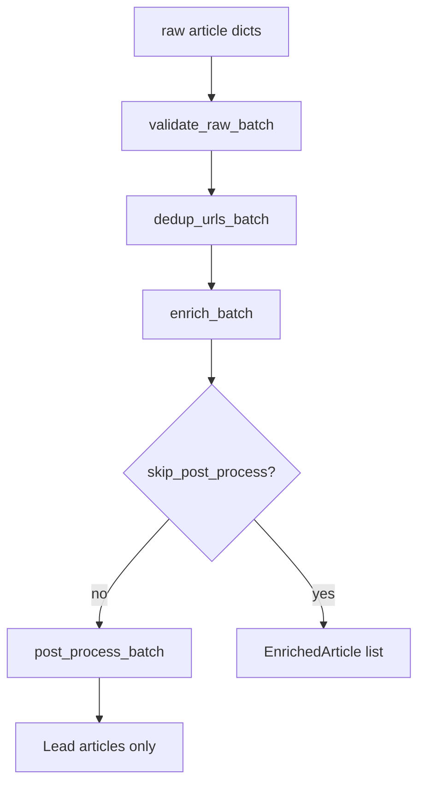

# Chapter 10 — Pipeline Overview

| Field | Value |
|-------|-------|
| **Package** | vinu-news |
| **Module** | `vinu_news/analysis/pipeline.py` |
| **Status** | REVIEW |
| **Verified** | 2026-07-01 |
| **Prerequisites** | Ch 06, Ch 02 |

## Learning objectives

- Map the analysis pipeline stages from raw dict to persist-ready leads.
- Use `process_batch()` programmatically with and without post-process.
- Interpret `ProcessResult` counters for debugging dedup behavior.

## 1. Problem this module solves

Raw RSS dicts are not ready for storage or research. The analysis package validates, deduplicates URLs, applies nine rule-based enrichment stages, post-processes with NER and cosine dedup, and outputs **lead articles only**. `pipeline.py` orchestrates steps 2–5 in a single call used by ingestion and tests.

## 2. Position in pipeline



| Step | Input | Output |
|------|-------|--------|
| Validate | Raw list | Rows with headline, link, source |
| URL dedup | Valid list | First normalized link per batch |
| Enrich | Deduped list | `EnrichedArticle` per row |
| Post-process | Enriched list | Leads only + cluster stats |
| Persist (external) | Leads | SQLite (see Ch 14) |

## 3. File map

| File | Responsibility |
|------|----------------|
| `analysis/pipeline.py` | `process_batch()`, `ProcessResult` |
| `analysis/pre_enrichment/validate_raw.py` | Required field checks |
| `analysis/pre_enrichment/url_dedup.py` | In-batch URL normalization |
| `analysis/enrichment/enrich.py` | Nine-stage enrichment |
| `analysis/post_enrichment/post_process.py` | NER, dedup, lead pick |
| `analysis/storage/persist.py` | DB writes (called after pipeline) |

## 4. Data contracts

### Input

| Field | Type | Required | Example |
|-------|------|----------|---------|
| `raw_articles` | list[dict] | yes | From RSS parser |
| `skip_post_process` | bool | no | `False` (default) |

### Output

`ProcessResult`:

| Field | Type | Example |
|-------|------|---------|
| `articles` | list[EnrichedArticle] | Leads (or all enriched if skip) |
| `validated_count` | int | `100` |
| `enriched_count` | int | `95` |
| `url_dedup_dropped` | int | `5` |
| `clusters_found` | int | `12` |
| `duplicates_dropped` | int | `30` |
| `post_process_applied` | bool | `True` |

## 5. Logic (step by step)

1. `validate_raw_batch()` — require non-empty `headline`, `link`, `source`; drop invalid.
2. `dedup_urls_batch()` — normalize URL (lowercase host, strip trailing `/`); first wins.
3. `enrich_batch()` — run 9 stages per article (Ch 12).
4. Unless `skip_post_process=True`:
   - NER → `entities_json`
   - Synonym normalize → `norm_text`
   - Cosine cluster + merge gates
   - Lead pick per cluster
5. Return leads in `ProcessResult.articles`.
6. Caller (`run_ingestion` or tests) passes leads to `persist_leads()`.

**Design principle:** Post-process is DB-free; cross-batch dedup only at persist.

## 6. Configuration

| Key | YAML/env | Default | Effect |
|-----|----------|---------|--------|
| `dedup.similarity_threshold` | `analysis.yaml` | `0.25` | In-batch merge |
| `dedup.thread_match_threshold` | `analysis.yaml` | `0.30` | Cross-batch (persist) |
| `lead_pick.prefer_recency_tiebreak` | `analysis.yaml` | `true` | Newest wins ties |
| `threads.headline_cleanup` | `analysis.yaml` | `true` | Prefix strip before vectorize |

## 7. Worked examples

### Example A — happy path (full pipeline)

```python
from vinu_news.analysis.pipeline import process_batch
from vinu_news.analysis.storage.persist import persist_leads
from vinu_news.analysis.storage.repository import NewsRepository

raw = [{
    "headline": "NVDA hits record high on AI demand",
    "summary": "NVIDIA stock rose after data center beat.",
    "link": "https://example.com/nvda-record",
    "pubDate": "Mon, 30 Jun 2026 14:00:00 GMT",
    "source": "REUTERS",
    "region": "US",
    "tier": 1,
}]

result = process_batch(raw)
with NewsRepository() as repo:
    pr = persist_leads(repo, result.articles)
    print(pr.inserted, pr.threads_created)
```

### Example B — edge case (skip post-process)

```python
result = process_batch(raw, skip_post_process=True)
# All enriched articles returned; clusters_found=0, duplicates_dropped=0
assert result.post_process_applied is False
assert len(result.articles) == result.enriched_count
```

Useful for testing enrichment stages in isolation.

## 8. API / CLI (if applicable)

Pipeline runs inside ingest — no dedicated HTTP route.

| Method | Path / Command | Params | Response |
|--------|----------------|--------|----------|
| POST | `/ingest/trigger` | — | Indirectly runs `process_batch` |
| CLI | `vinu-news-ingest --once` | — | Summary includes cluster stats |

## 9. SQL / queries (if applicable)

Verify pipeline output in DB:

```sql
SELECT id, headline, impact, sentiment, cluster_id, is_lead, thread_id
FROM articles
ORDER BY sort_ts DESC
LIMIT 10;
```

All stored rows have `is_lead = 1`.

## 10. Tests

| Test file | Asserts |
|-----------|---------|
| `analysis/tests/test_enrichment.py` | Pipeline + enrichment integration |
| `analysis/tests/test_post_process.py` | Full post-process batch |
| `analysis/tests/test_url_dedup.py` | URL dedup in pipeline |
| `rss/tests/test_ingestion_pipeline.py` | End-to-end with persist |

## 11. Troubleshooting

| Symptom | Likely cause | Action |
|---------|--------------|--------|
| `validated_count` << `raw_count` | Missing link/source | Check RSS parse |
| High `url_dedup_dropped` | Same URL multiple feeds | Expected in one poll |
| High `duplicates_dropped` | Syndicated stories | Tune similarity threshold |
| Empty `articles` after process | All failed validation | Inspect raw dicts |
| `skip_post_process` in prod | Debug flag left on | Always false in ingest |

## 12. Fincept / reference repo mapping

| Fincept reference | pipeline.py stage |
|-------------------|-------------------|
| Step 1.1 rule enrichment | `enrich_batch` |
| §4 NER + synonyms | `post_process_batch` |
| §5 Cosine dedup | In post-process |
| Lead-only persist | Non-leads dropped before persist |

~**95%** of Fincept Step 1 news stack implemented; on-demand LLM analyze (ch15), ticker news (ch08), and price reaction (ch16) are in place. LLM digest, scrapers, and trading hooks remain.

## 13. Related chapters

- [Chapter 06 — Ingestion Orchestration](../part-1-ingestion/ch06-ingestion-orchestration.md)
- [Chapter 11 — Pre-Enrichment](ch11-pre-enrichment.md)
- [Chapter 12 — Enrichment Overview](ch12-enrichment-overview.md)
- [Chapter 13 — Post-Enrichment](ch13-post-enrichment.md)
- [Chapter 14 — Story Threads & Persist](ch14-story-threads-persist.md)
