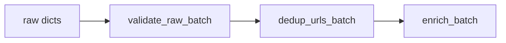

# Chapter 11 — Pre-Enrichment

| Field | Value |
|-------|-------|
| **Package** | vinu-news |
| **Module** | `vinu_news/analysis/pre_enrichment/` |
| **Status** | REVIEW |
| **Verified** | 2026-07-01 |
| **Prerequisites** | Ch 10, Ch 05 |

## Learning objectives

- Apply validation rules that drop malformed raw articles before enrichment cost.
- Explain in-batch URL deduplication and URL normalization rules.
- Diagnose high `url_dedup_dropped` counts in ingest logs.

## 1. Problem this module solves

RSS batches often contain broken entries (missing links) and duplicate URLs when multiple feeds syndicate the same story. Pre-enrichment runs **before** the nine rule stages to drop invalid rows and collapse duplicate links within a single poll — saving CPU and preventing double enrichment.

## 2. Position in pipeline



| Step | Input | Output |
|------|-------|--------|
| Validate | Raw list | Subset with required fields |
| URL dedup | Valid list | First occurrence per normalized link |

## 3. File map

| File | Responsibility |
|------|----------------|
| `pre_enrichment/validate_raw.py` | `validate_raw_batch()` |
| `pre_enrichment/url_dedup.py` | `dedup_urls_batch()`, `normalize_link()` |
| `analysis/storage/repository.py` | `normalize_link()` reused at persist |
| `analysis/pipeline.py` | Calls both before enrich |

## 4. Data contracts

### Input

| Field | Type | Required | Example |
|-------|------|----------|---------|
| `headline` | str | yes | Non-empty |
| `link` | str | yes | Non-empty URL |
| `source` | str | yes | Non-empty label |
| `summary` | str | no | May be empty |
| Other RSS fields | various | no | Passed through if valid |

### Output

| Field | Type | Example |
|-------|------|---------|
| Validated article | dict | Same shape as input |
| Dropped count | int | `url_dedup_dropped = len(validated) - len(deduped)` |

## 5. Logic (step by step)

### validate_raw.py

1. Iterate raw batch.
2. Require `headline`, `link`, `source` as non-empty strings.
3. Log and drop rows failing validation.
4. Return valid list.

### url_dedup.py

1. Normalize each `link`:
   - Lowercase hostname
   - Strip trailing `/`
   - Preserve query string
2. Track seen normalized links in batch order.
3. **First occurrence wins**; later duplicates dropped.
4. Cross-batch URL dedup happens later at persist via `link_exists()`.

## 6. Configuration

| Key | YAML/env | Default | Effect |
|-----|----------|---------|--------|
| Required fields | code | headline, link, source | Hard validation |
| URL normalization | `url_dedup.py` | lowercase host, strip `/` | Dedup key |

No YAML toggles for pre-enrichment — behavior is fixed and deterministic.

## 7. Worked examples

### Example A — happy path

```python
from vinu_news.analysis.pre_enrichment.validate_raw import validate_raw_batch
from vinu_news.analysis.pre_enrichment.url_dedup import dedup_urls_batch

raw = [
    {"headline": "Story A", "link": "https://Example.COM/path/", "source": "AP", "summary": ""},
    {"headline": "Story A dup", "link": "https://example.com/path", "source": "Reuters", "summary": ""},
    {"headline": "No link", "link": "", "source": "AP", "summary": ""},
]
valid = validate_raw_batch(raw)
deduped = dedup_urls_batch(valid)
print(len(raw), len(valid), len(deduped))  # 3, 2, 1
```

### Example B — edge case (persist-level URL skip)

In-batch dedup handles same poll; re-poll next cycle hits DB:

```python
from vinu_news.analysis.storage.repository import NewsRepository

with NewsRepository() as repo:
    exists = repo.link_exists("https://example.com/path")
    print(exists)  # True after first persist
```

Ingest logs show `url_skipped` (DB level), distinct from `url_dedup_dropped` (batch level).

## 8. API / CLI (if applicable)

Pre-enrichment has no direct API. Counters appear in ingest summary.

| Method | Path / Command | Params | Response |
|--------|----------------|--------|----------|
| POST | `/ingest/trigger` | — | `raw_count` vs inserts |
| CLI | `vinu-news-ingest --once` | — | `URL dedup dropped (batch): N` |

## 9. SQL / queries (if applicable)

Find duplicate links already in DB:

```sql
SELECT link, COUNT(*) AS cnt
FROM articles
GROUP BY link
HAVING cnt > 1;
```

Should return zero rows — link uniqueness enforced at persist.

```sql
SELECT headline, source, datetime(sort_ts, 'unixepoch') AS pub
FROM articles
WHERE link = 'https://example.com/path';
```

## 10. Tests

| Test file | Asserts |
|-----------|---------|
| `analysis/tests/test_url_dedup.py` | Normalization, first-wins |
| `analysis/tests/test_enrichment.py` | Validation drops bad rows |
| `analysis/tests/test_persist.py` | `link_exists` skip path |

## 11. Troubleshooting

| Symptom | Likely cause | Action |
|---------|--------------|--------|
| High validation drops | Feeds missing links | Fix feed or parser |
| High `url_dedup_dropped` | Syndication same poll | Expected |
| High `url_skipped` (not dedup) | Re-polling same URLs | Expected steady-state |
| Same story different URLs | Different links | Post-process cosine handles |

## 12. Fincept / reference repo mapping

| Fincept reference | Pre-enrichment |
|-------------------|----------------|
| Raw validation | Required field gate |
| URL dedup before enrich | `url_dedup.py` |
| Stable article id from link | SHA256(link) in enrichment |

## 13. Related chapters

- [Chapter 05 — Fetch & Parse](../part-1-ingestion/ch05-fetch-parse.md)
- [Chapter 10 — Pipeline Overview](ch10-pipeline-overview.md)
- [Chapter 12 — Enrichment Overview](ch12-enrichment-overview.md)
- [Chapter 14 — Story Threads & Persist](ch14-story-threads-persist.md)
