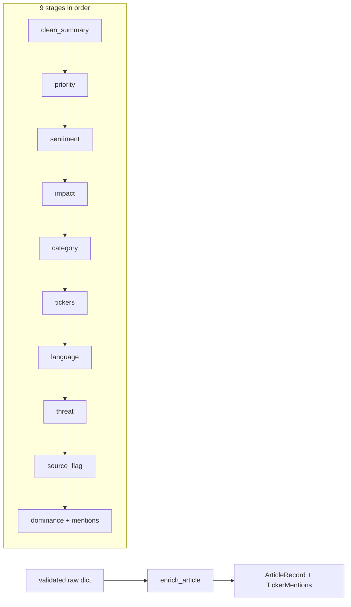

# Chapter 12 — Enrichment Overview

| Field | Value |
|-------|-------|
| **Package** | vinu-news |
| **Module** | `vinu_news/analysis/enrichment/` |
| **Status** | REVIEW |
| **Verified** | 2026-07-01 |
| **Prerequisites** | Ch 10, Ch 11 |

## Learning objectives

- List the nine enrichment stages and their execution order in `enrich.py`.
- Predict priority, sentiment, impact, and category for sample headlines.
- Understand ticker extraction limits and dominance scoring.

## 1. Problem this module solves

Raw RSS fields lack trading-relevant labels: urgency, sentiment, impact tier, tickers, threat, and source credibility. Enrichment applies **deterministic keyword rules** (no ML/LLM on ingest) to populate every column on `articles` before post-process and persist.

## 2. Position in pipeline



| Step | Input | Output |
|------|-------|--------|
| clean_summary | HTML summary | Max 300 char plain text |
| priority → impact | Headline + summary text | FLASH…ROUTINE, HIGH/MEDIUM/LOW |
| tickers | Text regex | Up to 5 symbols + dominance |
| All stages | Raw dict | `EnrichedArticle` |

## 3. File map

| File | Responsibility |
|------|----------------|
| `enrichment/enrich.py` | `enrich_article()`, `enrich_batch()` |
| `enrichment/summary_cleaner.py` | Strip HTML, truncate 300 chars |
| `enrichment/priority.py` | FLASH / URGENT / BREAKING / ROUTINE |
| `enrichment/sentiment.py` | BULLISH / BEARISH / NEUTRAL + score |
| `enrichment/impact.py` | HIGH / MEDIUM / LOW |
| `enrichment/category.py` | EARNINGS, CRYPTO, MARKETS, … |
| `enrichment/ticker_extractor.py` | `$TICKER` + uppercase regex |
| `enrichment/language.py` | Unicode script detection |
| `enrichment/threat.py` | Threat level + category + confidence |
| `enrichment/source_credibility.py` | `source_flag` 0/1/2 |
| `enrichment/ticker_dominance.py` | Normalized dominance scores |
| `enrichment/article_splitter.py` | `TickerMention` junction rows |

## 4. Data contracts

### Input

| Field | Type | Required | Example |
|-------|------|----------|---------|
| Raw article dict | dict | yes | From pre-enrichment |
| `source` | str | yes | Maps to credibility flag |

### Output

`ArticleRecord` columns (stored in `articles`):

| Field | Type | Example |
|-------|------|---------|
| `id` | TEXT | SHA256(link) |
| `priority` | TEXT | `URGENT` |
| `sentiment` | TEXT | `BEARISH` |
| `sentiment_score` | INTEGER | `-4` |
| `impact` | TEXT | `HIGH` |
| `category` | TEXT | `ECONOMIC` |
| `tickers` | TEXT | JSON array string |
| `lang` | TEXT | `en` |
| `threat_level` | TEXT | `Medium` |
| `threat_cat` | TEXT | `Regulatory` |
| `threat_conf` | REAL | `0.7` |
| `source_flag` | INTEGER | `0` |

Plus `mentions: list[TickerMention]` for junction table.

## 5. Logic (step by step)

Orchestration in `enrich.py`:

```
clean_summary → priority → sentiment → impact → category → tickers →
language → threat → source_flag → dominance → mentions
```

**Article ID:** `SHA256(link)` or `SHA256(headline:sort_ts)` if no link.

### Priority (first match wins)

| Level | Keywords |
|-------|----------|
| FLASH | breaking, alert |
| URGENT | urgent, emergency |
| BREAKING | announce, report |
| ROUTINE | default |

Example: `"URGENT ALERT: ECB bailout"` → **FLASH**.

### Sentiment

Weighted keyword lists (+3, +2, +1 positive; negative mirrored). Longest phrases first. Output: label + signed net score.

### Impact

```
HIGH   if priority in {FLASH, URGENT} or |score| >= 6
MEDIUM if priority == BREAKING or |score| >= 3
LOW    otherwise
```

### Category waterfall

EARNINGS, CRYPTO, DEFENSE, GEOPOLITICS, ECONOMIC, REGULATORY, TECH, MARKETS (default from feed).

### Tickers

- Regex: `$TICKER` and 1–5 letter uppercase symbols
- Stop-word filter (Fincept + extended NLP list)
- **Max 5 tickers** per article

### source_flag

| Flag | Value | Examples |
|------|-------|----------|
| NONE (trusted) | 0 | Reuters, AP, Bloomberg |
| STATE_MEDIA | 1 | XINHUA, RT, TASS |
| CAUTION | 2 | ZEROHEDGE, DAILY MAIL |

## 6. Configuration

| Key | YAML/env | Default | Effect |
|-----|----------|---------|--------|
| Keyword lists | Python modules | baked in | Priority, sentiment, category |
| Max tickers | `ticker_extractor.py` | `5` | Cap per article |
| Summary length | `summary_cleaner.py` | `300` | Truncation |
| Feed default category | `feeds.yaml` | per feed | Fallback category |

Enrichment thresholds are code-defined, not in `analysis.yaml` (dedup settings are separate).

## 7. Worked examples

### Example A — happy path

```python
from vinu_news.analysis.enrichment.enrich import enrich_article

raw = {
    "headline": "URGENT: Apple beats Q2 earnings, stock surges",
    "summary": "AAPL reported record iPhone revenue.",
    "link": "https://example.com/aapl-q2",
    "pubDate": "Mon, 30 Jun 2026 16:00:00 GMT",
    "source": "REUTERS",
    "region": "US",
    "tier": 1,
    "category": "MARKETS",
}
item = enrich_article(raw)
a = item.article
print(a.priority, a.sentiment, a.impact, a.category, a.tickers)
# FLASH or URGENT, BULLISH, HIGH, EARNINGS, '["AAPL"]'
```

### Example B — edge case (ROUTINE but HIGH impact via sentiment)

```python
raw = {
    "headline": "Market crash fears grow as banks tumble",
    "summary": "Heavy losses, recession risk, crisis deepening.",
    "link": "https://example.com/crash",
    "pubDate": "Mon, 30 Jun 2026 10:00:00 GMT",
    "source": "REUTERS",
    "region": "US",
    "tier": 1,
}
item = enrich_article(raw)
# priority may be ROUTINE but |sentiment_score| >= 6 → impact HIGH
print(item.article.priority, item.article.impact, item.article.sentiment_score)
```

## 8. API / CLI (if applicable)

Enrichment runs inside ingest. Query enriched fields via read API:

| Method | Path / Command | Params | Response |
|--------|----------------|--------|----------|
| GET | `/high-impact` | `hours`, `sentiment` | HIGH impact articles |
| GET | `/ticker/{symbol}` | `days`, `limit` | Ticker-filtered news |
| CLI | `vinu-news-query ticker NVDA --days 7` | — | Enriched rows |

## 9. SQL / queries (if applicable)

```sql
SELECT headline, priority, sentiment, impact, category, tickers
FROM articles
WHERE impact = 'HIGH'
  AND sort_ts >= strftime('%s', 'now', '-1 day')
ORDER BY sort_ts DESC;

SELECT sentiment, COUNT(*) AS cnt
FROM articles
WHERE sort_ts >= strftime('%s', 'now', '-7 days')
GROUP BY sentiment;
```

## 10. Tests

| Test file | Asserts |
|-----------|---------|
| `analysis/tests/test_enrichment.py` | All 9 stages + edge cases |
| `analysis/tests/test_enrichment.py` | Pipeline integration |

## 11. Troubleshooting

| Symptom | Likely cause | Action |
|---------|--------------|--------|
| Wrong category | Keyword miss | Check headline keywords |
| Too many tickers | Common words | Stop-word filter should cap |
| FALSE ticker match | Short uppercase word | Review stop-word list |
| Sentiment always NEUTRAL | No keyword hits | Expected for dry headlines |
| source_flag wrong | Source label mismatch | Match feeds.yaml `source` strings |

## 12. Fincept / reference repo mapping

| Fincept reference | Module |
|-------------------|--------|
| `step_1_1_news.md` rule enrichment | All 9 stages in `enrichment/` |
| Ticker extraction | `ticker_extractor.py` |
| Source credibility | `source_credibility.py` |
| Extensions | `ticker_dominance`, `article_ticker_mentions` |

## 13. Related chapters

- [Chapter 10 — Pipeline Overview](ch10-pipeline-overview.md)
- [Chapter 11 — Pre-Enrichment](ch11-pre-enrichment.md)
- [Chapter 13 — Post-Enrichment](ch13-post-enrichment.md)
- [Chapter 18 — articles & threads](../part-3-data/ch18-table-articles-threads.md)
