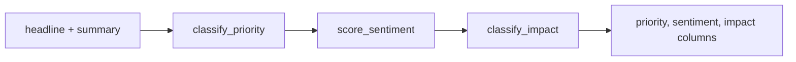

# Chapter 12a — Priority, Sentiment & Impact

| Field | Value |
|-------|-------|
| **Package** | vinu-news |
| **Module** | `vinu_news/analysis/enrichment/priority.py`, `sentiment.py`, `impact.py` |
| **Status** | REVIEW |
| **Verified** | 2026-07-01 |
| **Prerequisites** | Ch 12 |

## Learning objectives

- Apply the priority waterfall (FLASH → ROUTINE) to sample headlines.
- Compute weighted sentiment scores and derived BULLISH/BEARISH/NEUTRAL labels.
- Derive HIGH/MEDIUM/LOW impact from priority and sentiment strength.

## 1. Problem this module solves

Traders need **urgency** (priority), **directional tone** (sentiment), and **materiality** (impact) before reading full articles. These three stages run early in enrichment on combined headline + cleaned summary text, using deterministic keyword rules from Fincept Section 6C–6E.

## 2. Position in pipeline



| Step | Input | Output |
|------|-------|--------|
| Priority | combined text | `FLASH`…`ROUTINE` |
| Sentiment | combined text | label + `sentiment_score` |
| Impact | priority + score | `HIGH` / `MEDIUM` / `LOW` |

## 3. File map

| File | Responsibility |
|------|----------------|
| `enrichment/priority.py` | `classify_priority()` |
| `enrichment/sentiment.py` | `score_sentiment()` |
| `enrichment/impact.py` | `classify_impact()` |
| `enrichment/enrich.py` | Orchestrates stages 2–4 |

## 4. Data contracts

### Input

| Field | Type | Required | Example |
|-------|------|----------|---------|
| `combined_text` | str | yes | `"URGENT: Apple beats earnings"` |
| `priority` | str | for impact | `FLASH` |
| `sentiment_score` | int | for impact | `-7` |

### Output

| Field | Type | Example |
|-------|------|---------|
| `priority` | TEXT | `URGENT` |
| `sentiment` | TEXT | `BULLISH` |
| `sentiment_score` | INTEGER | `4` |
| `impact` | TEXT | `HIGH` |

## 5. Logic (step by step)

### Priority (`classify_priority`)

First keyword match wins (waterfall):

| Level | Keywords |
|-------|----------|
| FLASH | `breaking`, `alert` |
| URGENT | `urgent`, `emergency` |
| BREAKING | `announce`, `report` |
| ROUTINE | default |

`"URGENT ALERT: ECB bailout"` → **FLASH** (FLASH checked before URGENT).

### Sentiment (`score_sentiment`)

- Merges `POSITIVE_WORDS` (+1/+2/+3) and `NEGATIVE_WORDS` (-1/-2/-3).
- Sorts keywords by length descending to prefer multi-word phrases.
- `net = pos_total - neg_total`.
- Label: `BULLISH` if net ≥ 1; `BEARISH` if net ≤ -1; else `NEUTRAL`.

### Impact (`classify_impact`)

```
strength = abs(sentiment_score)
HIGH   if priority in {FLASH, URGENT} OR strength >= 6
MEDIUM if priority == BREAKING OR strength >= 3
LOW    otherwise
```

## 6. Configuration

| Key | YAML/env | Default | Effect |
|-----|----------|---------|--------|
| Keyword lists | Python constants | baked in | Not in `analysis.yaml` |
| `HIGH_SENTIMENT_THRESHOLD` | `impact.py` | `6` | HIGH via sentiment alone |
| `MEDIUM_SENTIMENT_THRESHOLD` | `impact.py` | `3` | MEDIUM via sentiment |

## 7. Worked examples

### Example A — happy path (earnings beat)

```python
from vinu_news.analysis.enrichment.priority import classify_priority
from vinu_news.analysis.enrichment.sentiment import score_sentiment
from vinu_news.analysis.enrichment.impact import classify_impact

text = "URGENT: Apple beats Q2 earnings, stock surges"
priority = classify_priority(text)          # FLASH or URGENT
sent = score_sentiment(text)              # BULLISH, positive net
impact = classify_impact(priority, sent["sentiment_score"])  # HIGH
```

### Example B — edge case (ROUTINE priority, HIGH impact via sentiment)

```python
text = "Market crash fears grow as banks tumble, recession crisis deepens"
priority = classify_priority(text)   # likely ROUTINE
sent = score_sentiment(text)         # BEARISH, |score| may be >= 6
impact = classify_impact(priority, sent["sentiment_score"])  # HIGH
```

### Example C — neutral dry headline

```python
text = "Company schedules annual shareholder meeting"
sent = score_sentiment(text)
# sentiment NEUTRAL, impact LOW unless BREAKING keyword present
```

## 8. API / CLI (if applicable)

Exposed on stored articles and read routes:

| Method | Path / Command | Params | Response |
|--------|----------------|--------|----------|
| GET | `/high-impact` | `hours`, `sentiment` | Articles with `impact=HIGH` |
| GET | `/latest` | `limit` | Includes priority/sentiment fields |
| SQL | `SELECT priority, sentiment, impact ...` | — | Direct query |

## 9. SQL / queries (if applicable)

Impact distribution last 24h:

```sql
SELECT impact, COUNT(*) AS cnt
FROM articles
WHERE sort_ts >= strftime('%s', 'now', '-1 day')
GROUP BY impact;
```

High-impact bearish headlines:

```sql
SELECT headline, priority, sentiment_score
FROM articles
WHERE impact = 'HIGH' AND sentiment = 'BEARISH'
ORDER BY sort_ts DESC
LIMIT 20;
```

## 10. Tests

| Test file | Asserts |
|-----------|---------|
| `tests/analysis/test_enrichment.py` | Priority waterfall, sentiment weights, impact thresholds |

## 11. Troubleshooting

| Symptom | Likely cause | Action |
|---------|--------------|--------|
| Everything ROUTINE | No urgency keywords | Expected for calm headlines |
| Sentiment always NEUTRAL | No keyword hits | Add terms or use LLM (Ch 15) |
| HIGH impact surprises | Strong sentiment without FLASH | Check `|sentiment_score| >= 6` |
| FLASH on benign text | Substring match (`alert` in word) | Rare; review headline |

## 12. Fincept / reference repo mapping

| Fincept reference | Module |
|-------------------|--------|
| Section 6C — priority | `priority.py` |
| Section 6D — sentiment | `sentiment.py` |
| Section 6E — impact | `impact.py` |

## 13. Related chapters

- [Chapter 12 — Enrichment Overview](ch12-enrichment-overview.md)
- [Chapter 12b — Category, Tickers, Threat](ch12b-category-tickers-threat.md)
- [Chapter 12c — Credibility, Language, Summary](ch12c-credibility-language.md)
- [Chapter 18 — articles & threads](../part-3-data/ch18-table-articles-threads.md)
