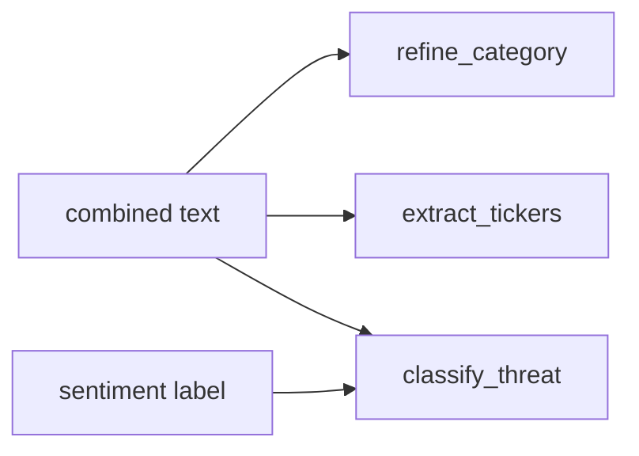

# Chapter 12b — Category, Tickers & Threat

| Field | Value |
|-------|-------|
| **Package** | vinu-news |
| **Module** | `vinu_news/analysis/enrichment/category.py`, `ticker_extractor.py`, `threat.py` |
| **Status** | REVIEW |
| **Verified** | 2026-07-01 |
| **Prerequisites** | Ch 12, Ch 12a |

## Learning objectives

- Apply the category keyword waterfall and feed-default fallback.
- Extract up to five tickers with stop-word filtering.
- Classify threat level, category, and confidence from pattern matrix.

## 1. Problem this module solves

Beyond urgency and sentiment, articles need **sector labels**, **tradeable symbols**, and **risk severity** for filtering and alerts. These stages use rule-based pattern matching (Fincept 6B, 6F, 6H) with no external NLP models on ingest.

## 2. Position in pipeline



| Step | Input | Output |
|------|-------|--------|
| Category | text + feed default | `EARNINGS`, `CRYPTO`, … |
| Tickers | headline + summary | up to 5 symbols |
| Threat | text + sentiment | level, cat, confidence |

## 3. File map

| File | Responsibility |
|------|----------------|
| `enrichment/category.py` | `refine_category()` |
| `enrichment/ticker_extractor.py` | `extract_tickers()` |
| `enrichment/threat.py` | `classify_threat()`, `THREAT_PATTERNS` |
| `enrichment/ticker_dominance.py` | Post-ticker scoring (Ch 12) |
| `enrichment/article_splitter.py` | `TickerMention` rows |

## 4. Data contracts

### Input

| Field | Type | Required | Example |
|-------|------|----------|---------|
| `combined_text` | str | yes | Headline + cleaned summary |
| `default` category | str | yes | From `feeds.yaml` |
| `sentiment` | str | for threat fallback | `BEARISH` |

### Output

| Field | Type | Example |
|-------|------|---------|
| `category` | TEXT | `ECONOMIC` |
| `tickers` | TEXT (JSON array) | `["AAPL","MSFT"]` |
| `threat_level` | TEXT | `HIGH` |
| `threat_cat` | TEXT | `market` |
| `threat_conf` | REAL | `0.75` |

## 5. Logic (step by step)

### Category waterfall

First matching group wins; else feed default (usually `MARKETS`):

| Category | Sample keywords |
|----------|-----------------|
| EARNINGS | `earnings`, `eps`, `guidance` |
| CRYPTO | `bitcoin`, `ethereum` |
| DEFENSE | `pentagon`, `military` |
| ECONOMIC | `fed`, `inflation`, `gdp` |
| MARKETS | `nasdaq`, `stock market` |
| ENERGY | `opec`, `crude` |
| TECH | `semiconductor`, ` ai ` |
| GEOPOLITICS | `ukraine`, `sanctions` |

### Ticker extraction

- Regex: `\b[A-Z]{2,5}\b` on headline + summary.
- Skip `TICKER_STOP_WORDS` (`THE`, `SEC`, `GDP`, `CEO`, …).
- **Max 5** unique symbols, first-seen order.

### Threat classification

- Scan `THREAT_PATTERNS` in list order (Critical patterns first).
- First substring match returns `threat_level`, `threat_cat`, `threat_conf`.
- No match + `BEARISH` sentiment → `LOW` / `general` / `0.40`.
- No match otherwise → `INFO` / `general` / `0.30`.

Sample critical patterns: `nuclear strike`, `market crash`, `circuit breaker`.

## 6. Configuration

| Key | YAML/env | Default | Effect |
|-----|----------|---------|--------|
| `MAX_TICKERS` | `ticker_extractor.py` | `5` | Cap per article |
| Feed `category` | `feeds.yaml` | `MARKETS` | Category fallback |
| `THREAT_PATTERNS` | `threat.py` | ordered list | First match wins |

## 7. Worked examples

### Example A — happy path (earnings + ticker)

```python
from vinu_news.analysis.enrichment.category import refine_category
from vinu_news.analysis.enrichment.ticker_extractor import extract_tickers
from vinu_news.analysis.enrichment.threat import classify_threat

headline = "AAPL beats Q2 earnings expectations"
summary = "Apple reported record iPhone revenue."
text = f"{headline} {summary}"

category = refine_category(text)           # EARNINGS
tickers = extract_tickers(headline, summary)  # includes AAPL
threat = classify_threat(text, "BULLISH")   # likely INFO fallback
```

### Example B — edge case (threat pattern)

```python
text = "Major cyberattack hits financial infrastructure"
threat = classify_threat(text, "BEARISH")
# threat_level HIGH, threat_cat cyber, threat_conf 0.80
```

### Example C — false ticker filtered

```python
tickers = extract_tickers("SEC probes trading desk", "")
# SEC is in stop words → not extracted
```

## 8. API / CLI (if applicable)

| Method | Path / Command | Params | Response |
|--------|----------------|--------|----------|
| GET | `/ticker/{symbol}` | `days`, `limit` | Articles with mention |
| GET | `/threads/active` | `hours` | Thread `category` field |
| SQL | junction query | — | `article_ticker_mentions` |

## 9. SQL / queries (if applicable)

Articles by threat level:

```sql
SELECT headline, threat_level, threat_cat, threat_conf
FROM articles
WHERE threat_level IN ('CRITICAL', 'HIGH')
ORDER BY sort_ts DESC
LIMIT 25;
```

Ticker mention counts:

```sql
SELECT ticker, COUNT(*) AS mentions
FROM article_ticker_mentions
GROUP BY ticker
ORDER BY mentions DESC
LIMIT 15;
```

## 10. Tests

| Test file | Asserts |
|-----------|---------|
| `tests/analysis/test_enrichment.py` | Category, tickers, threat cases |
| `tests/test_filter.py` | Ticker match for collection filter |

## 11. Troubleshooting

| Symptom | Likely cause | Action |
|---------|--------------|--------|
| Wrong category | Keyword miss | Check waterfall order |
| Ticker not found | Lowercase in headline | Regex needs uppercase |
| Spurious ticker | Common word | Extend stop-word list |
| Threat always INFO | No pattern match | Expected for neutral news |

## 12. Fincept / reference repo mapping

| Fincept reference | Module |
|-------------------|--------|
| Section 6B — category | `category.py` |
| Section 6F — tickers | `ticker_extractor.py` |
| Section 6H — threat matrix | `threat.py` |
| Extensions | `ticker_dominance`, `article_ticker_mentions` |

## 13. Related chapters

- [Chapter 12 — Enrichment Overview](ch12-enrichment-overview.md)
- [Chapter 12a — Priority, Sentiment, Impact](ch12a-priority-sentiment-impact.md)
- [Chapter 09 — Collection Filter](../part-1-ingestion/ch09-collection-filter.md)
- [Chapter 18 — articles & threads](../part-3-data/ch18-table-articles-threads.md)
