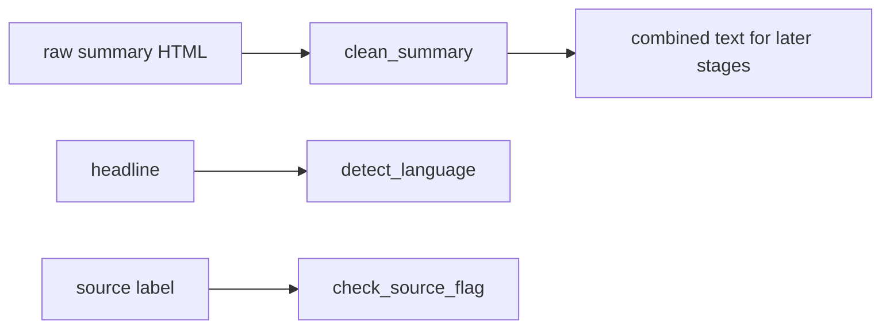

# Chapter 12c — Credibility, Language & Summary Cleaning

| Field | Value |
|-------|-------|
| **Package** | vinu-news |
| **Module** | `vinu_news/analysis/enrichment/source_credibility.py`, `language.py`, `summary_cleaner.py` |
| **Status** | REVIEW |
| **Verified** | 2026-07-01 |
| **Prerequisites** | Ch 12 |

## Learning objectives

- Map `source` strings to credibility flags (trusted, state media, caution).
- Detect headline language from Unicode script ranges.
- Strip HTML and truncate summaries to 300 characters.

## 1. Problem this module solves

Raw RSS summaries contain HTML tags; sources vary in editorial reliability; multilingual headlines need a **lang** tag for filtering. These three lightweight stages run at the start (summary) and middle (language, credibility) of enrichment without ML.

## 2. Position in pipeline



| Step | Input | Output |
|------|-------|--------|
| clean_summary | RSS summary | Plain text ≤300 chars |
| detect_language | headline | `en`, `ja`, `zh`, … |
| check_source_flag | `source` | `0`, `1`, or `2` |

## 3. File map

| File | Responsibility |
|------|----------------|
| `enrichment/summary_cleaner.py` | `clean_summary()` |
| `enrichment/language.py` | `detect_language()` |
| `enrichment/source_credibility.py` | `check_source_flag()` |
| `rss/config/feeds.yaml` | Canonical `source` strings |

## 4. Data contracts

### Input

| Field | Type | Required | Example |
|-------|------|----------|---------|
| `summary` raw | str | yes | `"<p>Markets rose...</p>"` |
| `headline` | str | yes | `"美联储降息"` |
| `source` | str | yes | `REUTERS` |

### Output

| Field | Type | Example |
|-------|------|---------|
| `summary` (stored) | TEXT | Cleaned plain text |
| `lang` | TEXT | `en` |
| `source_flag` | INTEGER | `0` |

### source_flag values

| Flag | Value | Sources |
|------|-------|---------|
| NONE (trusted) | 0 | Default |
| STATE_MEDIA | 1 | XINHUA, RT, TASS, … |
| CAUTION | 2 | ZEROHEDGE, DAILY MAIL, … |

## 5. Logic (step by step)

### Summary cleaning

1. Strip HTML tags via regex `<[^>]*>`.
2. Collapse whitespace.
3. Truncate to `MAX_SUMMARY_LEN` (300).

### Language detection

1. Empty headline → `en`.
2. Kana → `ja`; Hangul → `ko` (checked first).
3. Count CJK, Cyrillic, Arabic, Devanagari code points.
4. If any script > 10% of headline length → that lang code.
5. Default `en`.

### Source credibility

Uppercase-trim `source`; lookup in `STATE_MEDIA_SOURCES` then `CAUTION_SOURCES`; else `0`.

## 6. Configuration

| Key | YAML/env | Default | Effect |
|-----|----------|---------|--------|
| `MAX_SUMMARY_LEN` | `summary_cleaner.py` | `300` | Stored summary cap |
| `MAJORITY_THRESHOLD` | `language.py` | `0.10` | Script detection threshold |
| `source` in feeds | `feeds.yaml` | per feed | Must match credibility sets |

## 7. Worked examples

### Example A — happy path (HTML summary)

```python
from vinu_news.analysis.enrichment.summary_cleaner import clean_summary

raw = "<p><b>Fed</b> holds rates steady.</p> More text " * 50
cleaned = clean_summary(raw)
assert "<" not in cleaned
assert len(cleaned) <= 300
```

### Example B — edge case (state media flag)

```python
from vinu_news.analysis.enrichment.source_credibility import (
    check_source_flag, SOURCE_FLAG_STATE_MEDIA,
)

assert check_source_flag("TASS") == SOURCE_FLAG_STATE_MEDIA
assert check_source_flag("REUTERS") == 0
```

### Example C — language scripts

```python
from vinu_news.analysis.enrichment.language import detect_language

assert detect_language("東京株式市場") == "ja"
assert detect_language("Apple stock rises") == "en"
```

## 8. API / CLI (if applicable)

| Method | Path / Command | Params | Response |
|--------|----------------|--------|----------|
| GET | `/latest` | — | `summary`, `lang`, `source_flag` in rows |
| SQL | filter by lang | — | `WHERE lang = 'en'` |

## 9. SQL / queries (if applicable)

Flagged sources last week:

```sql
SELECT source, source_flag, COUNT(*) AS cnt
FROM articles
WHERE source_flag > 0
  AND sort_ts >= strftime('%s', 'now', '-7 days')
GROUP BY source, source_flag;
```

Non-English headlines:

```sql
SELECT headline, lang, source
FROM articles
WHERE lang != 'en'
ORDER BY sort_ts DESC
LIMIT 20;
```

## 10. Tests

| Test file | Asserts |
|-----------|---------|
| `tests/analysis/test_enrichment.py` | Summary strip, lang, source_flag |

## 11. Troubleshooting

| Symptom | Likely cause | Action |
|---------|--------------|--------|
| HTML in stored summary | Bypassed enrich | Should not happen on ingest |
| Wrong lang | Mixed scripts | 10% threshold may pick secondary |
| source_flag always 0 | Source string mismatch | Align `feeds.yaml` with lookup sets |
| Truncated mid-word | 300 char cap | Expected behavior |

## 12. Fincept / reference repo mapping

| Fincept reference | Module |
|-------------------|--------|
| Section 6A — summary clean | `summary_cleaner.py` |
| Section 6G — language | `language.py` |
| Section 6I — credibility | `source_credibility.py` |

## 13. Related chapters

- [Chapter 12 — Enrichment Overview](ch12-enrichment-overview.md)
- [Chapter 12a — Priority, Sentiment, Impact](ch12a-priority-sentiment-impact.md)
- [Chapter 04 — feeds.yaml](../part-1-ingestion/ch04-feeds-yaml.md)
- [Chapter 18 — articles & threads](../part-3-data/ch18-table-articles-threads.md)
