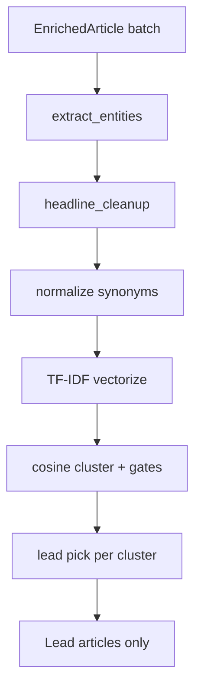

# Chapter 13 — Post-Enrichment

| Field | Value |
|-------|-------|
| **Package** | vinu-news |
| **Module** | `vinu_news/analysis/post_enrichment/` |
| **Status** | REVIEW |
| **Verified** | 2026-07-01 |
| **Prerequisites** | Ch 10, Ch 12 |

## Learning objectives

- Describe the post-process pipeline: NER, synonyms, cosine dedup, lead pick.
- Explain merge gates that prevent earnings beat/miss false merges.
- Tune `analysis.yaml` dedup thresholds for your feed mix.

## 1. Problem this module solves

After enrichment, a single poll may contain dozens of syndicated versions of the same story. Post-enrichment runs **in memory** (no DB): extracts entities, normalizes text for similarity, clusters duplicates via TF-IDF cosine similarity, and selects one **lead** per cluster using a multi-key score. Non-leads never reach persist.

## 2. Position in pipeline



| Step | Input | Output |
|------|-------|--------|
| NER | Headline + summary | `entities_json` on article |
| Synonyms | Text | `norm_text` on EnrichedArticle |
| Cosine dedup | norm_text vectors | Clusters with `cluster_id` |
| Lead pick | Cluster members | Single winner per cluster |

## 3. File map

| File | Responsibility |
|------|----------------|
| `post_enrichment/post_process.py` | `post_process_batch()` orchestrator |
| `post_enrichment/headline_cleanup.py` | Strip BREAKING:/UPDATE: prefixes |
| `post_enrichment/synonyms/synonym_map.py` | Domain term mappings |
| `post_enrichment/synonyms/normalize.py` | Longest-match replacement |
| `post_enrichment/ner/extract_entities.py` | People + country dictionaries |
| `post_enrichment/cosine_dedup/vectorize.py` | TF-IDF vectors |
| `post_enrichment/cosine_dedup/cluster.py` | Greedy clustering |
| `post_enrichment/cosine_dedup/gates.py` | Ticker/entity overlap, polarity |
| `post_enrichment/lead_pick/select_lead.py` | Multi-key scoring |

## 4. Data contracts

### Input

| Field | Type | Required | Example |
|-------|------|----------|---------|
| `EnrichedArticle` | dataclass | yes | From enrich_batch |
| `analysis.yaml` dedup settings | dict | yes | Loaded via settings_loader |

### Output

| Field | Type | Example |
|-------|------|---------|
| Lead articles | list[EnrichedArticle] | Subset of input |
| `entities_json` | TEXT | `{"people":["Jerome Powell"],"countries":["US"]}` |
| `norm_text` | str | On wrapper, not DB headline |
| `cluster_id` | TEXT | SHA256 of sorted member ids |
| `clusters_found` | int | Post-process stat |
| `duplicates_dropped` | int | Non-lead count |

## 5. Logic (step by step)

For each enriched article:

1. **NER** — rule dictionaries (`people_map.py`, `country_map.py`) → `entities_json`.
2. **Headline cleanup** (if `threads.headline_cleanup: true`) — strip `BREAKING:`, `UPDATE:`, `[bracket]` prefixes.
3. **Synonym normalize** — longest-match replacement (rates, sanctions, earnings, M&A, macro, crypto); lowercase; collapse whitespace → `norm_text`.
4. **Vectorize** — TF-IDF: `(term_count/total) * (ln((N+1)/(DF+1)) + 1)`.
5. **Cluster** — greedy assign to first cluster where cosine ≥ threshold AND merge gate passes.
6. **Lead pick** — highest score tuple wins (see below).

### Merge gates (`gates.py`)

- Require primary ticker overlap OR entity overlap (when enabled)
- Block polarity conflicts: earnings_beat vs earnings_miss pairs
- If no ticker and no entities on both sides → allow merge

### Lead pick score (higher wins)

| Key | Order |
|-----|-------|
| priority | FLASH(4) > URGENT(3) > BREAKING(2) > ROUTINE(1) |
| impact | HIGH(3) > MEDIUM(2) > LOW(1) |
| source_flag | 0(3) > 1(2) > 2(1) |
| tier | Lower tier number wins (1 beats 4) |
| sort_ts | Recency tie-break if enabled |

**DB stores original headline** — synonyms affect dedup only.

## 6. Configuration

| Key | YAML/env | Default | Effect |
|-----|----------|---------|--------|
| `dedup.similarity_threshold` | `analysis.yaml` | `0.25` | In-batch cosine merge |
| `dedup.require_ticker_or_entity_overlap` | `analysis.yaml` | `true` | Merge gate |
| `lead_pick.prefer_recency_tiebreak` | `analysis.yaml` | `true` | Newest wins ties |
| `threads.headline_cleanup` | `analysis.yaml` | `true` | Prefix strip before vectorize |

### Tuning guide

| Symptom | Adjustment |
|---------|------------|
| Too many false duplicate merges | Raise `similarity_threshold` to 0.30–0.35 |
| Same story not merging in-batch | Lower threshold slightly |
| Apple beat/miss merged wrongly | Keep overlap gate enabled |
| Wrong lead headline | Check tier/source; enable recency tiebreak |

## 7. Worked examples

### Example A — happy path

```python
from vinu_news.analysis.enrichment.enrich import enrich_batch
from vinu_news.analysis.post_enrichment.post_process import post_process_batch

raw = [
    {"headline": "Fed holds rates steady", "link": "https://a.com/1", "source": "REUTERS",
     "summary": "FOMC unchanged.", "pubDate": "Mon, 30 Jun 2026 12:00:00 GMT", "region": "US", "tier": 1},
    {"headline": "Federal Reserve keeps rates unchanged", "link": "https://b.com/2", "source": "AP",
     "summary": "Powell speaks.", "pubDate": "Mon, 30 Jun 2026 12:05:00 GMT", "region": "US", "tier": 1},
]
enriched = enrich_batch(raw)
result = post_process_batch(enriched)
print(result.clusters_found, result.duplicates_dropped, len(result.articles))
# 1, 1, 1
```

### Example B — edge case (beat vs miss gate blocks merge)

Two Apple headlines with opposite earnings polarity should **not** cluster when gates are active — they remain separate leads (or single-article clusters).

```python
# After enrich_batch with beat vs miss headlines:
result = post_process_batch(enriched)
# clusters_found reflects separate groups; duplicates_dropped lower than ungated
```

Verify with `analysis/tests/test_cluster_gates.py`.

## 8. API / CLI (if applicable)

Post-process is internal. Indirect metrics via ingest:

| Method | Path / Command | Params | Response |
|--------|----------------|--------|----------|
| POST | `/ingest/trigger` | — | Pipeline runs post-process |
| CLI | `vinu-news-ingest --once` | — | `Clusters found`, `Duplicates dropped` |

## 9. SQL / queries (if applicable)

Leads stored with cluster and entity metadata:

```sql
SELECT headline, cluster_id, entities_json, source, tier
FROM articles
WHERE cluster_id IS NOT NULL
ORDER BY sort_ts DESC
LIMIT 10;

SELECT cluster_id, COUNT(*) AS members
FROM articles
GROUP BY cluster_id
HAVING members > 1;
```

Note: non-leads are not stored — multiple rows per `cluster_id` only if separate persist events.

## 10. Tests

| Test file | Asserts |
|-----------|---------|
| `analysis/tests/test_post_process.py` | Full batch |
| `analysis/tests/test_cosine_dedup.py` | TF-IDF clustering |
| `analysis/tests/test_cluster_gates.py` | Beat vs miss separation |
| `analysis/tests/test_synonyms.py` | Normalization |
| `analysis/tests/test_ner.py` | Entity extraction |
| `analysis/tests/test_headline_cleanup.py` | Prefix stripping |
| `analysis/tests/test_recency_lead.py` | Tie-break |

## 11. Troubleshooting

| Symptom | Likely cause | Action |
|---------|--------------|--------|
| High `duplicates_dropped` | Many syndicated feeds | Expected |
| Same story twice in DB | Different URLs + gate miss | Tune thread threshold (Ch 14) |
| Wrong lead selected | Tier/source/recency | Adjust lead_pick settings |
| Empty entities_json | No dictionary match | Extend people_map/country_map |
| Beat/miss merged | Gate disabled | Set `require_ticker_or_entity_overlap: true` |

## 12. Fincept / reference repo mapping

| Fincept reference | Post-enrichment |
|-------------------|-----------------|
| `news_intelligence_pipeline.md` §4 NER + synonyms | `ner/`, `synonyms/` |
| §5 Cosine dedup | `cosine_dedup/` |
| Lead selection | `lead_pick/` |
| Post-process DB-free design | Matches Fincept batch pattern |

## 13. Related chapters

- [Chapter 12 — Enrichment Overview](ch12-enrichment-overview.md)
- [Chapter 14 — Story Threads & Persist](ch14-story-threads-persist.md)
- [Chapter 17 — Schema Catalog](../part-3-data/ch17-schema-catalog.md)
- [Chapter 24 — Config & Environment](../part-4-operations/ch24-config-env.md)
