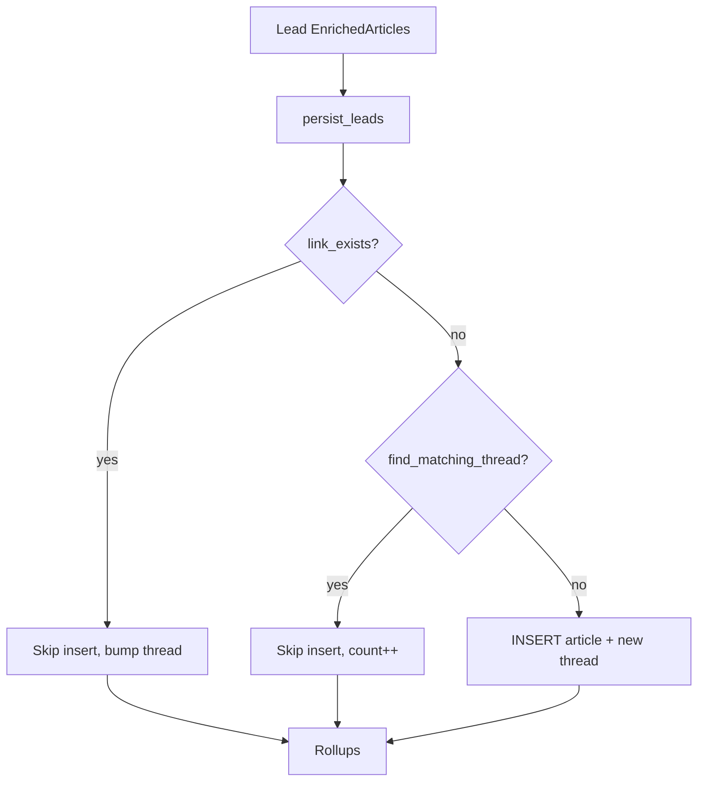

# Chapter 14 — Story Threads & Persist

| Field | Value |
|-------|-------|
| **Package** | vinu-news |
| **Module** | `vinu_news/analysis/storage/persist.py`, `storage/threading/` |
| **Status** | REVIEW |
| **Verified** | 2026-07-01 |
| **Prerequisites** | Ch 13, Ch 17 |

## Learning objectives

- Explain the three persist cases: new story, thread match, duplicate URL.
- Configure cross-batch thread matching (lookback, threshold, gates).
- Interpret `PersistResult` counters alongside daily rollups.

## 1. Problem this module solves

In-batch dedup only handles duplicates within one poll. Syndicated stories reappear across polls with different URLs. `persist_leads()` implements **cross-batch threading**: match new leads to active threads via TF-IDF cosine on `norm_text`, skip redundant article inserts while still updating rollups (`story_threads`, `thread_daily_snapshots`, `ticker_daily_stats`).

## 2. Position in pipeline



| Step | Input | Output |
|------|-------|--------|
| URL check | `link` | Skip or continue |
| Thread match | `norm_text`, active threads | Match or new thread |
| Insert | New story | `articles` + `story_threads` row |
| Rollups | Every persist event | Snapshots + ticker stats |

## 3. File map

| File | Responsibility |
|------|----------------|
| `storage/persist.py` | `persist_leads()`, `PersistResult` |
| `storage/threading/matcher.py` | `find_matching_thread()` |
| `storage/threading/assign.py` | `generate_thread_id()`, dominant ticker |
| `storage/repository.py` | `upsert_article()`, rollup helpers |
| `analysis/config/analysis.yaml` | Thread thresholds |

## 4. Data contracts

### Input

| Field | Type | Required | Example |
|-------|------|----------|---------|
| Lead `EnrichedArticle` | dataclass | yes | From post-process + mode filter |
| `norm_text` | str | yes | For thread matching |
| `link` | str | yes | URL dedup key |

### Output

`PersistResult`:

| Field | Type | Example |
|-------|------|---------|
| `inserted` | int | New `articles` rows |
| `url_skipped` | int | Duplicate link in DB |
| `thread_matched_skipped` | int | Matched existing thread |
| `threads_created` | int | New `story_threads` |
| `threads_updated` | int | Bumps / snapshot updates |

### Persist → table effects

| Event | `articles` | `story_threads` | `thread_daily_snapshots` | `ticker_daily_stats` |
|-------|------------|-----------------|--------------------------|----------------------|
| **New story** | INSERT | INSERT | UPSERT | UPSERT (if primary ticker) |
| **Thread match** | skip | count++, last_seen | UPSERT | UPSERT |
| **Duplicate URL** | skip | last_seen only | UPSERT | UPSERT |

## 5. Logic (step by step)

Decision flow in `persist_leads()`:

1. If `link_exists(link)` → skip insert; bump thread if known; update snapshots.
2. Else if `find_matching_thread(norm_text, …)` → skip insert; increment `article_count`; update snapshots.
3. Else → insert article + new thread + snapshots.

### Thread matcher (`matcher.py`)

- Loads active threads where `last_seen_at >= article.sort_ts - lookback_hours`
- Default lookback: **48 hours**
- Compares candidate `norm_text` to thread `norm_text` via TF-IDF cosine
- Cross-batch threshold: **0.30** (`thread_match_threshold`)
- Same merge gates as in-batch clustering

### Thread assign (`assign.py`)

- `generate_thread_id(norm_text, sort_ts, dominant_ticker)` — SHA256
- `dominant_ticker_from_mentions()` — primary mention or first ticker

## 6. Configuration

| Key | YAML/env | Default | Effect |
|-----|----------|---------|--------|
| `dedup.thread_match_threshold` | `analysis.yaml` | `0.30` | Cross-batch match (stricter than in-batch) |
| `dedup.lookback_hours` | `analysis.yaml` | `48` | Active thread window |
| `dedup.require_ticker_or_entity_overlap` | `analysis.yaml` | `true` | Thread merge gates |
| `VINU_NEWS_DB_PATH` | env | `./data/news.db` | SQLite target |

## 7. Worked examples

### Example A — happy path (programmatic persist)

```python
from vinu_news.analysis.pipeline import process_batch
from vinu_news.analysis.storage.persist import persist_leads
from vinu_news.analysis.storage.repository import NewsRepository

raw = [{"headline": "Oil prices surge on OPEC cut", "link": "https://ex.com/oil1",
        "source": "REUTERS", "summary": "Crude up 3%.", "pubDate": "Mon, 30 Jun 2026 08:00:00 GMT",
        "region": "GLOBAL", "tier": 1}]

result = process_batch(raw)
with NewsRepository() as repo:
    pr = persist_leads(repo, result.articles)
    print(pr.inserted, pr.threads_created)
    # Second run same link:
    pr2 = persist_leads(repo, result.articles)
    print(pr2.url_skipped)  # 1
```

### Example B — edge case (thread match without insert)

Re-poll similar headline, different URL, within 48h:

```python
# First article persists with inserted=1
# Second similar article: thread_matched_skipped=1, inserted=0
# thread_daily_snapshots.article_count still increments
with NewsRepository() as repo:
    timeline = repo.get_thread_timeline(thread_id)
    print(timeline[-1]["article_count"])
```

## 8. API / CLI (if applicable)

| Method | Path / Command | Params | Response |
|--------|----------------|--------|----------|
| GET | `/threads/active` | `hours`,  default 48 | Active threads |
| GET | `/threads/{thread_id}` | `limit` | Thread + articles |
| GET | `/threads/{thread_id}/timeline` | — | Daily snapshots |
| CLI | `vinu-news-ingest --once` | — | threads_created/updated counts |

## 9. SQL / queries (if applicable)

Story lifecycle:

```sql
SELECT
    thread_id,
    lead_headline,
    dominant_ticker,
    article_count,
    datetime(first_seen_at, 'unixepoch') AS first_seen,
    datetime(last_seen_at, 'unixepoch') AS last_seen,
    (last_seen_at - first_seen_at) / 86400.0 AS days_active
FROM story_threads
WHERE last_seen_at >= strftime('%s', 'now', '-7 days')
ORDER BY article_count DESC;
```

Daily intensity:

```sql
SELECT date, article_count, bullish_count, bearish_count,
       bullish_count * 1.0 / NULLIF(article_count, 0) AS bull_ratio
FROM thread_daily_snapshots
WHERE thread_id = ?
ORDER BY date;
```

## 10. Tests

| Test file | Asserts |
|-----------|---------|
| `analysis/tests/test_persist.py` | All three persist cases |
| `analysis/tests/test_thread_matcher.py` | Cross-batch cosine match |
| `analysis/tests/test_enrichment.py` | Repository integration |

## 11. Troubleshooting

| Symptom | Likely cause | Action |
|---------|--------------|--------|
| High `thread_matched_skipped` | Cross-batch dedup working | Expected |
| Same narrative, two threads | Below 0.30 similarity | Lower threshold or extend lookback |
| Snapshots > article rows | Matches without insert | Documented behavior |
| `threads.vue` 404 | Invalid thread_id | Use `/threads/active` ids |
| Windows test failures | DB locked | `repo.close()` in finally |

## 12. Fincept / reference repo mapping

| Fincept reference | vinu-news extension |
|-------------------|---------------------|
| Single-batch dedup | + cross-batch `story_threads` |
| SQLite schema | `schema.sql` threads + rollups |
| Not in Fincept | `thread_daily_snapshots`, `ticker_daily_stats` |

## 13. Related chapters

- [Chapter 13 — Post-Enrichment](ch13-post-enrichment.md)
- [Chapter 17 — Schema Catalog](../part-3-data/ch17-schema-catalog.md)
- [Chapter 18 — articles & threads](../part-3-data/ch18-table-articles-threads.md)
- [Chapter 20 — SQL Cookbook](../part-3-data/ch20-sql-cookbook.md)
- [Chapter 22 — HTTP API](../part-4-operations/ch22-http-api.md)
