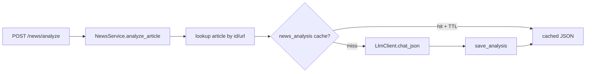

# Chapter 15 — LLM Analysis Layer

| Field | Value |
|-------|-------|
| **Package** | vinu-news |
| **Module** | `vinu_news/analysis/llm/` |
| **Status** | REVIEW |
| **Verified** | 2026-07-01 |
| **Prerequisites** | Ch 12, Ch 22 |

## Learning objectives

- Explain TASK-N01: LLM analysis is **on-demand**, not part of ingest enrichment.
- Trace `POST /news/analyze` through cache lookup, `LlmClient`, and `news_analysis` table.
- Configure Ollama/OpenAI-compatible endpoints via environment variables.

## 1. Problem this module solves

Rule-based enrichment is fast and deterministic but shallow. TASK-N01 adds **optional deep analysis** — sentiment score on a continuous scale, confidence, risk flags, and a narrative summary — triggered by API request and cached in SQLite. Ingest never calls the LLM; this keeps polling reliable and costs predictable.

## 2. Position in pipeline



| Step | Input | Output |
|------|-------|--------|
| Resolve | url or article id | `articles` row |
| Cache check | normalized URL + TTL | Cached analysis or miss |
| LLM call | headline + summary | JSON fields |
| Persist | analysis dict | `news_analysis` row |

## 3. File map

| File | Responsibility |
|------|----------------|
| `analysis/llm/analyze.py` | `analyze_article()` orchestration |
| `analysis/llm/client.py` | OpenAI-compatible HTTP client |
| `analysis/llm/cache.py` | `get_cached_analysis()`, `save_analysis()` |
| `analysis/llm/prompts.py` | System + user prompt templates — see [ch15b](ch15b-llm-prompts.md) |
| `server/routes_read.py` | `POST /news/analyze` |
| `service.py` | `analyze_article()` facade |
| `analysis/storage/schema.sql` | `news_analysis` table |

## 4. Data contracts

### Input

| Field | Type | Required | Example |
|-------|------|----------|---------|
| `url_or_id` | str | yes | Article id or link |
| `VINU_LLM_BASE_URL` | env | yes | `http://127.0.0.1:11434/v1` |
| `VINU_LLM_MODEL` | env | yes | `llama3.2` |

### Output

`news_analysis` columns:

| Field | Type | Example |
|-------|------|---------|
| `url` | TEXT PK | Normalized article link |
| `analysis_json` | TEXT | JSON blob |
| `created_at` | INTEGER | Unix ts |

Normalized `analysis` object keys:

| Field | Type | Example |
|-------|------|---------|
| `sentiment_score` | float | `-0.35` |
| `confidence` | int | `82` |
| `risk_flags` | list[str] | `["rate risk"]` |
| `summary` | str | One paragraph |

API response adds `cached: bool` and `url`.

## 5. Logic (step by step)

1. `analyze_article(repo, url_or_id)` loads article by `id` or `link` (with `normalize_link` fallback).
2. `get_cached_analysis(conn, url, ttl_sec)` returns parsed JSON if row exists and age ≤ `VINU_LLM_TTL_SEC`.
3. On miss: build prompt from `ANALYSIS_USER_TEMPLATE`; call `LlmClient.chat_json()`.
4. `_normalize_analysis()` coerces types; `save_analysis()` upserts `news_analysis`.
5. Returns `{"url", "cached", "analysis"}`.
6. **Not called** from `enrich_article()`, `process_batch()`, or `run_ingestion_cycle()`.

## 6. Configuration

| Key | YAML/env | Default | Effect |
|-----|----------|---------|--------|
| `VINU_LLM_BASE_URL` | env | `http://127.0.0.1:11434/v1` | Chat completions endpoint |
| `VINU_LLM_MODEL` | env | `llama3.2` | Model name |
| `VINU_LLM_API_KEY` | env | none | Bearer token if needed |
| `VINU_LLM_TTL_SEC` | env | `86400` | Cache TTL (0 = always miss) |

## 7. Worked examples

### Example A — happy path (HTTP)

```bash
curl -X POST http://127.0.0.1:8080/news/analyze \
  -H "Content-Type: application/json" \
  -d '{"url_or_id":"https://example.com/article-123"}'
```

First call: `"cached": false`. Repeat within TTL: `"cached": true`.

### Example B — edge case (article not found)

```bash
curl -X POST http://127.0.0.1:8080/news/analyze \
  -H "Content-Type: application/json" \
  -d '{"url_or_id":"nonexistent"}'
```

Returns HTTP 404.

### Example C — LLM unavailable

When Ollama is down, API returns HTTP 503 with error detail from `LlmClientError`.

## 8. API / CLI (if applicable)

| Method | Path / Command | Params | Response |
|--------|----------------|--------|----------|
| POST | `/news/analyze` | `{"url_or_id":"..."}` | `AnalyzeResponse` |
| — | `NewsService.analyze_article(url)` | — | Same dict structure |

## 9. SQL / queries (if applicable)

```sql
SELECT url, created_at, analysis_json
FROM news_analysis
ORDER BY created_at DESC
LIMIT 10;
```

Parse JSON in SQLite 3.38+:

```sql
SELECT url,
       json_extract(analysis_json, '$.sentiment_score') AS score,
       json_extract(analysis_json, '$.confidence') AS conf
FROM news_analysis;
```

## 10. Tests

| Test file | Asserts |
|-----------|---------|
| `tests/test_llm_analyze.py` | Cache hit, mock LLM client |

## 11. Troubleshooting

| Symptom | Likely cause | Action |
|---------|--------------|--------|
| HTTP 503 | LLM down or misconfigured | Start Ollama; check `VINU_LLM_*` |
| HTTP 404 | Article not in DB | Ingest first |
| Stale analysis | Within TTL | Wait or lower `VINU_LLM_TTL_SEC` |
| JSON parse error | Model returned markdown | Client strips ``` fences |

## 12. Fincept / reference repo mapping

| Fincept reference | Implementation |
|-------------------|----------------|
| `step_1_1_news.md` §8 LLM analyze | TASK-N01 — **on-demand only** |
| §8 LLM summarize / digest | **Not built** (see Appendix D) |
| Rule enrichment on ingest | Unchanged — no LLM |

## 13. Related chapters

- [ARCHITECTURE.md](../ARCHITECTURE.md) §3 — architecture with LLM
- [Chapter 15b — LLM Prompts](ch15b-llm-prompts.md) — exact prompt text
- [Chapter 12 — Enrichment Overview](ch12-enrichment-overview.md)
- [Chapter 22 — HTTP API](../part-4-operations/ch22-http-api.md)
- [Chapter 24 — Config & Env](../part-4-operations/ch24-config-env.md)
- [Chapter 26 — Service Facade](../part-4-operations/ch26-service-facade.md)
- [Appendix D — Roadmap & Gaps](../part-5-appendices/apx-d-roadmap-gaps.md)
