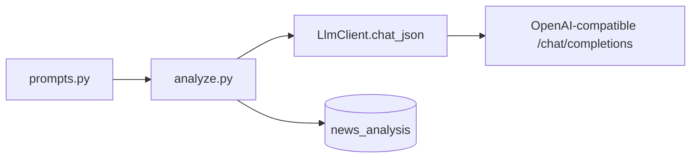

# Chapter 15b — LLM Prompts Reference

| Field | Value |
|-------|-------|
| **Package** | vinu-news |
| **Module** | `vinu_news/analysis/llm/prompts.py` |
| **Status** | REVIEW |
| **Verified** | 2026-07-01 |
| **Prerequisites** | [ARCHITECTURE.md](../ARCHITECTURE.md), [Chapter 15](ch15-llm-layer.md) |

## Learning objectives

- Find the **exact prompt text** used for LLM article analysis without opening the whole codebase.
- Know which prompts are **implemented** vs **planned** (TASK-N05 digest).
- Understand how prompts connect to `analyze.py` and expected JSON output.

## 1. Problem this module solves

[Chapter 15](ch15-llm-layer.md) documents behavior, API, and cache. This chapter is the **prompt catalog**: constants, placeholders, output schema, and links to source files. When you change prompts in code, update this chapter in the same PR.

**Note:** Rule-based enrichment (ch10–ch12) uses **keyword lists in Python**, not LLM prompts. Only `analysis/llm/prompts.py` holds LLM templates today.

## 2. Position in pipeline



| Step | Input | Output |
|------|-------|--------|
| `ANALYSIS_USER_TEMPLATE.format(...)` | headline, summary, url | User message string |
| `LlmClient.chat_json(ANALYSIS_SYSTEM, prompt)` | system + user | Parsed JSON dict |
| `_normalize_analysis()` | raw JSON | Cached `analysis_json` |

## 3. File map

| File | Responsibility |
|------|----------------|
| [`vinu_news/analysis/llm/prompts.py`](../../../../vinu_news/analysis/llm/prompts.py) | **Source of truth** for prompt constants |
| [`vinu_news/analysis/llm/analyze.py`](../../../../vinu_news/analysis/llm/analyze.py) | Formats template, calls client, normalizes |
| [`vinu_news/analysis/llm/client.py`](../../../../vinu_news/analysis/llm/client.py) | HTTP to `/chat/completions` |
| [`vinu_news/analysis/llm/cache.py`](../../../../vinu_news/analysis/llm/cache.py) | SQLite `news_analysis` TTL cache |

## 4. Data contracts

### LLM response JSON (required keys)

| Field | Type | Range / shape | Stored in |
|-------|------|---------------|-----------|
| `sentiment_score` | float | -1.0 … +1.0 | `analysis_json` |
| `confidence` | int | 0–100 | `analysis_json` |
| `risk_flags` | list[str] | short strings | `analysis_json` |
| `summary` | string | one paragraph | `analysis_json` |

Normalized by `_normalize_analysis()` in `analyze.py`.

### Prompt catalog

| ID | Constant | Status | Source |
|----|----------|--------|--------|
| `article-analysis-system` | `ANALYSIS_SYSTEM` | **Implemented** | `prompts.py` |
| `article-analysis-user` | `ANALYSIS_USER_TEMPLATE` | **Implemented** | `prompts.py` |
| `market-digest` | — | **TODO** TASK-N05 | `digest.py` (planned) |
| `ticker-daily-digest` | — | **TODO** TASK-N05 | `digest.py` (planned) |

## 5. Logic (step by step)

1. Client calls `POST /news/analyze` with `url_or_id`.
2. `analyze_article()` loads article row from `articles`.
3. Cache lookup on normalized URL (`news_analysis`, TTL from `VINU_LLM_TTL_SEC`).
4. On miss: `ANALYSIS_USER_TEMPLATE.format(headline=..., summary=..., url=...)`.
5. `LlmClient.chat_json(ANALYSIS_SYSTEM, prompt)` — model must return JSON only.
6. Client strips markdown fences if model wraps JSON in ` ``` `.
7. `save_analysis()` persists JSON; response includes `cached: true/false`.

## 6. Configuration

| Key | YAML/env | Default | Effect |
|-----|----------|---------|--------|
| `VINU_LLM_BASE_URL` | env | `http://127.0.0.1:11434/v1` | LLM endpoint |
| `VINU_LLM_MODEL` | env | `llama3.2` | Model name in request body |
| `VINU_LLM_API_KEY` | env | empty | Bearer token if set |
| `VINU_LLM_TTL_SEC` | env | `86400` | Cache TTL for same URL |

## 7. Worked examples

### Example A — implemented prompts (verbatim from code)

**Source file:** [`vinu_news/analysis/llm/prompts.py`](../../../../vinu_news/analysis/llm/prompts.py)

**System (`ANALYSIS_SYSTEM`):**

```
You are a financial news analyst. Respond with valid JSON only, no markdown.
```

**User template (`ANALYSIS_USER_TEMPLATE`):**

```
Analyze this financial news article and return JSON with exactly these keys:
- sentiment_score: float from -1.0 (very bearish) to +1.0 (very bullish)
- confidence: integer 0-100
- risk_flags: list of short strings (market risks mentioned)
- summary: one paragraph summary

Headline: {headline}
Summary: {summary}
URL: {url}
```

Placeholders: `{headline}`, `{summary}`, `{url}` — filled from the `articles` row.

### Example B — trigger analysis (uses prompts above)

```bash
curl -X POST http://127.0.0.1:8080/news/analyze \
  -H "Content-Type: application/json" \
  -d '{"url_or_id":"https://example.com/some-article"}'
```

Second call with same URL returns `"cached": true` within TTL.

### Example C — edge case (digest not implemented)

There is **no** digest prompt in the repo yet. TASK-N05 will add templates to a new `digest.py` — track in [Appendix E](../part-5-appendices/apx-e-yet-to-build.md).

## 8. API / CLI (if applicable)

| Method | Path | Uses prompts |
|--------|------|--------------|
| POST | `/news/analyze` | `ANALYSIS_SYSTEM` + `ANALYSIS_USER_TEMPLATE` |

## 9. SQL / queries (if applicable)

```sql
SELECT url,
       json_extract(analysis_json, '$.summary') AS summary,
       json_extract(analysis_json, '$.sentiment_score') AS score,
       datetime(created_at, 'unixepoch') AS analyzed_at
FROM news_analysis
ORDER BY created_at DESC
LIMIT 5;
```

## 10. Tests

| Test file | Asserts |
|-----------|---------|
| `tests/test_llm_analyze.py` | Mock LLM response; cache hit; uses same JSON shape as prompts |

## 11. Troubleshooting

| Symptom | Likely cause | Action |
|---------|--------------|--------|
| Model returns markdown | Ignored system instruction | `client.py` strips fences; tighten `ANALYSIS_SYSTEM` |
| Wrong JSON keys | Model drift | Edit `prompts.py` + ch15b; add examples in system prompt |
| Prompt out of sync with doc | Code changed without doc PR | **Rule:** update ch15b when editing `prompts.py` |

## 12. Fincept / reference repo mapping

| Reference | Use |
|-----------|-----|
| FinRobot `finrobot/agents/prompts.py` | Pattern inspiration for TASK-N01 — **not copied verbatim** |
| FinRL-Trading sentiment parse helpers | JSON field ideas for `sentiment_score` |
| TASK-N05 spec in [`enhancement-doc1.md`](../../../../vinu-news-stock-price-enhancement/enhancement-doc1.md) | Future digest prompts |

## 13. Related chapters

- [ARCHITECTURE.md](../ARCHITECTURE.md) — with/without LLM diagrams
- [Chapter 15 — LLM Layer](ch15-llm-layer.md) — API, cache, config
- [Chapter 16 — Price Reaction](ch16-price-reaction.md) — uses stock API, not LLM
- [Appendix E — Yet to Build](../part-5-appendices/apx-e-yet-to-build.md) — TASK-N05 digest
