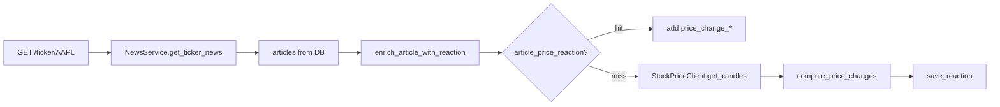

# Chapter 16 — Price Reaction Tagging

| Field | Value |
|-------|-------|
| **Package** | vinu-news |
| **Module** | `vinu_news/integrations/stock_price.py`, `analysis/post_enrichment/price_reaction.py` |
| **Status** | REVIEW |
| **Verified** | 2026-07-01 |
| **Prerequisites** | Ch 12b, Ch 22 |

## Learning objectives

- Connect vinu-news to vinu-stock-price via `VINU_STOCK_API_URL`.
- Explain TASK-N03: 1h and 1d price change after article `sort_ts`.
- Trace lazy computation on read paths vs `article_price_reaction` cache.

## 1. Problem this module solves

Headlines claim market impact; researchers want **measured** price moves. TASK-N03 fetches OHLC candles from the sister stock-price service, computes percent change 1 hour and 1 day after publication, and caches results per article. Computation runs on **read** (ticker news, thread detail) — not during ingest.

## 2. Position in pipeline



| Step | Input | Output |
|------|-------|--------|
| Primary ticker | `tickers` JSON [0] | Symbol for candles |
| Candles | `sort_ts` .. +25h | Close prices |
| Compute | base + 1h/1d bars | `%` changes |
| Cache | article_id | `article_price_reaction` row |

## 3. File map

| File | Responsibility |
|------|----------------|
| `integrations/stock_price.py` | `StockPriceClient` HTTP client |
| `analysis/post_enrichment/price_reaction.py` | Compute + cache helpers |
| `service.py` | `_enrich_with_price_reaction()` on read paths |
| `analysis/storage/schema.sql` | `article_price_reaction` table |
| `config.py` | `VINU_STOCK_API_URL` |

## 4. Data contracts

### Input

| Field | Type | Required | Example |
|-------|------|----------|---------|
| `article.id` | str | yes | SHA256 link |
| `article.sort_ts` | int | yes | Pub timestamp |
| `article.tickers` | JSON str | yes | `["NVDA"]` |
| `VINU_STOCK_API_URL` | env | yes | `http://127.0.0.1:8081` |

### Output

`article_price_reaction` columns:

| Field | Type | Example |
|-------|------|---------|
| `article_id` | TEXT PK | Article id |
| `price_change_1h` | REAL | `1.25` (percent) |
| `price_change_1d` | REAL | `-0.80` |
| `computed_at` | INTEGER | Unix ts |

API rows may include `price_change_1h`, `price_change_1d`, `computed_at` when enriched.

## 5. Logic (step by step)

1. `enrich_article_with_reaction(conn, article, client)` checks cache via `get_cached_reaction()`.
2. On miss: `_primary_ticker()` parses first symbol from `tickers` JSON.
3. `StockPriceClient.get_candles(symbol, from_ts=sort_ts, to_ts=sort_ts+90000, limit=2000)`.
4. `compute_price_changes()`:
   - Base close = first candle with `bar_ts >= sort_ts`.
   - 1h close = first candle with `bar_ts >= sort_ts + 3600`.
   - 1d close = first candle with `bar_ts >= sort_ts + 86400`.
   - Percent change: `(close - base) / base * 100`.
5. `save_reaction()` upserts; merges fields into returned dict.
6. If API unavailable or no candles → article returned unchanged (no error).

## 6. Configuration

| Key | YAML/env | Default | Effect |
|-----|----------|---------|--------|
| `VINU_STOCK_API_URL` | env | `http://127.0.0.1:8081` | Candle API base |
| Client timeout | `stock_price.py` | `10.0` sec | HTTP timeout |
| Candle `limit` | `get_candles` | `2000` | Max bars fetched |

Sister volume: [vinu-stock-price Textbook](../../../../vinu-stock-price/docs/INDEX.md).

## 7. Worked examples

### Example A — happy path (unit compute)

```python
from vinu_news.analysis.post_enrichment.price_reaction import compute_price_changes

candles = [
    {"bar_ts": 1000, "close": 100.0},
    {"bar_ts": 4600, "close": 101.0},
    {"bar_ts": 87400, "close": 99.0},
]
ch_1h, ch_1d = compute_price_changes(candles, sort_ts=1000)
# ch_1h ≈ 1.0%, ch_1d ≈ -1.0%
```

### Example B — edge case (no primary ticker)

Article with `tickers='[]'` → `enrich_article_with_reaction` returns article unchanged; no API call.

### Example C — read path with stock API

```bash
# Start vinu-stock-price on :8081, then:
curl "http://127.0.0.1:8080/ticker/NVDA?days=7&limit=5"
```

Response rows may include `price_change_1h` after first fetch; subsequent calls use cache.

## 8. API / CLI (if applicable)

| Method | Path / Command | Params | Response |
|--------|----------------|--------|----------|
| GET | `/ticker/{symbol}` | `days`, `limit` | Articles + price fields |
| GET | `/threads/{id}` | `limit` | Thread articles enriched |
| GET | `/threads/{id}/timeline` | — | Snapshots enriched |

Price reaction is **not** computed on ingest or `/latest` by default.

## 9. SQL / queries (if applicable)

```sql
SELECT a.headline, r.price_change_1h, r.price_change_1d, r.computed_at
FROM article_price_reaction r
JOIN articles a ON a.id = r.article_id
ORDER BY r.computed_at DESC
LIMIT 20;
```

Articles with large 1h moves:

```sql
SELECT price_change_1h, price_change_1d
FROM article_price_reaction
WHERE ABS(price_change_1h) > 2.0;
```

## 10. Tests

| Test file | Asserts |
|-----------|---------|
| `tests/test_price_reaction.py` | `compute_price_changes()` math |

## 11. Troubleshooting

| Symptom | Likely cause | Action |
|---------|--------------|--------|
| No price fields | Stock API down | Check `VINU_STOCK_API_URL` |
| Always null changes | No candles in window | Verify symbol + market hours |
| Wrong ticker used | First JSON symbol only | Reorder tickers or extend logic |
| Stale reaction | Cached row | Delete from `article_price_reaction` to recompute |

## 12. Fincept / reference repo mapping

| Fincept reference | Implementation |
|-------------------|----------------|
| News ↔ price join | TASK-N03 |
| Stock candle data | vinu-stock-price `/candles/{symbol}` |
| On-read enrichment | Not on ingest pipeline |

## 13. Related chapters

- [Chapter 12b — Category, Tickers, Threat](ch12b-category-tickers-threat.md)
- [Chapter 22 — HTTP API](../part-4-operations/ch22-http-api.md)
- [Chapter 24 — Config & Env](../part-4-operations/ch24-config-env.md)
- [vinu-stock-price Volume 2](../../../../vinu-stock-price/docs/INDEX.md)
- [Appendix D — Roadmap & Gaps](../part-5-appendices/apx-d-roadmap-gaps.md)
