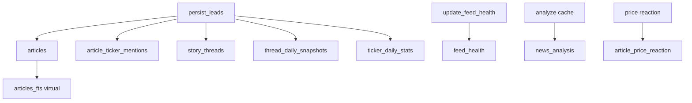

# Chapter 17 — Schema Catalog

| Field | Value |
|-------|-------|
| **Package** | vinu-news |
| **Module** | `vinu_news/analysis/storage/schema.sql` |
| **Status** | REVIEW |
| **Verified** | 2026-07-01 |
| **Prerequisites** | Ch 14 |

## Learning objectives

- Navigate the full SQLite schema: base, derived, ops, and extension tables.
- Distinguish tables populated at persist vs poll time.
- Locate the schema source of truth and FTS5 virtual table setup.

## 1. Problem this module solves

Research and debugging require a single map of every table, column, and relationship. `schema.sql` defines the DDL; `fts.py` adds the FTS5 virtual table at init. This chapter catalogs all storage with accurate column names from the schema file only.

## 2. Position in pipeline



| Step | Input | Output |
|------|-------|--------|
| Schema init | `schema.sql` + `fts.py` | SQLite tables |
| Persist | Lead articles | Base + derived rows |
| Poll | Feed results | `feed_health` upserts |

## 3. File map

| File | Responsibility |
|------|----------------|
| `analysis/storage/schema.sql` | DDL source of truth |
| `analysis/storage/fts.py` | `articles_fts` + triggers |
| `analysis/storage/repository.py` | Queries and upserts |
| `settings/schema.sql` | `vinu_settings` runtime keys |
| Default DB path | `./data/news.db` via `VINU_NEWS_DB_PATH` |

## 4. Data contracts

### Layer overview

| Layer | Tables | Meaning |
|-------|--------|---------|
| **Base** | `articles`, `article_ticker_mentions` | One row per lead headline |
| **Derived** | `story_threads`, `thread_daily_snapshots`, `ticker_daily_stats` | Rollups from persist events |
| **Ops** | `feed_health` | RSS poll reliability |
| **Extension** | `news_analysis`, `article_price_reaction` | LLM cache, price reaction |
| **Search** | `articles_fts` | FTS5 virtual (from `fts.py`) |
| **Settings** | `vinu_settings` | mode, poll_interval_sec |

### Master catalog

| Table | Type | Populated by | Primary use |
|-------|------|--------------|-------------|
| `articles` | base | `persist_leads` INSERT | Headlines, sentiment, FTS |
| `article_ticker_mentions` | junction | `upsert_article` | Per-ticker dominance |
| `story_threads` | derived | new thread / bump | Story span, coverage |
| `thread_daily_snapshots` | rollup | every persist on thread | Daily intensity |
| `ticker_daily_stats` | rollup | persist with primary ticker | Ticker volume by day |
| `feed_health` | ops | `update_feed_health` | Source reliability |
| `news_analysis` | extension | LLM analyze | URL → analysis JSON cache |
| `article_price_reaction` | extension | price integration | 1h/1d price change |
| `articles_fts` | virtual | triggers on `articles` | Keyword search |

## 5. Logic (step by step)

1. On first `NewsRepository` open, run `schema.sql` statements.
2. `init_fts()` creates virtual table + sync triggers + backfill.
3. Settings DB seeds `vinu_settings` from env defaults.
4. Only **lead** articles insert into `articles` (see Ch 14).
5. Thread match / URL skip may still update derived rollups without new article row.
6. All snapshot dates are **UTC** from article `sort_ts`.

## 6. Configuration

| Key | YAML/env | Default | Effect |
|-----|----------|---------|--------|
| `VINU_NEWS_DB_PATH` | env | `./data/news.db` | SQLite file |
| `VINU_NEWS_STORAGE` | env | `sqlite` | Backend selector |
| `VINU_NEWS_DATABASE_URL` | env | — | Postgres (v1.1 stub) |

## 7. Worked examples

### Example A — happy path (inspect schema)

```bash
sqlite3 ./data/news.db ".tables"
```

Expected tables include: `articles`, `article_ticker_mentions`, `story_threads`, `thread_daily_snapshots`, `ticker_daily_stats`, `feed_health`, `news_analysis`, `article_price_reaction`, `articles_fts`, `vinu_settings`.

```sql
SELECT name FROM sqlite_master WHERE type='table' ORDER BY name;
```

### Example B — edge case (empty fresh DB)

```python
from vinu_news.analysis.storage.repository import NewsRepository

with NewsRepository(":memory:") as repo:
    row = repo._conn.execute(
        "SELECT COUNT(*) FROM articles"
    ).fetchone()
    print(row[0])  # 0 — schema exists, no rows yet
```

## 8. API / CLI (if applicable)

| Method | Path / Command | Params | Response |
|--------|----------------|--------|----------|
| GET | `/health` | — | DB path confirmation |
| GET | `/latest` | `limit` | Rows from `articles` |
| CLI | `vinu-news-query latest` | — | JSON from `articles` |

## 9. SQL / queries (if applicable)

Table row counts:

```sql
SELECT 'articles' AS tbl, COUNT(*) AS n FROM articles
UNION ALL SELECT 'story_threads', COUNT(*) FROM story_threads
UNION ALL SELECT 'feed_health', COUNT(*) FROM feed_health
UNION ALL SELECT 'news_analysis', COUNT(*) FROM news_analysis;
```

Index listing on articles:

```sql
SELECT name FROM sqlite_master
WHERE type='index' AND tbl_name='articles';
```

## 10. Tests

| Test file | Asserts |
|-----------|---------|
| `analysis/tests/test_persist.py` | Schema + insert |
| `analysis/tests/test_fts.py` | FTS5 virtual table |
| `analysis/tests/test_enrichment.py` | Repository against schema |

## 11. Troubleshooting

| Symptom | Likely cause | Action |
|---------|--------------|--------|
| Missing `articles_fts` | DB opened without init | Use `NewsRepository` (calls init_fts) |
| Wrong DB file | Path mismatch | Check `VINU_NEWS_DB_PATH` / Docker volume |
| Postgres errors | Stub backend | Keep `VINU_NEWS_STORAGE=sqlite` |
| Column not found | Old DB file | Migrate or delete volume |

## 12. Fincept / reference repo mapping

| Fincept reference | Schema artifact |
|-------------------|-----------------|
| `step_1_1_news.md` SQLite schema | `schema.sql` |
| FTS5 §7 | `articles_fts` via `fts.py` |
| Extensions | `story_threads`, rollups, `news_analysis` |

## 13. Related chapters

- [Chapter 14 — Story Threads & Persist](../part-2-analysis/ch14-story-threads-persist.md)
- [Chapter 18 — articles & threads](ch18-table-articles-threads.md)
- [Chapter 20 — SQL Cookbook](ch20-sql-cookbook.md)
- [Chapter 24 — Config & Environment](../part-4-operations/ch24-config-env.md)
