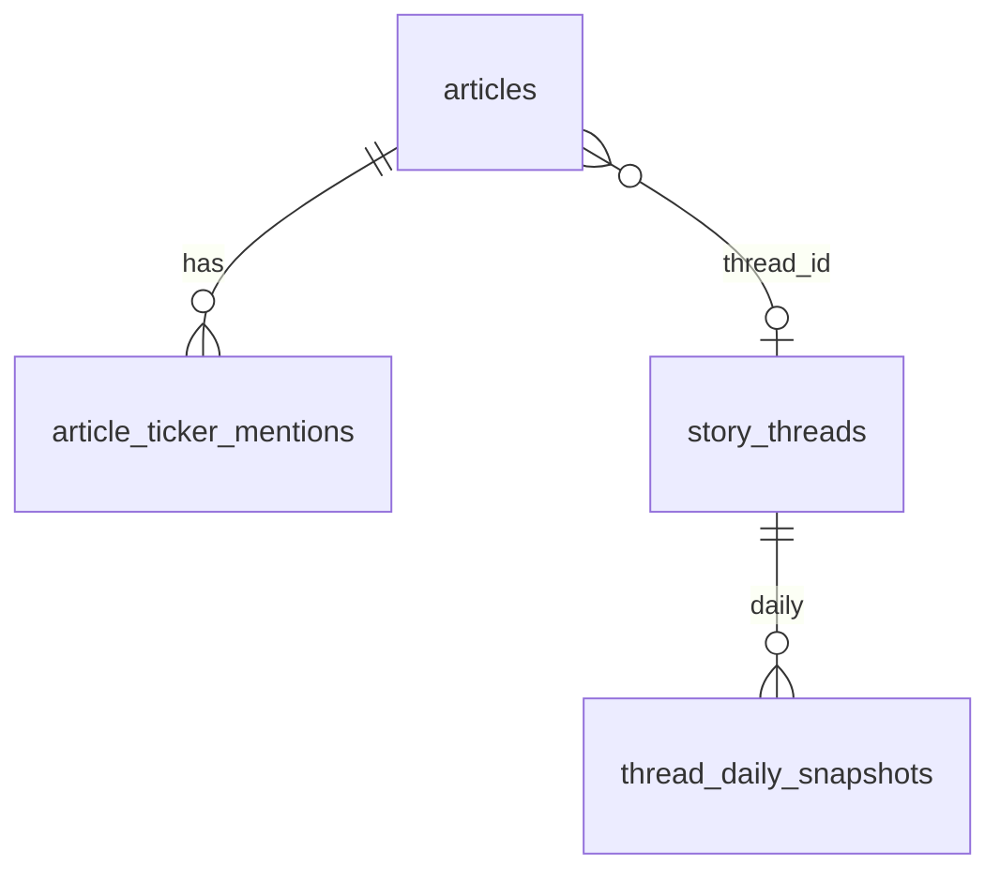

# Chapter 18 — articles & threads

| Field | Value |
|-------|-------|
| **Package** | vinu-news |
| **Module** | `vinu_news/analysis/storage/schema.sql` |
| **Status** | REVIEW |
| **Verified** | 2026-07-01 |
| **Prerequisites** | Ch 17 |

## Learning objectives

- List every column on `articles`, `article_ticker_mentions`, and `story_threads` from `schema.sql`.
- Write joins between articles, mentions, and threads for ticker research.
- Explain when `thread_daily_snapshots` counts exceed `articles` row counts.

## 1. Problem this module solves

The core research entities are lead headlines (`articles`), per-ticker dominance (`article_ticker_mentions`), and narrative identity (`story_threads`). This chapter is the per-table reference for those tables plus rollup companions, using **only** columns defined in `schema.sql`.

## 2. Position in pipeline



| Step | Input | Output |
|------|-------|--------|
| persist new story | Lead article | `articles` INSERT + mentions |
| thread bump | Match event | `story_threads` update + snapshots |
| query | ticker or thread_id | Joined research rows |

## 3. File map

| File | Responsibility |
|------|----------------|
| `storage/schema.sql` | Column definitions |
| `storage/models.py` | `ArticleRecord`, `EnrichedArticle` |
| `storage/repository.py` | `get_news_for_ticker`, `get_thread`, etc. |
| `storage/persist.py` | Writes articles, threads, rollups |

## 4. Data contracts

### `articles`

| Column | Type | Meaning |
|--------|------|---------|
| `id` | TEXT PK | SHA256 of link |
| `headline` | TEXT NOT NULL | Original RSS headline |
| `summary` | TEXT NOT NULL | HTML-stripped, max 300 chars |
| `source` | TEXT NOT NULL | Feed source label |
| `link` | TEXT NOT NULL | Canonical URL |
| `sort_ts` | INTEGER NOT NULL | Unix seconds UTC |
| `region` | TEXT NOT NULL | US, EU, GLOBAL, etc. |
| `tier` | INTEGER NOT NULL | Feed tier 1–4 |
| `category` | TEXT NOT NULL | EARNINGS, MARKETS, etc. |
| `priority` | TEXT NOT NULL | FLASH, URGENT, BREAKING, ROUTINE |
| `sentiment` | TEXT NOT NULL | BULLISH, BEARISH, NEUTRAL |
| `sentiment_score` | INTEGER NOT NULL | Signed keyword score |
| `impact` | TEXT NOT NULL | HIGH, MEDIUM, LOW |
| `tickers` | TEXT NOT NULL | JSON array string |
| `lang` | TEXT NOT NULL | Language code |
| `threat_level` | TEXT NOT NULL | Critical, High, Medium, Low |
| `threat_cat` | TEXT NOT NULL | Cyber, Regulatory, etc. |
| `threat_conf` | REAL NOT NULL | 0.0–1.0 |
| `source_flag` | INTEGER NOT NULL DEFAULT 0 | 0 trusted, 1 state, 2 caution |
| `entities_json` | TEXT NOT NULL DEFAULT '{}' | NER JSON |
| `cluster_id` | TEXT | In-batch cluster hash |
| `is_lead` | INTEGER NOT NULL DEFAULT 1 | Always 1 for stored rows |
| `thread_id` | TEXT | FK to story_threads |

**Indexes:** `sort_ts`, `source+sort_ts`, `impact+sort_ts`, `cluster_id`, `thread_id`, `link`

### `article_ticker_mentions`

| Column | Type | Meaning |
|--------|------|---------|
| `id` | TEXT PK | `{article_id}:{ticker}` hash |
| `article_id` | TEXT NOT NULL | FK → `articles.id` |
| `ticker` | TEXT NOT NULL | Uppercase symbol |
| `dominance` | REAL NOT NULL | 0.0–1.0, sums to 1.0 per article |
| `is_primary` | INTEGER NOT NULL DEFAULT 0 | 1 = dominant ticker |

**Unique:** `(article_id, ticker)`

### `story_threads`

| Column | Type | Meaning |
|--------|------|---------|
| `thread_id` | TEXT PK | SHA256 identity |
| `first_seen_at` | INTEGER NOT NULL | Thread creation ts |
| `last_seen_at` | INTEGER NOT NULL | Most recent persist event |
| `article_count` | INTEGER NOT NULL DEFAULT 1 | Coverage count |
| `lead_headline` | TEXT NOT NULL | First lead headline |
| `dominant_ticker` | TEXT | Primary ticker or NULL |
| `entities_json` | TEXT NOT NULL DEFAULT '{}' | NER from first article |
| `category` | TEXT NOT NULL DEFAULT 'MARKETS' | From first article |
| `last_article_id` | TEXT | First lead article id |
| `norm_text` | TEXT NOT NULL DEFAULT '' | For cross-batch matching |

### `thread_daily_snapshots`

| Column | Type | Meaning |
|--------|------|---------|
| `thread_id` | TEXT NOT NULL | FK → story_threads |
| `date` | TEXT NOT NULL | YYYY-MM-DD UTC |
| `article_count` | INTEGER NOT NULL DEFAULT 0 | Persist events that day |
| `bullish_count` | INTEGER NOT NULL DEFAULT 0 | BULLISH events |
| `bearish_count` | INTEGER NOT NULL DEFAULT 0 | BEARISH events |
| `neutral_count` | INTEGER NOT NULL DEFAULT 0 | NEUTRAL events |
| `flash_count` | INTEGER NOT NULL DEFAULT 0 | FLASH priority events |

**Primary key:** `(thread_id, date)`

### `ticker_daily_stats`

| Column | Type | Meaning |
|--------|------|---------|
| `ticker` | TEXT NOT NULL | Uppercase symbol |
| `date` | TEXT NOT NULL | YYYY-MM-DD UTC |
| `article_count` | INTEGER NOT NULL DEFAULT 0 | Primary-ticker events |
| `bullish_count` | INTEGER NOT NULL DEFAULT 0 | BULLISH events |
| `bearish_count` | INTEGER NOT NULL DEFAULT 0 | BEARISH events |
| `neutral_count` | INTEGER NOT NULL DEFAULT 0 | NEUTRAL events |
| `top_thread_id` | TEXT | Last thread written that day |

**Primary key:** `(ticker, date)`

## 5. Logic (step by step)

1. New story → INSERT `articles` with all enrichment columns + `thread_id`.
2. `upsert_article` writes `article_ticker_mentions` rows with dominance.
3. New thread → INSERT `story_threads` with `norm_text` for future matching.
4. Thread match → no new article; `article_count++`, `last_seen_at` updated.
5. Every persist event upserts `thread_daily_snapshots` and `ticker_daily_stats` (if primary ticker).
6. Snapshot `article_count` can exceed distinct `articles` rows (matches without insert still count).

## 6. Configuration

| Key | YAML/env | Default | Effect |
|-----|----------|---------|--------|
| `dedup.lookback_hours` | `analysis.yaml` | `48` | Thread active window |
| `mode` | DB settings | `ticker` | Which articles reach persist |

## 7. Worked examples

### Example A — happy path (ticker join)

```sql
SELECT a.headline, a.sentiment, a.impact, m.dominance, m.is_primary
FROM article_ticker_mentions m
JOIN articles a ON a.id = m.article_id
WHERE m.ticker = 'AAPL'
ORDER BY a.sort_ts DESC
LIMIT 20;
```

```python
from vinu_news.analysis.storage.repository import NewsRepository

with NewsRepository() as repo:
    rows = repo.get_news_for_ticker("AAPL", limit=20)
    print(rows[0]["headline"], rows[0]["sentiment"])
```

### Example B — edge case (thread without many article rows)

```sql
SELECT t.thread_id, t.lead_headline, t.article_count,
       SUM(s.article_count) AS snapshot_events
FROM story_threads t
JOIN thread_daily_snapshots s ON s.thread_id = t.thread_id
GROUP BY t.thread_id
HAVING snapshot_events > t.article_count;
```

This can occur when thread matches increment snapshots without new `articles` inserts.

## 8. API / CLI (if applicable)

| Method | Path / Command | Params | Response |
|--------|----------------|--------|----------|
| GET | `/ticker/{symbol}` | `days`, `limit` | Articles for ticker |
| GET | `/threads/{thread_id}` | `limit` | Thread + articles |
| GET | `/stats/ticker/{symbol}` | `days` | `ticker_daily_stats` rows |
| CLI | `vinu-news-query ticker NVDA --days 7` | — | Article JSON |

## 9. SQL / queries (if applicable)

Article + thread metadata:

```sql
SELECT a.headline, a.sentiment, t.lead_headline, t.article_count
FROM articles a
JOIN story_threads t ON a.thread_id = t.thread_id
WHERE a.thread_id IS NOT NULL
ORDER BY a.sort_ts DESC
LIMIT 20;
```

Entity search (simple):

```sql
SELECT headline, source, datetime(sort_ts, 'unixepoch') AS pub
FROM articles
WHERE entities_json LIKE '%Jerome Powell%'
ORDER BY sort_ts DESC
LIMIT 50;
```

## 10. Tests

| Test file | Asserts |
|-----------|---------|
| `analysis/tests/test_persist.py` | Article + thread writes |
| `analysis/tests/test_enrichment.py` | Mentions junction |
| `analysis/tests/test_thread_matcher.py` | Thread bumps |

## 11. Troubleshooting

| Symptom | Likely cause | Action |
|---------|--------------|--------|
| No mentions row | No tickers extracted | Check headline for `$TICKER` |
| `thread_id` NULL | Legacy row or bug | Re-ingest; check persist path |
| Dominance not summing to 1 | Single ticker | One ticker → dominance 1.0 |
| Empty ticker query | Ticker mode filter | Add to watchlist or use `all` mode |

## 12. Fincept / reference repo mapping

| Fincept reference | Table |
|-------------------|-------|
| Flat ticker list | `articles.tickers` JSON |
| Extension | `article_ticker_mentions` dominance |
| Not in base Fincept | `story_threads`, rollups |

## 13. Related chapters

- [Chapter 17 — Schema Catalog](ch17-schema-catalog.md)
- [Chapter 14 — Story Threads & Persist](../part-2-analysis/ch14-story-threads-persist.md)
- [Chapter 20 — SQL Cookbook](ch20-sql-cookbook.md)
- [Chapter 22 — HTTP API](../part-4-operations/ch22-http-api.md)
