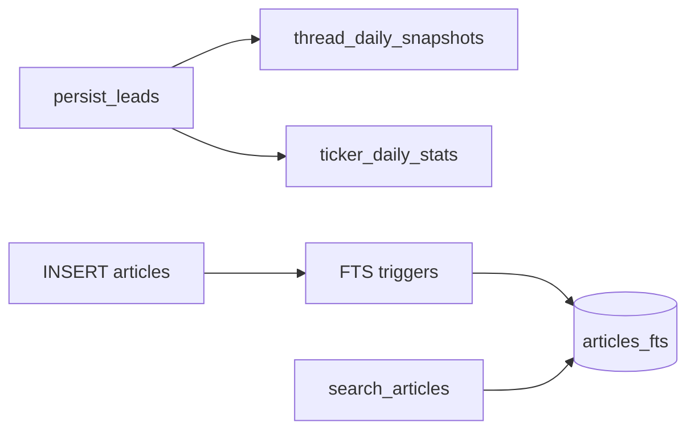

# Chapter 19 — Analytics Tables & FTS

| Field | Value |
|-------|-------|
| **Package** | vinu-news |
| **Module** | `vinu_news/analysis/storage/schema.sql`, `fts.py` |
| **Status** | REVIEW |
| **Verified** | 2026-07-01 |
| **Prerequisites** | Ch 17, Ch 18 |

## Learning objectives

- Describe `thread_daily_snapshots` and `ticker_daily_stats` rollup columns.
- Explain FTS5 setup in `init_fts()` and how search joins `articles_fts`.
- Write queries for thread timelines and per-ticker daily sentiment counts.

## 1. Problem this module solves

Raw `articles` rows are too granular for dashboards. Daily snapshot tables aggregate **per-thread** and **per-ticker** sentiment and volume; FTS5 enables **full-text search** on headlines and summaries without external search infrastructure.

## 2. Position in pipeline



| Step | Input | Output |
|------|-------|--------|
| Persist lead | EnrichedArticle + thread_id | Snapshot upsert |
| Dominant ticker | mentions | `ticker_daily_stats` upsert |
| Article insert | headline, summary | FTS index row |
| Search | query string | Ranked articles |

## 3. File map

| File | Responsibility |
|------|----------------|
| `analysis/storage/schema.sql` | DDL for snapshots, stats |
| `analysis/storage/fts.py` | `init_fts()` virtual table + triggers |
| `analysis/storage/persist.py` | `_upsert_thread_snapshot()` |
| `analysis/storage/repository.py` | `search_articles()`, timeline getters |

## 4. Data contracts

### thread_daily_snapshots

| Field | Type | Example |
|-------|------|---------|
| `thread_id` | TEXT | Thread PK (composite PK) |
| `date` | TEXT | `YYYY-MM-DD` UTC |
| `article_count` | INTEGER | `3` |
| `bullish_count` | INTEGER | `2` |
| `bearish_count` | INTEGER | `0` |
| `neutral_count` | INTEGER | `1` |
| `flash_count` | INTEGER | `1` |

### ticker_daily_stats

| Field | Type | Example |
|-------|------|---------|
| `ticker` | TEXT | `NVDA` (composite PK) |
| `date` | TEXT | `2026-06-30` |
| `article_count` | INTEGER | `5` |
| `bullish_count` | INTEGER | `3` |
| `bearish_count` | INTEGER | `1` |
| `neutral_count` | INTEGER | `1` |
| `top_thread_id` | TEXT | Latest thread id |

### articles_fts (FTS5)

Indexed columns: `headline`, `summary`. Tokenizer: `porter unicode61`. Content synced from `articles` via triggers.

## 5. Logic (step by step)

### Snapshot rollups (`persist.py`)

On each inserted lead linked to a thread:

1. Compute UTC `date` from `article.sort_ts`.
2. Increment counters: `flash` if priority==FLASH; sentiment bucket counts.
3. `INSERT ... ON CONFLICT DO UPDATE` adds to existing daily row.
4. If dominant ticker from mentions exists, upsert `ticker_daily_stats` with same sentiment increments; `top_thread_id` updated to current thread.

### FTS (`init_fts`)

1. Create `articles_fts` virtual table with `content='articles'`.
2. AFTER INSERT/DELETE/UPDATE triggers keep FTS in sync.
3. On init, if articles exist but FTS empty → backfill from `articles`.

### Search (`repository.search_articles`)

```sql
SELECT a.* FROM articles a
JOIN articles_fts ON a.rowid = articles_fts.rowid
WHERE articles_fts MATCH ?
ORDER BY rank
```

## 6. Configuration

| Key | YAML/env | Default | Effect |
|-----|----------|---------|--------|
| FTS tokenizer | `fts.py` | `porter unicode61` | Stemming + Unicode |
| Date bucketing | `utc_date_from_ts()` | UTC | Snapshot `date` column |
| Search limit | API default | `50` | Max FTS results |

## 7. Worked examples

### Example A — happy path (thread timeline)

```python
from vinu_news.analysis.storage.repository import NewsRepository

repo = NewsRepository("data/news.db")
timeline = repo.get_thread_timeline("thread-abc123")
# list of dicts with date, article_count, bullish_count, ...
```

### Example B — ticker daily stats

```python
stats = repo.get_ticker_daily_stats("NVDA", "2026-06-01", "2026-06-30")
```

### Example C — FTS search edge case

```bash
curl "http://127.0.0.1:8080/search?q=federal+AND+reserve&limit=10"
```

Use FTS5 syntax: `AND`, `OR`, quoted phrases. Empty DB → zero results.

## 8. API / CLI (if applicable)

| Method | Path / Command | Params | Response |
|--------|----------------|--------|----------|
| GET | `/search` | `q`, `limit` | FTS-ranked articles |
| GET | `/threads/{id}/timeline` | — | Daily snapshots |
| GET | `/ticker/{symbol}/stats` | `days` | `ticker_daily_stats` rows |
| CLI | `vinu-news-query search "earnings"` | — | Terminal output |

## 9. SQL / queries (if applicable)

Thread heatmap last 7 days:

```sql
SELECT date, SUM(article_count) AS articles, SUM(flash_count) AS flashes
FROM thread_daily_snapshots
WHERE date >= date('now', '-7 days')
GROUP BY date
ORDER BY date;
```

Ticker sentiment ratio:

```sql
SELECT date,
       bullish_count,
       bearish_count,
       article_count,
       ROUND(100.0 * bullish_count / NULLIF(article_count, 0), 1) AS bull_pct
FROM ticker_daily_stats
WHERE ticker = 'AAPL'
ORDER BY date DESC
LIMIT 14;
```

FTS diagnostic:

```sql
SELECT COUNT(*) FROM articles_fts;
SELECT COUNT(*) FROM articles;
-- Counts should match after ingest
```

## 10. Tests

| Test file | Asserts |
|-----------|---------|
| `tests/analysis/test_fts.py` | Search after insert |
| `tests/analysis/test_persist.py` | Snapshots on persist |

## 11. Troubleshooting

| Symptom | Likely cause | Action |
|---------|--------------|--------|
| FTS returns nothing | Empty DB or bad syntax | Ingest first; use FTS5 operators |
| FTS count < articles | Missing backfill | Re-open DB triggers `init_fts` backfill |
| Empty timeline | Thread has no persisted leads | Check ticker mode filter |
| Stats only for dominant ticker | Design | Secondary tickers not in daily stats |

## 12. Fincept / reference repo mapping

| Fincept reference | Implementation |
|-------------------|----------------|
| `step_1_1_news.md` FTS5 | `fts.py` |
| Daily rollups | `thread_daily_snapshots`, `ticker_daily_stats` |
| Research SQL | See Ch 20 cookbook |

## 13. Related chapters

- [Chapter 17 — Schema Catalog](ch17-schema-catalog.md)
- [Chapter 18 — articles & threads](ch18-table-articles-threads.md)
- [Chapter 20 — SQL Cookbook](ch20-sql-cookbook.md)
- [Chapter 21 — Python Repository API](ch21-python-repository-api.md)
- [Chapter 14 — Story Threads & Persist](../part-2-analysis/ch14-story-threads-persist.md)
