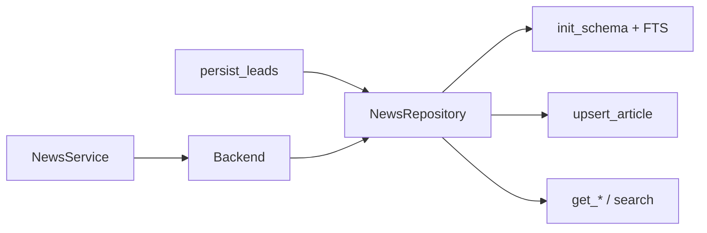

# Chapter 21 — Python Repository API

| Field | Value |
|-------|-------|
| **Package** | vinu-news |
| **Module** | `vinu_news/analysis/storage/repository.py` |
| **Status** | REVIEW |
| **Verified** | 2026-07-01 |
| **Prerequisites** | Ch 17, Ch 18 |

## Learning objectives

- Instantiate `NewsRepository` and understand schema initialization.
- Call read methods for threads, tickers, FTS search, and high-impact filters.
- Use `upsert_article` / `upsert_batch` for programmatic inserts.

## 1. Problem this module solves

`NewsRepository` is the **low-level SQLite access layer** for articles, mentions, threads, analytics tables, and FTS. `SqliteBackend` and `NewsService` delegate most persistence to `persist_leads()`, but scripts and tests use the repository directly for queries and single-row upserts.

## 2. Position in pipeline



| Step | Input | Output |
|------|-------|--------|
| `__init__` | db path | Connection + schema |
| `upsert_article` | `EnrichedArticle` | bool inserted |
| `get_news_for_ticker` | symbol + window | joined rows |
| `search_articles` | FTS query | ranked dicts |

## 3. File map

| File | Responsibility |
|------|----------------|
| `analysis/storage/repository.py` | `NewsRepository` class |
| `analysis/storage/schema.sql` | DDL executed on init |
| `analysis/storage/fts.py` | Called from `init_schema()` |
| `analysis/storage/models.py` | `ArticleRecord`, `EnrichedArticle` |
| `analysis/storage/persist.py` | Higher-level lead persist |
| `storage/sqlite_backend.py` | Wraps repo for service |

## 4. Data contracts

### Constructor

| Field | Type | Required | Example |
|-------|------|----------|---------|
| `db_path` | str \| Path | no | `./data/news.db` |

### Key method signatures

| Method | Returns | Notes |
|--------|---------|-------|
| `link_exists(link)` | bool | Normalized URL check |
| `get_thread_id_for_link(link)` | str \| None | Thread lookup |
| `upsert_article(enriched)` | bool | `INSERT OR IGNORE` |
| `upsert_batch(list)` | int | Count inserted |
| `get_active_threads(since_ts, limit)` | list[dict] | From `story_threads` |
| `get_thread(thread_id)` | dict \| None | Single thread |
| `get_thread_articles(thread_id, limit)` | list[dict] | Ordered by `sort_ts` |
| `get_thread_timeline(thread_id)` | list[dict] | Daily snapshots |
| `get_ticker_daily_stats(ticker, start, end)` | list[dict] | Date range |
| `search_articles(query, limit)` | list[dict] | FTS5 |
| `get_news_for_ticker(ticker, start, end, limit)` | list[dict] | Join mentions |
| `get_news_for_date(date_str, limit)` | list[dict] | UTC calendar day |
| `get_high_impact(since_ts, sentiment, limit)` | list[dict] | impact=HIGH |

### Helpers

| Function | Purpose |
|----------|---------|
| `normalize_link(link)` | URL dedup normalization |
| `parse_pub_date(pub_date)` | RSS → Unix ts |
| `utc_date_from_ts(sort_ts)` | Unix → `YYYY-MM-DD` |

## 5. Logic (step by step)

1. `NewsRepository(db_path)` creates parent dirs, connects SQLite with `row_factory=Row`.
2. `init_schema()` runs `schema.sql`, applies column migrations, calls `init_fts()`.
3. `upsert_article()` inserts article columns from `ARTICLE_COLUMNS` tuple; `INSERT OR IGNORE` on duplicate `id`.
4. Mention rows inserted with `INSERT OR IGNORE` on `(article_id, ticker)`.
5. Read methods return `list[dict]` via `dict(row)` for JSON-serializable API use.
6. `close()` / context manager release connection — **required in tests on Windows**.

## 6. Configuration

| Key | YAML/env | Default | Effect |
|-----|----------|---------|--------|
| `VINU_NEWS_DB_PATH` | env | `./data/news.db` | Default path |
| `DEFAULT_DB_PATH` | module constant | package `data/news.db` | Fallback if no arg |
| `SCHEMA_PATH` | fixed | adjacent `schema.sql` | DDL source |

## 7. Worked examples

### Example A — happy path (context manager)

```python
from vinu_news.analysis.storage.repository import NewsRepository

with NewsRepository("./data/news.db") as repo:
    rows = repo.get_high_impact(
        since_ts=1700000000,
        sentiment="BEARISH",
        limit=10,
    )
    print(len(rows))
```

### Example B — FTS search

```python
with NewsRepository() as repo:
    hits = repo.search_articles("earnings AND beat", limit=20)
```

### Example C — edge case (duplicate upsert)

```python
inserted = repo.upsert_article(enriched_item)
again = repo.upsert_article(enriched_item)
# inserted=True, again=False (same id)
```

### Example D — link normalization

```python
from vinu_news.analysis.storage.repository import normalize_link

assert normalize_link("https://Example.com/path/") == normalize_link(
    "https://example.com/path"
)
```

## 8. API / CLI (if applicable)

Repository is Python-only; HTTP equivalents:

| Method | Path / Command | Maps to |
|--------|----------------|---------|
| GET | `/latest` | storage backend query |
| GET | `/search?q=` | `search_articles()` |
| GET | `/ticker/{sym}` | `get_news_for_ticker()` |
| GET | `/high-impact` | `get_high_impact()` |
| GET | `/threads/{id}` | `get_thread()` + articles |

## 9. SQL / queries (if applicable)

Repository methods wrap SQL — for ad-hoc use `repo.conn`:

```python
repo.conn.execute("SELECT COUNT(*) FROM articles").fetchone()
```

Prefer repository methods to keep column lists consistent with `ARTICLE_COLUMNS`.

## 10. Tests

| Test file | Asserts |
|-----------|---------|
| `tests/analysis/test_persist.py` | Upsert + threads via repo |
| `tests/analysis/test_fts.py` | `search_articles()` |
| `tests/test_llm_analyze.py` | Direct repo fixture |
| `tests/rss/test_feed_health.py` | `repo.conn` for health |

## 11. Troubleshooting

| Symptom | Likely cause | Action |
|---------|--------------|--------|
| `database is locked` | Unclosed connection | Use `with NewsRepository()` |
| Schema mismatch | Old DB file | Delete DB or rely on `_migrate_schema` |
| FTS empty | No articles | Run ingest |
| `upsert` returns False | Duplicate id | Expected for re-ingest |

## 12. Fincept / reference repo mapping

| Fincept reference | Implementation |
|-------------------|----------------|
| `step_1_1_news.md` SQLite layer | `NewsRepository` |
| FTS5 search | `search_articles()` |
| Thread analytics | `get_thread_timeline()` |

## 13. Related chapters

- [Chapter 17 — Schema Catalog](ch17-schema-catalog.md)
- [Chapter 18 — articles & threads](ch18-table-articles-threads.md)
- [Chapter 19 — Analytics & FTS](ch19-table-analytics-fts.md)
- [Chapter 26 — Service Facade](../part-4-operations/ch26-service-facade.md)
