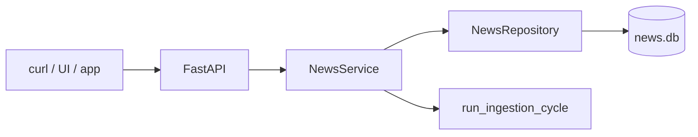

# Chapter 22 — HTTP API

| Field | Value |
|-------|-------|
| **Package** | vinu-news |
| **Module** | `vinu_news/server/routes_read.py`, `routes_config.py`, `app.py` |
| **Status** | REVIEW |
| **Verified** | 2026-07-01 |
| **Prerequisites** | Ch 01, Ch 06 |

## Learning objectives

- Call all read and config routes from `routes_read.py` and `routes_config.py` plus `/ingest/trigger`.
- Know query parameter bounds and response envelope shapes.
- Use OpenAPI docs at `/docs` and the web UI at `/ui`.

## 1. Problem this module solves

Downstream apps, curl scripts, and the bundled web UI consume news through a FastAPI HTTP layer. Routes delegate to `NewsService`, which wraps the SQLite repository, settings bridge, watchlist, and ingestion cycle. This chapter documents every route from the source files.

## 2. Position in pipeline



| Step | Input | Output |
|------|-------|--------|
| Read routes | GET params | `DataResponse` or detail models |
| Config routes | PATCH/POST body | Settings / watchlist |
| Ingest trigger | POST | Ingest summary |

## 3. File map

| File | Responsibility |
|------|----------------|
| `server/app.py` | App factory, `/ingest/trigger`, `/ui` mount |
| `server/routes_read.py` | News consumption routes |
| `server/routes_config.py` | Settings, watchlist, ticker-news ingest |
| `server/schemas.py` | Pydantic request/response models |
| `service.py` | Business logic behind routes |

## 4. Data contracts

### Response envelopes

| Model | Fields |
|-------|--------|
| `DataResponse` | `count`, `data` (list) |
| `SettingsResponse` | `mode`, `poll_interval_sec` |
| `WatchlistResponse` | `tickers` |
| `ThreadDetailResponse` | thread metadata + articles |
| `AnalyzeResponse` | LLM analysis result |
| `IngestTriggerResponse` | `ok`, `summary` dict |

## 5. Logic (step by step)

1. `create_app()` builds FastAPI with shared `NewsService`.
2. `routes_config.router` and `routes_read.router` injected with `get_service`.
3. Static UI mounted at `/ui` when `server/static/` exists.
4. Read routes query repository with limits (typically max 500).
5. Config routes mutate settings/watchlist in DB.
6. `POST /ingest/trigger` runs one full ingestion cycle synchronously.

## 6. Configuration

| Key | YAML/env | Default | Effect |
|-----|----------|---------|--------|
| `VINU_NEWS_HOST` | env | `127.0.0.1` | Bind address |
| `VINU_NEWS_PORT` | env | `8080` | Listen port |
| `mode` | DB | `ticker` | Affects ingest persist filter |

## 7. Worked examples

### Example A — happy path (first-run workflow)

```bash
curl http://localhost:8080/health

curl -X POST http://localhost:8080/watchlist/tickers \
  -H "Content-Type: application/json" \
  -d '{"tickers":["AAPL","NVDA"]}'

curl -X POST http://localhost:8080/ingest/trigger

curl "http://localhost:8080/ticker/NVDA?days=7&limit=10"

curl "http://localhost:8080/search?q=Powell+inflation"

curl http://localhost:8080/threads/active?hours=48
```

### Example B — edge case (404 thread)

```bash
curl -i http://localhost:8080/threads/nonexistent-thread-id
# HTTP 404 {"detail":"Thread not found"}
```

LLM analyze when article missing or LLM down:

```bash
curl -X POST http://localhost:8080/news/analyze \
  -H "Content-Type: application/json" \
  -d '{"url_or_id":"https://unknown.example/article"}'
# 404 ValueError or 503 RuntimeError if LLM unavailable
```

## 8. API / CLI (if applicable)

### Read routes (`routes_read.py`)

| Method | Path | Params | Response |
|--------|------|--------|----------|
| GET | `/health` | — | dict |
| GET | `/latest` | `limit` 1–500, default 20 | `DataResponse` |
| GET | `/ticker/{symbol}` | `days` 1–365, `limit` 1–500 | `DataResponse` |
| GET | `/watchlist/news` | `days`, `limit` | `DataResponse` |
| GET | `/search` | `q` (required), `limit` | `DataResponse` |
| GET | `/high-impact` | `hours` 1–720, `sentiment?`, `limit` | `DataResponse` |
| GET | `/threads/active` | `hours` 1–720, `limit` | `DataResponse` |
| GET | `/threads/{thread_id}` | `limit` | `ThreadDetailResponse` |
| GET | `/threads/{thread_id}/timeline` | — | `DataResponse` |
| GET | `/stats/ticker/{symbol}` | `days` 1–365 | `DataResponse` |
| GET | `/articles/since` | `ts` (unix sec), `limit` | `DataResponse` |
| POST | `/news/analyze` | body: `{"url_or_id":"..."}` | `AnalyzeResponse` |

### Config routes (`routes_config.py`)

| Method | Path | Params | Response |
|--------|------|--------|----------|
| GET | `/settings` | — | `SettingsResponse` |
| PATCH | `/settings` | body: `mode?`, `poll_interval_sec?` | `SettingsResponse` |
| GET | `/watchlist/tickers` | — | `WatchlistResponse` |
| POST | `/watchlist/tickers` | body: `{"tickers":[...]}` | `WatchlistResponse` |
| DELETE | `/watchlist/tickers/{symbol}` | — | `WatchlistResponse` |
| POST | `/watchlist/sync` | — | sync result dict |
| POST | `/ingest/ticker-news` | `days=7` | Yahoo ticker news summary |

### App route (`app.py`)

| Method | Path | Params | Response |
|--------|------|--------|----------|
| POST | `/ingest/trigger` | — | `IngestTriggerResponse` |

### Docs & UI

| URL | Purpose |
|-----|---------|
| `http://localhost:8080/docs` | OpenAPI interactive docs |
| `http://localhost:8080/ui` | Web UI (Settings + Search tabs) |

## 9. SQL / queries (if applicable)

API reads same tables as Ch 20. Verify after API call:

```sql
SELECT COUNT(*) FROM articles WHERE sort_ts >= strftime('%s', 'now', '-1 day');
```

## 10. Tests

| Test file | Asserts |
|-----------|---------|
| `tests/test_api.py` | Route responses (if present) |
| `tests/test_service.py` | Service layer used by routes |

## 11. Troubleshooting

| Symptom | Likely cause | Action |
|---------|--------------|--------|
| Empty `/ticker/{sym}` | Ticker mode + no matches | Add watchlist; trigger ingest |
| `/search` empty | FTS syntax or empty DB | Use `AND`/`OR`; ingest first |
| PATCH 400 | Invalid mode value | Use `ticker` or `all` |
| `/news/analyze` 503 | LLM not running | Start Ollama; check `VINU_LLM_*` |
| Poll interval unchanged | Applies next sleep cycle | Wait for ingest loop |
| CORS from browser | Not configured | Use `/ui` or same origin |

## 12. Fincept / reference repo mapping

| Fincept reference | HTTP surface |
|-------------------|--------------|
| Query helpers §8 | Read routes |
| Runtime settings | PATCH `/settings` |
| Not in Fincept | Watchlist, `/ingest/trigger`, `/ui` |

**Production note:** Add API key auth and rate limiting before public exposure.

## 13. Related chapters

- [Chapter 01 — Install & First Run](../part-0-getting-started/ch01-install-first-run.md)
- [Chapter 06 — Ingestion Orchestration](../part-1-ingestion/ch06-ingestion-orchestration.md)
- [Chapter 20 — SQL Cookbook](../part-3-data/ch20-sql-cookbook.md)
- [Chapter 23 — CLI & Docker](ch23-cli-docker.md)
- [Chapter 24 — Config & Environment](ch24-config-env.md)
