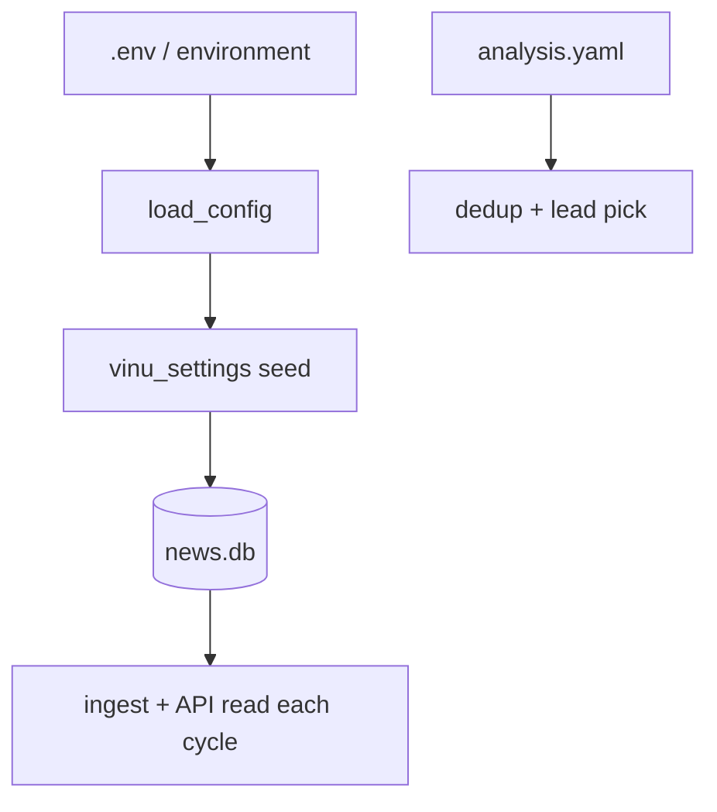

# Chapter 24 — Config & Environment

| Field | Value |
|-------|-------|
| **Package** | vinu-news |
| **Module** | `vinu_news/config.py`, `.env.example`, `analysis/config/analysis.yaml` |
| **Status** | REVIEW |
| **Verified** | 2026-07-01 |
| **Prerequisites** | Ch 01, Ch 23 |

## Learning objectives

- Map every environment variable in `.env.example` to runtime behavior.
- Distinguish env-seeded defaults from DB-persisted settings (`mode`, poll interval).
- Tune analysis dedup thresholds in `analysis.yaml` without code changes.

## 1. Problem this module solves

vinu-news configuration spans three layers: **environment variables** (boot defaults and integrations), **DB settings bridge** (runtime mode and poll interval), and **YAML analysis config** (dedup/thread thresholds). Misunderstanding which layer wins causes “I changed .env but mode didn’t change” confusion on existing Docker volumes.

## 2. Position in pipeline



| Step | Input | Output |
|------|-------|--------|
| Boot | `.env` | `VinuConfig` dataclass |
| First DB open | env defaults | `vinu_settings` rows |
| Runtime | PATCH / CLI | Updated settings in DB |
| Analysis | `analysis.yaml` | Cached via `get_settings()` |

## 3. File map

| File | Responsibility |
|------|----------------|
| `vinu_news/config.py` | `load_config()`, `VinuConfig`, dotenv loading |
| `.env.example` | Documented env template |
| `vinu_news/settings/` | DB settings store + schema |
| `analysis/config/analysis.yaml` | Dedup/thread/lead_pick |
| `vinu_news/analysis/config/settings_loader.py` | Cached YAML loader |
| `vinu_news/rss/config/feeds.yaml` | Feed registry (separate from env) |
| `vinu_news/rss/config/settings.py` | HTTP fetch constants |

## 4. Data contracts

### Environment variables (`.env.example`)

| Variable | Default | Description |
|----------|---------|-------------|
| `VINU_NEWS_DB_PATH` | `./data/news.db` | SQLite file path |
| `VINU_NEWS_STORAGE` | `sqlite` | `sqlite` or `postgres` (stub v1.1) |
| `VINU_NEWS_MODE` | `ticker` | Initial mode when DB first created |
| `VINU_NEWS_POLL_INTERVAL_SEC` | `600` | Initial poll interval (10 min) |
| `VINU_NEWS_HOST` | `0.0.0.0` in example | API bind host |
| `VINU_NEWS_PORT` | `8080` | API port |
| `VINU_STOCK_API_URL` | `http://127.0.0.1:8081` | vinu-stock-price integration |
| `VINU_SHARED_WATCHLIST_PATH` | empty | Shared watchlist JSON path |
| `VINU_LLM_BASE_URL` | `http://127.0.0.1:11434/v1` | OpenAI-compatible LLM |
| `VINU_LLM_MODEL` | `llama3.2` | Model name |
| `VINU_LLM_API_KEY` | empty | Optional API key |
| `VINU_LLM_TTL_SEC` | `86400` | Analysis cache TTL |
| `FMP_API_KEY` | empty | Future FMP ticker news |
| `VINU_NEWS_DATABASE_URL` | — | Postgres URL (v1.1, README) |

### DB settings (`vinu_settings`)

| Key | Values | Effect |
|-----|--------|--------|
| `mode` | `ticker`, `all` | Persist filter |
| `poll_interval_sec` | integer | Ingest sleep duration |

### analysis.yaml

| Key | Default | Effect |
|-----|---------|--------|
| `dedup.similarity_threshold` | `0.25` | In-batch cosine |
| `dedup.thread_match_threshold` | `0.30` | Cross-batch match |
| `dedup.lookback_hours` | `48` | Thread window |
| `dedup.require_ticker_or_entity_overlap` | `true` | Merge gates |
| `lead_pick.prefer_recency_tiebreak` | `true` | Lead tie-break |
| `threads.headline_cleanup` | `true` | Prefix strip |

## 5. Logic (step by step)

1. `load_dotenv()` loads package `.env` then cwd `.env`.
2. `load_config()` builds immutable `VinuConfig`.
3. First DB init: `settings_env_defaults()` seeds `mode` and `poll_interval_sec`.
4. **Existing Docker volumes keep saved mode** — env change alone does not reset.
5. Ingest reads mode at **start of each cycle** — no restart needed after PATCH.
6. Poll interval change applies on **next sleep** after current cycle completes.
7. `analysis.yaml` loaded once and cached by `get_settings()` in analysis package.
8. `--db` CLI flag sets `os.environ["VINU_NEWS_DB_PATH"]` before service start.

### Collection modes

| Mode | Behavior |
|------|----------|
| `ticker` | Save only articles mentioning a watchlist ticker |
| `all` | Save every lead from RSS pipeline |

Switching `all` → `ticker` does **not** delete existing rows. Switching back to `all` resumes full persist.

## 6. Configuration

| Key | YAML/env | Default | Effect |
|-----|----------|---------|--------|
| All env vars | `.env` | see §4 | Boot + integrations |
| Runtime mode | DB | from env seed | Watchlist filter |
| Dedup thresholds | `analysis.yaml` | see §4 | Dedup tuning |
| Feed list | `feeds.yaml` | baked in | Poll targets |

## 7. Worked examples

### Example A — happy path (runtime settings via HTTP)

```bash
curl http://localhost:8080/settings
# {"mode":"ticker","poll_interval_sec":600}

curl -X PATCH http://localhost:8080/settings \
  -H "Content-Type: application/json" \
  -d '{"mode":"all","poll_interval_sec":900}'

curl http://localhost:8080/settings
# {"mode":"all","poll_interval_sec":900}
```

CLI equivalent:

```bash
vinu-news-query settings set mode all
vinu-news-query settings show
```

### Example B — edge case (env ignored on existing volume)

```bash
# .env says VINU_NEWS_MODE=ticker but volume was previously mode=all
docker compose up
curl http://localhost:8080/settings
# mode may still be "all" from DB

# Reset options:
curl -X PATCH http://localhost:8080/settings -H "Content-Type: application/json" -d '{"mode":"ticker"}'
# OR docker compose down -v  (deletes volume — data loss)
```

Tune dedup in `vinu_news/analysis/config/analysis.yaml`:

```yaml
dedup:
  similarity_threshold: 0.30
  thread_match_threshold: 0.30
  lookback_hours: 72
```

Restart ingest process to reload cached YAML (or clear settings cache in long-running process).

## 8. API / CLI (if applicable)

| Method | Path / Command | Params | Response |
|--------|----------------|--------|----------|
| GET | `/settings` | — | Current mode + interval |
| PATCH | `/settings` | `mode`, `poll_interval_sec` | Updated settings |
| CLI | `vinu-news-query settings set mode all` | — | JSON |
| CLI | `vinu-news-query settings set poll_interval_sec 300` | — | JSON |
| Env | `VINU_NEWS_DB_PATH` | path | DB location |

## 9. SQL / queries (if applicable)

Inspect persisted settings:

```sql
SELECT key, value FROM vinu_settings;
```

Expected rows: `mode`, `poll_interval_sec`.

## 10. Tests

| Test file | Asserts |
|-----------|---------|
| `tests/test_service.py` | Settings patch + ingest mode |
| `analysis/tests/test_cosine_dedup.py` | YAML threshold behavior |

## 11. Troubleshooting

| Symptom | Likely cause | Action |
|---------|--------------|--------|
| Mode won't change from .env | Stored in DB | PATCH `/settings` or new volume |
| Too many duplicate merges | Low similarity threshold | Raise to 0.30–0.35 |
| Stories not threading | Threshold too high | Lower `thread_match_threshold` |
| LLM analyze fails | Wrong `VINU_LLM_*` | Start Ollama; check base URL |
| Price reaction empty | vinu-stock-price down | Check `VINU_STOCK_API_URL` |
| Postgres selected | Stub backend | Use `VINU_NEWS_STORAGE=sqlite` |

## 12. Fincept / reference repo mapping

| Fincept reference | Config location |
|-------------------|-----------------|
| Dedup thresholds | `analysis.yaml` |
| Feed timeouts | `rss/config/settings.py` |
| Runtime toggles | Extension: DB settings bridge |

## 13. Related chapters

- [Chapter 01 — Install & First Run](../part-0-getting-started/ch01-install-first-run.md)
- [Chapter 13 — Post-Enrichment](../part-2-analysis/ch13-post-enrichment.md)
- [Chapter 22 — HTTP API](ch22-http-api.md)
- [Chapter 23 — CLI & Docker](ch23-cli-docker.md)
- [Chapter 04 — feeds.yaml](../part-1-ingestion/ch04-feeds-yaml.md)
