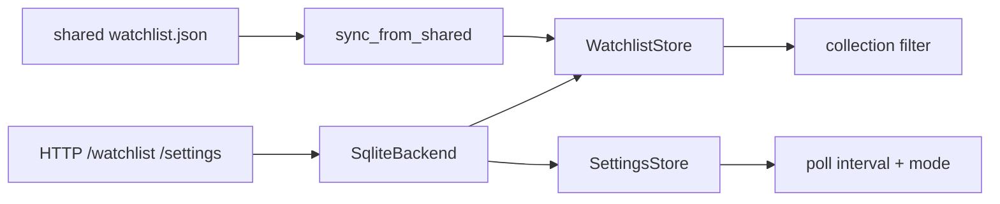

# Chapter 25 — Watchlist & Settings

| Field | Value |
|-------|-------|
| **Package** | vinu-news |
| **Module** | `vinu_news/watchlist/`, `vinu_news/settings/` |
| **Status** | REVIEW |
| **Verified** | 2026-07-01 |
| **Prerequisites** | Ch 01, Ch 09 |

## Learning objectives

- CRUD watchlist tickers in SQLite and via HTTP API.
- Configure collection `mode` and `poll_interval_sec` in `vinu_settings`.
- Implement TASK-X01 shared watchlist sync from JSON file.

## 1. Problem this module solves

**Ticker mode** needs a persisted watchlist; **continuous ingest** needs a DB-backed poll interval that operators can change without redeploying. TASK-X01 lets a sibling process (e.g. portfolio tool) write a shared JSON file that vinu-news merges into its local watchlist on demand.

## 2. Position in pipeline



| Step | Input | Output |
|------|-------|--------|
| Add tickers | symbol list | `watchlist_tickers` rows |
| Patch settings | mode, interval | `vinu_settings` update |
| Sync shared | JSON path | Union merge into watchlist |

## 3. File map

| File | Responsibility |
|------|----------------|
| `watchlist/store.py` | `WatchlistStore` CRUD |
| `watchlist/shared.py` | `read_shared()`, `sync_from_shared()` (TASK-X01) |
| `settings/store.py` | `SettingsStore`, `SettingsView` |
| `settings/schema.sql` | `vinu_settings` DDL |
| `watchlist/schema.sql` | `watchlist_tickers` DDL |
| `storage/sqlite_backend.py` | Wires stores + sync |
| `server/routes_config.py` | HTTP routes |
| `service.py` | Facade methods |

## 4. Data contracts

### watchlist_tickers

| Field | Type | Example |
|-------|------|---------|
| `ticker` | TEXT PK | `AAPL` |
| `added_at` | INTEGER | Unix ts |

### vinu_settings

| Key | Value example | Valid values |
|-----|---------------|--------------|
| `mode` | `ticker` | `ticker`, `all` |
| `poll_interval_sec` | `600` | int ≥ 60 |

### Shared JSON file (TASK-X01)

| Field | Type | Example |
|-------|------|---------|
| `tickers` | array | `["AAPL","MSFT"]` |
| `updated_at` | int | Unix ts (on write) |

## 5. Logic (step by step)

### WatchlistStore

- `add_tickers()` uppercases, `INSERT OR IGNORE`, returns newly added symbols.
- `remove_ticker()` deletes one row.
- `list_tickers()` ordered by `added_at`, then symbol.

### SettingsStore

- `init_schema()` seeds defaults from env via `settings_env_defaults()`.
- `patch()` validates mode ∈ `{all, ticker}`; enforces `poll_interval_sec >= 60`.
- Invalid mode raises `ValueError` → HTTP 400.

### Shared sync (TASK-X01)

1. `read_shared(path)` parses JSON; returns uppercased ticker list (empty if missing file).
2. `sync_from_shared(store, path)` calls `store.add_tickers(shared)` — **union**, never removes local-only tickers.
3. `NewsService.sync_watchlist_from_shared()` requires `VINU_SHARED_WATCHLIST_PATH`; returns `{ok, added, tickers}`.
4. `export_to_shared()` writes current watchlist back to JSON (optional tooling).

## 6. Configuration

| Key | YAML/env | Default | Effect |
|-----|----------|---------|--------|
| `VINU_NEWS_MODE` | env | `ticker` | Seeds `mode` on first DB init |
| `VINU_NEWS_POLL_INTERVAL_SEC` | env | `600` | Seeds poll interval |
| `VINU_SHARED_WATCHLIST_PATH` | env | none | Enables `/watchlist/sync` |

## 7. Worked examples

### Example A — happy path (HTTP CRUD)

```bash
curl -X POST http://127.0.0.1:8080/watchlist/tickers \
  -H "Content-Type: application/json" \
  -d '{"tickers":["NVDA","AMD"]}'

curl http://127.0.0.1:8080/watchlist/tickers

curl -X PATCH http://127.0.0.1:8080/settings \
  -H "Content-Type: application/json" \
  -d '{"mode":"ticker","poll_interval_sec":300}'
```

### Example B — shared sync (TASK-X01)

```json
// /data/shared_watchlist.json
{
  "tickers": ["AAPL", "GOOG"],
  "updated_at": 1719792000
}
```

```bash
export VINU_SHARED_WATCHLIST_PATH=/data/shared_watchlist.json
curl -X POST http://127.0.0.1:8080/watchlist/sync
# {"ok":true,"added":["AAPL","GOOG"],"tickers":[...]}
```

### Example C — edge case (sync without env)

```bash
curl -X POST http://127.0.0.1:8080/watchlist/sync
# HTTP 400: VINU_SHARED_WATCHLIST_PATH not set
```

## 8. API / CLI (if applicable)

| Method | Path / Command | Params | Response |
|--------|----------------|--------|----------|
| GET | `/watchlist/tickers` | — | `{tickers:[]}` |
| POST | `/watchlist/tickers` | `tickers[]` | Updated list |
| DELETE | `/watchlist/tickers/{symbol}` | — | Updated list |
| POST | `/watchlist/sync` | — | `{ok, added, tickers}` |
| GET | `/settings` | — | mode, poll_interval_sec |
| PATCH | `/settings` | partial | Updated settings |

## 9. SQL / queries (if applicable)

```sql
SELECT ticker, datetime(added_at, 'unixepoch') AS added
FROM watchlist_tickers
ORDER BY added_at;

SELECT key, value FROM vinu_settings;
```

## 10. Tests

| Test file | Asserts |
|-----------|---------|
| `tests/test_settings_watchlist.py` | CRUD, env seed, invalid mode |
| `tests/test_watchlist_sync.py` | Shared read/write, merge (TASK-X01) |
| `tests/test_api.py` | HTTP watchlist + settings roundtrip |

## 11. Troubleshooting

| Symptom | Likely cause | Action |
|---------|--------------|--------|
| Sync adds nothing | File empty or missing | Check JSON path and content |
| Mode reverts | New DB without env | Set `VINU_NEWS_MODE` before first init |
| Poll interval ignored | CLI uses DB value | `vinu-news-ingest --continuous` reads settings |
| Duplicate tickers | INSERT OR IGNORE | Harmless; list is unique |

## 12. Fincept / reference repo mapping

| Fincept reference | Implementation |
|-------------------|----------------|
| Portfolio watchlist | `watchlist_tickers` + ticker mode |
| Shared config across services | TASK-X01 `shared.py` |
| Runtime tuning | `vinu_settings` |

## 13. Related chapters

- [Chapter 01 — Install & First Run](../part-0-getting-started/ch01-install-first-run.md)
- [Chapter 09 — Collection Filter](../part-1-ingestion/ch09-collection-filter.md)
- [Chapter 22 — HTTP API](ch22-http-api.md)
- [Chapter 24 — Config & Env](ch24-config-env.md)
- [Chapter 26 — Service Facade](ch26-service-facade.md)
