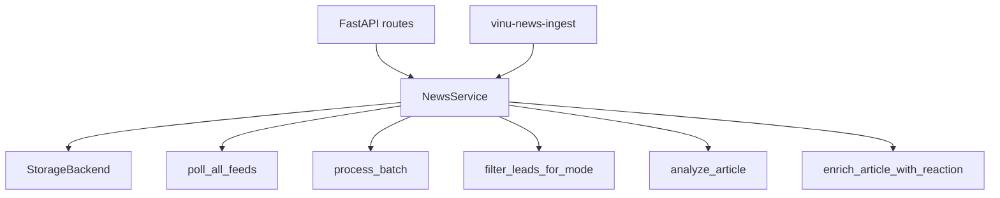

# Chapter 26 — Service Facade (`NewsService`)

| Field | Value |
|-------|-------|
| **Package** | vinu-news |
| **Module** | `vinu_news/service.py` |
| **Status** | REVIEW |
| **Verified** | 2026-07-01 |
| **Prerequisites** | Ch 06, Ch 22 |

## Learning objectives

- Describe `NewsService` as the single orchestrator for ingest, query, LLM, and price enrichment.
- Interpret `IngestionCycleResult` fields from RSS and ticker-news cycles.
- Know which methods delegate to storage vs inline pipeline logic.

## 1. Problem this module solves

HTTP routes, CLI, and tests should not wire RSS, analysis, settings, and storage separately. `NewsService` provides one **facade** with lifecycle management (`close()`, context manager) and consistent reporting via `IngestionCycleResult`.

## 2. Position in pipeline



| Step | Input | Output |
|------|-------|--------|
| `run_ingestion_cycle` | feed_ids, dry_run | `IngestionCycleResult` |
| `run_ticker_news_ingest` | tickers, days | `IngestionCycleResult` |
| Read methods | query params | JSON-serializable dicts |

## 3. File map

| File | Responsibility |
|------|----------------|
| `service.py` | `NewsService`, `IngestionCycleResult` |
| `storage/factory.py` | `create_storage()` |
| `storage/sqlite_backend.py` | Default backend |
| `config.py` | `VinuConfig` passed to service |
| `server/app.py` | Injects service into routes |
| `cli.py` | CLI uses `NewsService` |

## 4. Data contracts

### IngestionCycleResult

| Field | Type | Meaning |
|-------|------|---------|
| `feeds_polled` | int | Feed or ticker count |
| `feeds_failed` | int | Zero-article polls |
| `raw_count` | int | Raw dicts fetched |
| `enriched_count` | int | After enrichment |
| `leads_before_filter` | int | Post-process leads |
| `leads_after_filter` | int | After collection filter |
| `inserted` | int | New DB rows |
| `clusters_found` | int | Dedup clusters |
| `duplicates_dropped` | int | In-batch dupes |
| `url_dedup_dropped` | int | URL dupes in batch |
| `url_skipped` | int | Existing URLs in DB |
| `thread_matched_skipped` | int | Cross-batch thread dupes |
| `threads_created` | int | New story threads |
| `threads_updated` | int | Bumped threads |
| `mode` | str | Collection mode used |
| `watchlist_size` | int | Tickers in watchlist |
| `feed_results` | list | Per-feed poll details |

### NewsService public methods

| Category | Methods |
|----------|---------|
| Lifecycle | `close()`, context manager |
| Settings | `get_settings()`, `patch_settings()` |
| Watchlist | `get_watchlist()`, `add_watchlist_tickers()`, `remove_watchlist_ticker()`, `sync_watchlist_from_shared()` |
| Ingest | `run_ingestion_cycle()`, `run_ticker_news_ingest()` |
| Query | `get_latest()`, `get_articles_since()`, `get_ticker_news()`, `get_watchlist_news()`, `search()`, `get_high_impact()` |
| Threads | `get_active_threads()`, `get_thread_detail()`, `get_thread_timeline()` |
| Analytics | `get_ticker_stats()` |
| LLM | `analyze_article()` |
| Ops | `health()` |
| Static helpers | `ts_days_ago()`, `date_range_days()` |

## 5. Logic (step by step)

### `run_ingestion_cycle`

1. Load settings + watchlist from storage.
2. `load_feeds()` → `poll_all_feeds()`.
3. If `dry_run` → return counts only (no health, no persist).
4. `update_feed_health()` → `process_batch()` → optional `filter_leads_for_mode()`.
5. `persist_leads()` or `upsert_batch()` if `skip_post_process`.
6. Assemble `IngestionCycleResult`.

### `run_ticker_news_ingest`

1. Resolve tickers (arg or watchlist); empty → zero result.
2. `TickerNewsRegistry.fetch_for_ticker()` per symbol.
3. `process_batch()` → filter → `persist_leads()`.

### Read paths with price reaction

`get_ticker_news()`, `get_thread_detail()`, `get_thread_timeline()` call `_enrich_with_price_reaction()` which lazy-fetches candles (Ch 16).

### `analyze_article`

Delegates to `analysis.llm.analyze`; wraps `LlmClientError` as `RuntimeError` for HTTP 503.

## 6. Configuration

| Key | YAML/env | Default | Effect |
|-----|----------|---------|--------|
| `VINU_NEWS_STORAGE` | env | `sqlite` | Backend selection |
| `VINU_NEWS_DB_PATH` | env | `./data/news.db` | SQLite path |
| `VINU_STOCK_API_URL` | env | `http://127.0.0.1:8081` | Price enrichment |
| Constructor `storage=` | inject | auto | Tests pass mock backend |

## 7. Worked examples

### Example A — happy path (ingest cycle)

```python
from vinu_news.service import NewsService

with NewsService() as svc:
    svc.add_watchlist_tickers(["AAPL"])
    result = svc.run_ingestion_cycle()
    print(result.format_report())
```

### Example B — dry run

```python
with NewsService() as svc:
    result = svc.run_ingestion_cycle(dry_run=True)
    assert result.inserted == 0
    assert result.raw_count > 0
```

### Example C — ticker news ingest

```python
with NewsService() as svc:
    result = svc.run_ticker_news_ingest(tickers=["NVDA"], days=3)
    print(result.inserted)
```

### Example D — query with price fields

```python
with NewsService() as svc:
    rows = svc.get_ticker_news("NVDA", days=7, limit=5)
    # rows may include price_change_1h if stock API up
```

## 8. API / CLI (if applicable)

All HTTP routes use a shared `NewsService` instance:

| Method | Path / Command | Service method |
|--------|----------------|----------------|
| POST | `/ingest/trigger` | `run_ingestion_cycle()` |
| POST | `/ingest/ticker-news` | `run_ticker_news_ingest()` |
| GET | `/latest` | `get_latest()` |
| POST | `/news/analyze` | `analyze_article()` |
| CLI | `vinu-news-ingest --once` | `run_ingestion_cycle()` |

## 9. SQL / queries (if applicable)

Service does not expose raw SQL — use `svc.storage.repo.conn` only in scripts. Prefer service methods for API parity.

```python
svc.storage.repo.conn.execute("SELECT COUNT(*) FROM articles").fetchone()
```

## 10. Tests

| Test file | Asserts |
|-----------|---------|
| `tests/test_ingest_filter.py` | Full service ingest + filter |
| `tests/test_api.py` | Routes → service |
| `tests/test_cli_continuous.py` | Service poll interval |
| `tests/test_ticker_news_provider.py` | Ticker ingest path |

## 11. Troubleshooting

| Symptom | Likely cause | Action |
|---------|--------------|--------|
| `inserted=0` | Ticker filter or dupes | Read `format_report()` fields |
| DB locked in tests | Service not closed | Use `with NewsService()` |
| No price on `/latest` | By design | Use `/ticker/{sym}` |
| 503 on analyze | LLM error | Check Ch 15 config |

## 12. Fincept / reference repo mapping

| Fincept reference | Implementation |
|-------------------|----------------|
| Orchestration entry point | `NewsService` replaces legacy `run_ingestion` CLI-only |
| Ingest + query unified | Single facade for API and CLI |

## 13. Related chapters

- [Chapter 06 — Ingestion Orchestration](../part-1-ingestion/ch06-ingestion-orchestration.md)
- [Chapter 08 — Ticker News Providers](../part-1-ingestion/ch08-ticker-news-providers.md)
- [Chapter 09 — Collection Filter](../part-1-ingestion/ch09-collection-filter.md)
- [Chapter 15 — LLM Layer](../part-2-analysis/ch15-llm-layer.md)
- [Chapter 16 — Price Reaction](../part-2-analysis/ch16-price-reaction.md)
- [Chapter 22 — HTTP API](ch22-http-api.md)
- [Chapter 25 — Watchlist & Settings](ch25-watchlist-settings.md)
