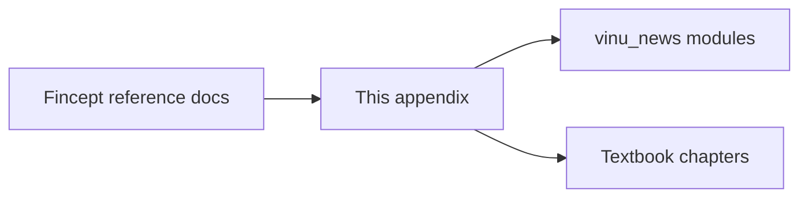

# Appendix A — Fincept Mapping

| Field | Value |
|-------|-------|
| **Package** | vinu-news |
| **Module** | — |
| **Status** | REVIEW |
| **Verified** | 2026-07-01 |
| **Prerequisites** | Chapter 02 |

## Learning objectives

- Map Fincept reference documents to vinu-news modules and textbook chapters.
- Identify what is implemented vs still out of scope (Steps 2–5).
- Use this table when tracing requirements from `personal_understanding/`.

## 1. Problem this module solves

Fincept documentation is spread across multiple markdown files (`step1_ingestion_streaming.md`, `step_1_1_news.md`, etc.). Contributors need a **single lookup table** from Fincept concept → Vinu implementation → textbook chapter.

## 2. Position in pipeline



| Step | Input | Output |
|------|-------|--------|
| Lookup | Fincept section name | Module path + chapter link |
| Gap check | Unmapped row | See Appendix D |

## 3. File map

| File | Responsibility |
|------|----------------|
| `docs/complete_guide_news_analysis.md` §13 | Source mapping (legacy) |
| `personal_understanding/` | Original Fincept notes |
| `docs/book/part-*/ch*.md` | Detailed implementation chapters |

## 4. Data contracts

### Input

| Field | Type | Required | Example |
|-------|------|----------|---------|
| Fincept doc | markdown path | yes | `step_1_1_news.md` |
| Section id | string | no | `§6D sentiment` |

### Output

| Field | Type | Example |
|-------|------|---------|
| Module path | string | `analysis/enrichment/sentiment.py` |
| Chapter link | markdown | `ch12a-priority-sentiment-impact.md` |
| Status | enum | `Done`, `Partial`, `Not built` |

## 5. Logic (step by step)

1. Start from Fincept Step 1 (news ingestion + analysis).
2. Match each subsection to vinu-news package (`rss/`, `analysis/`, `server/`).
3. Extensions beyond Fincept (threads, dominance, cross-batch dedup) are listed separately.
4. Steps 2–5 (trading, portfolio) remain out of scope for vinu-news v1.

## 6. Configuration

| Key | YAML/env | Default | Effect |
|-----|----------|---------|--------|
| — | — | — | Reference appendix only |

## 7. Worked examples

### Example A — trace RSS fetch requirement

| Fincept reference | Section | Implementation | Chapter |
|-------------------|---------|----------------|---------|
| `step1_ingestion_streaming.md` | RSS fetch, stability | `vinu_news/rss/fetch/` | Ch 03, Ch 05 |
| Same | Feed health | `rss/storage/feed_health.py` | Ch 07 |
| Same | Parallel poll | `parallel_fetcher.py` | Ch 03 |

### Example B — trace enrichment rule stages

| Fincept reference | Section | Implementation | Chapter | Status |
|-------------------|---------|----------------|---------|--------|
| `step_1_1_news.md` | Rule enrichment (9 stages) | `analysis/enrichment/` | Ch 12, 12a–c | Done |
| `step_1_1_news.md` | SQLite schema | `storage/schema.sql` | Ch 17 | Done |
| `step_1_1_news.md` | FTS5 | `storage/fts.py` | Ch 19 | Done |
| `news_intelligence_pipeline.md` | §4 NER + synonyms | `post_enrichment/ner/`, `synonyms/` | Ch 13 | Done |
| `news_intelligence_pipeline.md` | §5 Cosine dedup | `cosine_dedup/` | Ch 13 | Done |

### Example C — gaps (not built or partial)

| Fincept reference | Section | Status | Notes |
|-------------------|---------|--------|-------|
| `step_1_1_news.md` | §8 LLM analyze | **Done** (on-demand) | TASK-N01 → Ch 15 |
| `step_1_1_news.md` | §8 LLM summarize/digest | **Not built** | Appendix D |
| `stock_analysis_lifecycle.md` | Steps 2–5 | **Not built** | Separate trading stack |
| Ticker-specific news | — | **Done** | TASK-N02 → Ch 08 |
| Price reaction | — | **Done** | TASK-N03 → Ch 16 |

### Extensions beyond Fincept

| Extension | Implementation | Chapter |
|-----------|----------------|---------|
| `ticker_dominance` | `enrichment/ticker_dominance.py` | Ch 12 |
| `article_ticker_mentions` | junction table | Ch 18 |
| `story_threads` | `storage/threading/` | Ch 14 |
| Cross-batch dedup | `persist_leads()` | Ch 14 |
| Shared watchlist | TASK-X01 | Ch 25 |

## 8. API / CLI (if applicable)

| Method | Path / Command | Params | Response |
|--------|----------------|--------|----------|
| — | — | — | Documentation only |

## 9. SQL / queries (if applicable)

Verify Fincept schema expectations against live DB:

```sql
SELECT name FROM sqlite_master
WHERE type='table'
ORDER BY name;
```

Expected tables include: `articles`, `story_threads`, `feed_health`, `articles_fts`, `news_analysis`, `article_price_reaction`.

## 10. Tests

| Test file | Asserts |
|-----------|---------|
| `tests/analysis/test_enrichment.py` | Fincept §6 worked examples |
| Full suite | See [Appendix C](apx-c-test-map.md) |

## 11. Troubleshooting

| Symptom | Likely cause | Action |
|---------|--------------|--------|
| Fincept doc says "not built" but code exists | Stale legacy guide | Prefer this appendix + chapters |
| Behavior differs from Fincept | Intentional extension | Check chapter for Vinu-specific rules |
| Missing trading hooks | Out of scope | Fincept Steps 2–5 |

## 12. Fincept / reference repo mapping

This appendix **is** the mapping. Primary sources:

| Document | Location |
|----------|----------|
| `step1_ingestion_streaming.md` | `personal_understanding/` |
| `step_1_1_news.md` | `personal_understanding/` |
| `news_intelligence_pipeline.md` | `personal_understanding/` |
| `stock_analysis_lifecycle.md` | Steps 2–5 (not in vinu-news) |

## 13. Related chapters

- [Chapter 02 — Concepts Glossary](../part-0-getting-started/ch02-concepts-glossary.md)
- [Chapter 10 — Pipeline Overview](../part-2-analysis/ch10-pipeline-overview.md)
- [Appendix D — Roadmap & Gaps](apx-d-roadmap-gaps.md)
- [docs/complete_guide_news_analysis.md](../../complete_guide_news_analysis.md) (legacy §13)
