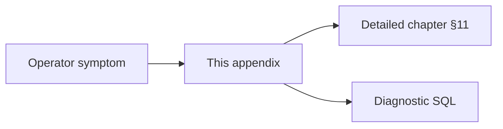

# Appendix B — Troubleshooting

| Field | Value |
|-------|-------|
| **Package** | vinu-news |
| **Module** | — |
| **Status** | REVIEW |
| **Verified** | 2026-07-01 |
| **Prerequisites** | Chapter 01 |

## Learning objectives

- Diagnose common ingest, persist, search, and API failures from symptoms.
- Know which metrics (`url_skipped`, `thread_matched_skipped`) are expected behavior.
- Resolve platform-specific issues (Windows DB locks, Docker networking).

## 1. Problem this module solves

Operators hit recurring failure modes: zero inserts, FTS empty results, feed timeouts, LLM 503s. This appendix consolidates troubleshooting from the complete guide §14 and per-chapter tables into one **symptom → cause → action** reference.

## 2. Position in pipeline



| Step | Input | Output |
|------|-------|--------|
| Match symptom | Log or API behavior | Likely cause + fix |
| Escalate | Persistent failure | Chapter deep-dive |

## 3. File map

| File | Responsibility |
|------|----------------|
| `docs/complete_guide_news_analysis.md` §14 | Legacy source |
| `docs/book/part-*/ch*.md` §11 | Per-module troubleshooting |
| `feed_health` table | Feed diagnostics |
| `IngestionCycleResult` | Ingest counters |

## 4. Data contracts

### Input

| Field | Type | Required | Example |
|-------|------|----------|---------|
| Symptom description | string | yes | `inserted=0` |
| Ingest report fields | dict | helpful | `url_skipped`, `mode` |
| `feed_health.last_error` | string | for feeds | `timeout` |

### Output

| Field | Type | Example |
|-------|------|---------|
| Action | string | Add watchlist tickers |
| SQL query | string | `SELECT * FROM feed_health` |

## 5. Logic (step by step)

1. **Ingest returns zero inserts** — check collection mode (Ch 09), watchlist, then dedup counters.
2. **Search empty** — confirm articles exist; validate FTS5 query syntax (Ch 19).
3. **Feed failures** — query `feed_health` (Ch 07).
4. **API errors** — map HTTP status to module (503 LLM, 400 watchlist sync).
5. **Tests fail** — close DB connections; see Windows note below.

## 6. Configuration

| Key | YAML/env | Default | Effect |
|-----|----------|---------|--------|
| `VINU_NEWS_MODE` | env | `ticker` | Zero inserts if empty watchlist |
| `VINU_SHARED_WATCHLIST_PATH` | env | none | Required for sync |
| `VINU_LLM_BASE_URL` | env | Ollama URL | 503 if unreachable |
| `VINU_STOCK_API_URL` | env | `:8081` | Missing price fields |

## 7. Worked examples

### Example A — happy path (expected dedup)

Ingest report:

```
Leads before filter: 40
Leads after filter: 12
New DB inserts: 0
URL skipped (DB): 12
Thread matched skipped: 0
```

**Interpretation:** Articles matched watchlist but URLs already in DB from prior poll. **Expected** — not a failure.

### Example B — edge case (ticker mode, nothing saved)

```
Mode: ticker (watchlist: 0 tickers)
Leads after filter: 0
New DB inserts: 0
```

**Action:** `POST /watchlist/tickers` or switch to `all` mode (Ch 01, Ch 09).

### Example C — feed always failing

```sql
SELECT feed_id, fail_streak, last_error
FROM feed_health
WHERE fail_streak >= 3;
```

| Symptom | `last_error` | Action |
|---------|--------------|--------|
| Timeout | `timeout` | Check URL; network egress in Docker |
| Cloaking | `html_cloaking_detected` | CDN returns HTML error page |
| Empty | `empty_feed` | Source has zero entries |

## 8. API / CLI (if applicable)

| Method | Path / Command | Params | Response |
|--------|----------------|--------|----------|
| GET | `/health` | — | DB path, article count |
| POST | `/ingest/trigger` | — | Full counter dict |
| CLI | `vinu-news-ingest --once --verbose` | — | Per-feed OK/FAIL |

## 9. SQL / queries (if applicable)

### Master symptom table

| Symptom | Likely cause | Action |
|---------|--------------|--------|
| `inserted=0`, high `url_skipped` | Same links re-polled | Expected; snapshots still update |
| High `thread_matched_skipped` | Cross-batch dedup working | Expected for syndicated stories |
| High `duplicates_dropped` | Many feeds same story | Expected; check `clusters_found` |
| FTS returns nothing | Empty DB or query syntax | Run ingest; use `AND`/`OR` FTS5 syntax |
| Feed always failing | Bad URL, cloaking, timeout | Check `feed_health.last_error` |
| Beat/miss merged | Gate disabled or no ticker | Enable overlap gate; check synonyms (Ch 13) |
| Tests fail on Windows | DB file locked | Ensure `repo.close()` / `with NewsService()` |
| HTTP 503 on `/news/analyze` | LLM down | Start Ollama; check env (Ch 15) |
| HTTP 400 on `/watchlist/sync` | Path not set | `VINU_SHARED_WATCHLIST_PATH` |
| No `price_change_*` fields | Stock API down | Start vinu-stock-price (Ch 16) |
| All feeds fail in Docker | Network egress blocked | Verify container network |
| Wrong category/sentiment | Keyword miss | Rule-based limits (Ch 12a–b) |

Quick health check:

```sql
SELECT COUNT(*) AS articles FROM articles;
SELECT COUNT(*) AS fts FROM articles_fts;
SELECT SUM(fail_streak) AS failing_feeds FROM feed_health;
```

## 10. Tests

| Test file | Asserts |
|-----------|---------|
| `tests/test_api.py` | `/health` smoke |
| `tests/rss/test_feed_health.py` | Feed error tracking |
| `tests/test_filter.py` | Ticker mode zero-insert scenario |

## 11. Troubleshooting

If this appendix does not cover your issue:

1. Find the module chapter via [INDEX.md](../../INDEX.md).
2. Read that chapter's §11 table.
3. Check [Appendix D](apx-d-roadmap-gaps.md) for known unimplemented features.
4. Run `pytest vinu-news/tests/ -v` to isolate regressions.

## 12. Fincept / reference repo mapping

| Fincept reference | Implementation |
|-------------------|----------------|
| `complete_guide` §14 | This appendix |
| Operational monitoring | `feed_health`, `/health`, ingest counters |

## 13. Related chapters

- [Chapter 01 — Install & First Run](../part-0-getting-started/ch01-install-first-run.md)
- [Chapter 07 — Feed Health](../part-1-ingestion/ch07-feed-health.md)
- [Chapter 09 — Collection Filter](../part-1-ingestion/ch09-collection-filter.md)
- [Chapter 15 — LLM Layer](../part-2-analysis/ch15-llm-layer.md)
- [Chapter 16 — Price Reaction](../part-2-analysis/ch16-price-reaction.md)
- [Appendix C — Test Map](apx-c-test-map.md)
