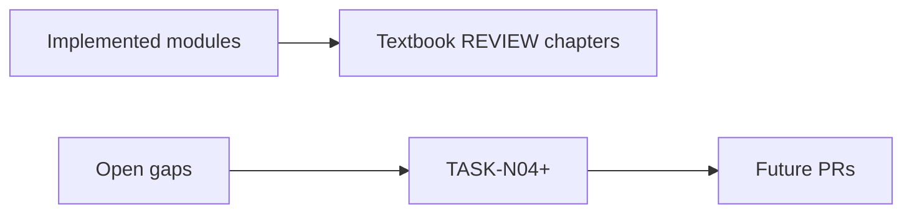

# Appendix D — Roadmap & Gaps

| Field | Value |
|-------|-------|
| **Package** | vinu-news |
| **Module** | — |
| **Status** | REVIEW |
| **Verified** | 2026-07-01 |
| **Prerequisites** | Chapter 01 |

## Learning objectives

- See what is built (~95%) vs remaining Fincept-style gaps.
- Map enhancement tasks (TASK-N*, TASK-X*) to textbook chapters and code status.
- Know that TASK-N01/N02/N03 are **implemented**; digest and scrapers remain TODO.

## 1. Problem this module solves

Tracks **remaining work** so contributors do not duplicate effort. Source references: [`news_componete_still_missing.md`](../../news_componete_still_missing.md), [`vinu-news-stock-price-enhancement/enhancement-doc1.md`](../../../../vinu-news-stock-price-enhancement/enhancement-doc1.md).

## 2. Position in pipeline



| Step | Input | Output |
|------|-------|--------|
| Pick task | TASK id | Target chapter + module |
| Verify status | git / tests | Done vs TODO |

## 3. File map

| File | Responsibility |
|------|----------------|
| `docs/news_componete_still_missing.md` | Legacy gap list |
| `vinu-news-stock-price-enhancement/enhancement-doc1.md` | Cross-service specs |
| `docs/book/part-*/ch*.md` | Implementation docs per task |

## 4. Data contracts

### Enhancement task status

| Task | Priority | Chapter | Code status |
|------|----------|---------|-------------|
| TASK-N01 | HIGH | [ch15](../part-2-analysis/ch15-llm-layer.md) | **Done** — on-demand LLM + `news_analysis` cache |
| TASK-N02 | HIGH | [ch08](../part-1-ingestion/ch08-ticker-news-providers.md) | **Done** — Yahoo provider; FMP stub |
| TASK-N03 | HIGH | [ch16](../part-2-analysis/ch16-price-reaction.md) | **Done** — `article_price_reaction` + stock API |
| TASK-X01 | HIGH | [ch25](../part-4-operations/ch25-watchlist-settings.md) | **Done** — shared watchlist JSON sync |
| TASK-N04 | MED | ch08, ch15 | SEC filings provider — **TODO** |
| TASK-N05 | MED | ch15 | LLM **digest** (batch summarize) — **TODO** |
| TASK-N06 | MED | ch08 | Additional news providers — **TODO** |
| TASK-N07 | LOW | ch03 | Social sentiment feeds — **TODO** |
| TASK-N08 | LOW | ch03 | Python scrapers (BoJ, calendars) — **TODO** |

## 5. Logic (step by step)

1. **Core stack (done):** RSS ingest, 9-stage enrichment, post-process, threads, FTS, API, ticker mode, feed health.
2. **Enhancement wave 1 (done in code):** TASK-N01 (LLM analyze on demand), N02 (ticker news), N03 (price reaction), X01 (watchlist sync).
3. **Still open:** LLM digest (not on-demand analyze), SEC/scraper providers, UI beyond `/ui` stub, Fincept Steps 2–5 trading hooks.
4. FMP provider exists but returns `[]` until `stock_news` endpoint is wired.

## 6. Configuration

| Key | YAML/env | Default | Effect |
|-----|----------|---------|--------|
| `VINU_LLM_*` | env | Ollama defaults | TASK-N01 |
| `FMP_API_KEY` | env | `""` | TASK-N02 FMP (stub) |
| `VINU_STOCK_API_URL` | env | `:8081` | TASK-N03 |
| `VINU_SHARED_WATCHLIST_PATH` | env | none | TASK-X01 |

## 7. Worked examples

### Example A — happy path (verify TASK-N01 done)

```bash
pytest vinu-news/tests/test_llm_analyze.py -v
curl -X POST http://127.0.0.1:8080/news/analyze \
  -H "Content-Type: application/json" \
  -d '{"url_or_id":"<existing-article-url>"}'
```

Expect cached analysis after first call (Ch 15).

### Example B — verify TASK-N03 done

```bash
pytest vinu-news/tests/test_price_reaction.py -v
# With vinu-stock-price running:
curl "http://127.0.0.1:8080/ticker/NVDA?days=3&limit=1"
```

### Example C — edge case (digest still TODO)

There is **no** `POST /news/digest` or batch summarize endpoint. LLM runs only via `POST /news/analyze` per article. Digest remains TASK-N05.

## 8. API / CLI (if applicable)

| Method | Path / Command | Task | Status |
|--------|----------------|------|--------|
| POST | `/news/analyze` | N01 | Done |
| POST | `/ingest/ticker-news` | N02 | Done |
| GET | `/ticker/{sym}` (price fields) | N03 | Done |
| POST | `/watchlist/sync` | X01 | Done |
| — | `/news/digest` | N05 | **Not built** |

## 9. SQL / queries (if applicable)

Verify enhancement tables exist:

```sql
SELECT COUNT(*) FROM news_analysis;
SELECT COUNT(*) FROM article_price_reaction;
```

## 10. Tests

| Test file | Task | Asserts |
|-----------|------|---------|
| `tests/test_llm_analyze.py` | N01 | Cache + mock LLM |
| `tests/test_ticker_news_provider.py` | N02 | Registry fetch |
| `tests/test_price_reaction.py` | N03 | Price change math |
| `tests/test_watchlist_sync.py` | X01 | Shared JSON merge |

## 11. Troubleshooting

| Symptom | Likely cause | Action |
|---------|--------------|--------|
| Doc says LLM "not built" | Stale complete_guide | N01 done — see Ch 15 |
| FMP returns nothing | Stub implementation | Use Yahoo or implement FMP |
| Expected digest | Not implemented | TASK-N05 open |
| Trading integration | Out of scope v1 | Fincept Steps 2–5 |

## 12. Fincept / reference repo mapping

| Area | Status | Notes |
|------|--------|-------|
| Rule enrichment + threads | Done | ch10–ch14 |
| LLM deep analysis (on-demand) | **Done** | TASK-N01 |
| LLM digest / summarize | **TODO** | TASK-N05 |
| Ticker-specific news | **Done** | TASK-N02 |
| Price reaction tagging | **Done** | TASK-N03 |
| Python scrapers (BoJ, calendars) | **TODO** | TASK-N08 |
| Trading / portfolio hooks | Out of scope v1 | Fincept Steps 2–5 |
| UI beyond `/ui` stub | **TODO** | |

## 13. Related chapters

- [docs/INDEX.md](../../INDEX.md)
- [**Appendix E — Yet to build**](apx-e-yet-to-build.md) (TODO-only dashboard)
- [news_componete_still_missing.md](../../news_componete_still_missing.md)
- [Chapter 15 — LLM Layer](../part-2-analysis/ch15-llm-layer.md)
- [Chapter 08 — Ticker News Providers](../part-1-ingestion/ch08-ticker-news-providers.md)
- [Chapter 16 — Price Reaction](../part-2-analysis/ch16-price-reaction.md)
- [vinu-stock-price apx-d](../../../../vinu-stock-price/docs/book/part-6-appendices/apx-d-roadmap.md)
