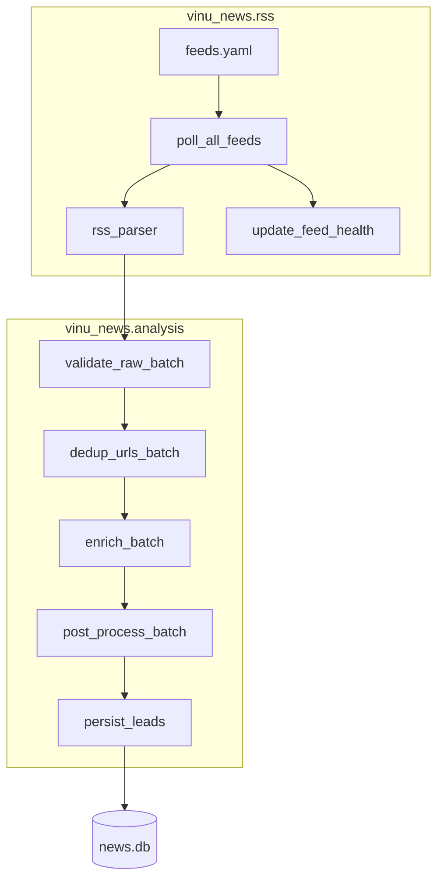

# Complete Guide — News Analysis Pipeline

> **Legacy guide.** Prefer the chapter-based textbook: **[INDEX.md](INDEX.md)**. This file is kept for reference; content is being split into `docs/book/`.

End-to-end reference for the personal Fincept-style news system: RSS ingestion, rule-based enrichment, post-processing, story threads, and SQLite persistence.

Related docs:
- Database tables & research SQL: [`news_derived_tables.md`](news_derived_tables.md)
- Status & remaining work (~8%): [`news_componete_still_missing.md`](../news_componete_still_missing.md)
- Fincept source notes: [`personal_understanding/`](../personal_understanding/)

**Database path:** `./data/news.db` (default via `VINU_NEWS_DB_PATH` / `vinu-news-serve`)

---

## 1. Introduction

### What this system does

1. **Poll** Tier 1–4 RSS feeds in parallel (fail-soft per feed)
2. **Validate & deduplicate** raw articles (URL, required fields)
3. **Enrich** each article with 9 Fincept rule stages (priority, sentiment, impact, …)
4. **Post-process** with NER, synonyms, in-batch cosine dedup, lead pick
5. **Persist** leads with cross-batch story threading and daily rollups
6. **Search** via FTS5; **monitor** feeds via `feed_health`

### Package modules (single install: `vinu-news`)

| Module | Role |
|--------|------|
| [`vinu_news/rss/`](../vinu-news/vinu_news/rss/) | Fetch, parse RSS, feed health |
| [`vinu_news/analysis/`](../vinu-news/vinu_news/analysis/) | Enrich, post-process, SQLite, threads |
| [`vinu_news/server/`](../vinu-news/vinu_news/server/) | HTTP API, settings, watchlist |

### Completion status

~**92%** of Fincept Step 1 news stack. Missing: LLM analysis, scrapers, UI, trading hooks (Steps 2–5).

---

## 2. Architecture



### Design principles

- **Post-process is DB-free** — in-batch dedup runs in memory; cross-batch logic only in `persist_leads()`
- **Lead articles only** — syndicated duplicates dropped before DB (batch + thread match)
- **Rule-based** — no ML/LLM on ingest; deterministic and testable
- **Configurable** — thresholds in `config/analysis.yaml`

---

## 3. End-to-end data flow

| Step | Package | File | Function | Input → Output |
|------|---------|------|----------|----------------|
| 1 Poll | ingestion | `fetch/parallel_fetcher.py` | `poll_all_feeds` | feeds → raw dicts + `FeedPollResult` |
| 2 Validate | analysis | `pre_enrichment/validate_raw.py` | `validate_raw_batch` | raw → valid raw (drop bad rows) |
| 3 URL dedup | analysis | `pre_enrichment/url_dedup.py` | `dedup_urls_batch` | valid → deduped (first link wins) |
| 4 Enrich | analysis | `enrichment/enrich.py` | `enrich_batch` | raw → `EnrichedArticle` |
| 5 Post-process | analysis | `post_enrichment/post_process.py` | `post_process_batch` | enriched → leads only |
| 6 Orchestrate | analysis | `pipeline.py` | `process_batch` | wraps steps 2–5 |
| 7 Persist | analysis | `storage/persist.py` | `persist_leads` | leads → SQLite + threads |
| 8 Ingest CLI | ingestion | `orchestration/ingestion_pipeline.py` | `run_ingestion` | full pipeline + feed health |

### Raw article dict (7 fields from RSS)

Produced by [`parse/rss_parser.py`](../vinu-news/vinu_news/rss/parse/rss_parser.py):

```python
{
    "headline": str,
    "summary": str,
    "link": str,
    "pubDate": str,      # RSS date string
    "source": str,       # from feeds.yaml
    "region": str,       # US, EU, GLOBAL, …
    "tier": int,           # 1–4
    "category": str,       # optional, from feed config
}
```

### EnrichedArticle wrapper

After enrichment + post-process ([`storage/models.py`](../vinu-news/vinu_news/analysis/storage/models.py)):

- `article: ArticleRecord` — all DB columns
- `mentions: list[TickerMention]` — junction rows
- `norm_text: str` — synonym-normalized text for dedup/thread match (set in post-process)

---

## 4. Ingestion package (`vinu-news/vinu_news/rss/`)

### 4.1 Configuration

**[`config/feeds.yaml`](../vinu-news/vinu_news/rss/config/feeds.yaml)**

| Field | Meaning |
|-------|---------|
| `id` | Unique feed identifier (CLI `--feeds`) |
| `url` | RSS/Atom URL |
| `source` | Display name stored on articles |
| `region` | Geographic tag |
| `tier` | 1 (best) – 4 |
| `category` | Default category if enrichment doesn't override |
| `enabled` | Skip if false |

**[`config/settings.py`](../vinu-news/vinu_news/rss/config/settings.py)**

| Constant | Value | Purpose |
|----------|-------|---------|
| `REQUEST_TIMEOUT_SEC` | 4 | Fincept `kFeedTransferTimeoutMs` equivalent |
| `MAX_WORKERS` | 8 | Parallel fetch pool |
| `HTML_CLOAK_PREFIX_LEN` | 20 | Bytes checked for `<html` cloaking |
| `MIN_BODY_BYTES` | 50 | Reject tiny/error bodies |
| `DEFAULT_POLL_INTERVAL_SEC` | 900 | 15 min loop default |

### 4.2 Fetch layer

**[`fetch/http_client.py`](../vinu-news/vinu_news/rss/fetch/http_client.py)**
- `fetch_url(url)` → `FetchResult` (status, body, error, duration_ms)
- Timeout → `error="timeout"`, empty body

**[`fetch/response_validator.py`](../vinu-news/vinu_news/rss/fetch/response_validator.py)**
- Rejects: empty body, `body_too_short`, `html_cloaking_detected`
- Accepts valid RSS/XML prefix

**[`fetch/parallel_fetcher.py`](../vinu-news/vinu_news/rss/fetch/parallel_fetcher.py)**
- `poll_all_feeds(feeds)` — ThreadPoolExecutor, **fail-soft** (one feed failure doesn't block others)

**[`orchestration/feed_poller.py`](../vinu-news/vinu_news/rss/orchestration/feed_poller.py)**
- `poll_feed(feed_config)` — fetch + validate + parse single feed

### 4.3 Parse layer

**[`parse/rss_parser.py`](../vinu-news/vinu_news/rss/parse/rss_parser.py)**
- Uses `feedparser`
- Skips entries without `link`
- Strips HTML from summary via enrichment's `clean_summary` path

### 4.4 Orchestration & CLI

**[`orchestration/ingestion_pipeline.py`](../vinu-news/vinu_news/rss/orchestration/ingestion_pipeline.py)**

```python
run_ingestion(db_path=None, feed_ids=None, dry_run=False, skip_post_process=False)
```

**`IngestionSummary` fields:**

| Field | Meaning |
|-------|---------|
| `feeds_polled` | Feed count this run |
| `feeds_failed` | Feeds with 0 articles |
| `raw_count` | Articles from RSS before processing |
| `url_dedup_dropped` | Duplicates removed in-batch (pre-enrich) |
| `enriched_count` | Articles after enrich + post-process input |
| `clusters_found` | In-batch duplicate groups |
| `duplicates_dropped` | Non-leads removed in-batch |
| `inserted` | New rows in `articles` |
| `url_skipped` | Skipped at persist (link already in DB) |
| `thread_matched_skipped` | Skipped insert (matched existing thread) |
| `threads_created` | New `story_threads` rows |
| `threads_updated` | Thread bumps / snapshot updates |

**[`run_ingestion.py`](../vinu-news/vinu_news/rss/run_ingestion.py) CLI:**

```bash
python -m vinu_news.rss.run_ingestion --once
python -m vinu_news.rss.run_ingestion --once --feeds federal_reserve,ap_top_news
python -m vinu_news.rss.run_ingestion --once --dry-run
python -m vinu_news.rss.run_ingestion --interval 900
python -m vinu_news.rss.run_ingestion --db path/to/custom.db --verbose
```

### 4.5 Feed health

**[`storage/feed_health.py`](../vinu-news/vinu_news/rss/storage/feed_health.py)**
- Called after each poll (non-dry-run)
- Updates `feed_health` table: streaks, latency, errors

---

## 5. Pre-enrichment (`vinu-news/vinu_news/analysis/pre_enrichment/`)

### 5.1 validate_raw.py

**Required keys:** `headline`, `link`, `source` (non-empty strings)

Invalid rows logged and dropped before enrichment.

### 5.2 url_dedup.py

- Normalizes URLs: lowercase host, strip trailing `/`, keep query string
- Within one poll batch: **first occurrence wins**
- Uses `normalize_link()` from repository

---

## 6. Enrichment (`vinu-news/vinu_news/analysis/enrichment/`)

Orchestrated by [`enrich.py`](../vinu-news/vinu_news/analysis/enrichment/enrich.py) in this order:

```
clean_summary → priority → sentiment → impact → category → tickers →
language → threat → source_flag → dominance → mentions
```

**Article ID:** `SHA256(link)` or `SHA256(headline:sort_ts)` if no link.

### 6.1 summary_cleaner.py

- Strip HTML tags from RSS summary
- Truncate to **300 characters**

### 6.2 priority.py

Waterfall (first match wins):

| Level | Trigger keywords |
|-------|------------------|
| FLASH | breaking, alert |
| URGENT | urgent, emergency |
| BREAKING | announce, report |
| ROUTINE | default |

**Example:** `"URGENT ALERT: ECB bailout"` → **FLASH** (breaking/alert checked first in combined text).

### 6.3 sentiment.py

- Weighted keyword lists (+3, +2, +1 positive; negative mirrored)
- Longest phrases matched first (cumulative tally)
- Output: `sentiment` (BULLISH/BEARISH/NEUTRAL), `sentiment_score` (signed net)

### 6.4 impact.py

```python
HIGH   if priority in {FLASH, URGENT} or |score| >= 6
MEDIUM if priority == BREAKING or |score| >= 3
LOW    otherwise
```

Extreme sentiment can yield HIGH impact even with ROUTINE priority.

### 6.5 category.py

Waterfall keyword categories: EARNINGS, CRYPTO, DEFENSE, GEOPOLITICS, ECONOMIC, REGULATORY, TECH, MARKETS (default from feed).

### 6.6 ticker_extractor.py

- Regex for `$TICKER` and uppercase 1–5 letter symbols
- Stop-word filter (Fincept C++ list + extended Python NLP list)
- **Max 5 tickers** per article

### 6.7 language.py

Unicode script detection on headline → language code.

### 6.8 threat.py

Keyword categories: Cyber, Regulatory, Geopolitical, etc.
Fallback: bearish sentiment → low threat baseline.

### 6.9 source_credibility.py

| Flag | Value | Sources (examples) |
|------|-------|---------------------|
| NONE | 0 | Reuters, AP, Bloomberg |
| STATE_MEDIA | 1 | XINHUA, RT, TASS, … |
| CAUTION | 2 | ZEROHEDGE, DAILY MAIL, … |

### 6.10 ticker_dominance.py (extension)

- Scores each ticker by mention count + headline proximity
- Normalized to sum **1.0**

### 6.11 article_splitter.py (extension)

- Builds `TickerMention` rows for junction table
- Sets `is_primary=1` on highest dominance ticker

---

## 7. Post-enrichment (`vinu-news/vinu_news/analysis/post_enrichment/`)

Executed by [`post_process.py`](../vinu-news/vinu_news/analysis/post_enrichment/post_process.py):

```
For each enriched article:
  1. NER → entities_json
  2. Headline cleanup (optional) + synonym normalize → norm_text
  3. Cosine cluster (with gates)
  4. Lead pick per cluster
```

### 7.1 Synonyms (`synonyms/`)

- [`synonym_map.py`](../vinu-news/vinu_news/analysis/post_enrichment/synonyms/synonym_map.py) — rates, sanctions, earnings, M&A, macro, crypto terms
- [`normalize.py`](../vinu-news/vinu_news/analysis/post_enrichment/synonyms/normalize.py) — longest-match replacement, lowercase, collapse whitespace
- **Used only for dedup vectors** — DB stores original headline

### 7.2 Headline cleanup (`headline_cleanup.py`)

Strips before vectorize: `BREAKING:`, `UPDATE:`, `EXCLUSIVE:`, `[bracket]` prefixes.

Controlled by `threads.headline_cleanup` in yaml.

### 7.3 NER (`ner/`)

Rule-based dictionaries (no ML):

- **people_map.py** — powell → Jerome Powell, musk → Elon Musk, …
- **country_map.py** — beijing/china → CN, moscow/russia → RU, …
- **extract_entities.py** → `{"people": [...], "countries": [...]}`

Stored in `articles.entities_json`.

### 7.4 Cosine dedup (`cosine_dedup/`)

**TF-IDF** ([`vectorize.py`](../vinu-news/vinu_news/analysis/post_enrichment/cosine_dedup/vectorize.py)):

```
TF-IDF = (term_count / total_terms) * (ln((N+1)/(DF+1)) + 1)
```

**Clustering** ([`cluster.py`](../vinu-news/vinu_news/analysis/post_enrichment/cosine_dedup/cluster.py)):
- Greedy: assign to first cluster where cosine ≥ threshold AND merge gate passes
- Default threshold: **0.25** (`similarity_threshold` in yaml)
- `cluster_id` = SHA256 of sorted member article ids

**Merge gates** ([`gates.py`](../vinu-news/vinu_news/analysis/post_enrichment/cosine_dedup/gates.py)):
- Requires primary ticker overlap OR entity overlap (when enabled)
- Blocks polarity conflicts: earnings_beat vs earnings_miss pairs
- If no ticker and no entities on both sides → allow merge

### 7.5 Lead pick (`lead_pick/`)

Score tuple (higher wins):

1. `priority` — FLASH(4) > URGENT(3) > BREAKING(2) > ROUTINE(1)
2. `impact` — HIGH(3) > MEDIUM(2) > LOW(1)
3. `source_flag` — 0(3) > 1(2) > 2(1)
4. `-tier` — tier 1 beats tier 4
5. `sort_ts` — recency tie-break (when `prefer_recency_tiebreak: true`)

One lead per cluster; non-leads dropped from persist list.

---

## 8. Cross-batch threading & persist

### 8.1 Thread matcher (`storage/threading/matcher.py`)

- Loads active threads where `last_seen_at >= article.sort_ts - lookback_hours`
- Default lookback: **48 hours**
- Compares candidate `norm_text` to thread `norm_text` via TF-IDF cosine
- Cross-batch threshold: **0.30** (`thread_match_threshold`)
- Applies same merge gates as in-batch clustering

### 8.2 Thread assign (`storage/threading/assign.py`)

- `generate_thread_id(norm_text, sort_ts, dominant_ticker)` — SHA256
- `dominant_ticker_from_mentions()` — primary mention or first ticker

### 8.3 persist_leads (`storage/persist.py`)

Three cases per lead — see [`news_derived_tables.md`](news_derived_tables.md) §5 for table effects.

Returns `PersistResult`: `inserted`, `url_skipped`, `thread_matched_skipped`, `threads_created`, `threads_updated`.

---

## 9. Configuration reference

**[`config/analysis.yaml`](../vinu-news/vinu_news/analysis/config/analysis.yaml)**

```yaml
dedup:
  similarity_threshold: 0.25      # in-batch cosine merge threshold
  thread_match_threshold: 0.30    # cross-batch (stricter)
  lookback_hours: 48                # thread match window
  require_ticker_or_entity_overlap: true

lead_pick:
  prefer_recency_tiebreak: true     # newest wins on equal scores

threads:
  headline_cleanup: true            # strip BREAKING:/UPDATE: before vectorize
```

**Tuning guide:**

| Symptom | Adjustment |
|---------|------------|
| Too many false duplicate merges | Raise `similarity_threshold` to 0.30–0.35 |
| Same story not merging across polls | Lower `thread_match_threshold` or extend `lookback_hours` |
| Apple beat/miss merged wrongly | Keep `require_ticker_or_entity_overlap: true` (gates active) |
| Wrong lead headline | Check tier/source; enable recency tiebreak |

Loaded via [`config/settings_loader.py`](../vinu-news/vinu_news/analysis/config/settings_loader.py) (`get_settings()`, cached).

---

## 10. Programmatic usage

### Full pipeline (manual)

```python
from vinu_news.analysis.pipeline import process_batch
from vinu_news.analysis.storage.persist import persist_leads
from vinu_news.analysis.storage.repository import NewsRepository

raw = [{"headline": "...", "summary": "...", "link": "https://...",
        "pubDate": "...", "source": "REUTERS", "region": "US", "tier": 1}]

result = process_batch(raw)
print(result.clusters_found, result.duplicates_dropped, result.url_dedup_dropped)

with NewsRepository() as repo:
    persist_result = persist_leads(repo, result.articles)
    print(persist_result.threads_created)
    print(repo.search_articles("Powell rates"))
```

### Enrichment only (skip post-process)

```python
result = process_batch(raw, skip_post_process=True)
# All enriched articles returned; no dedup/lead pick
```

### Query helpers

See [`news_derived_tables.md`](news_derived_tables.md) §8 for full API list.

---

## 11. FTS5 search (overview)

- Virtual table `articles_fts` on headline + summary
- Porter + unicode61 tokenizer
- Auto-sync triggers on INSERT/UPDATE/DELETE
- Backfill on first init if articles exist but FTS empty

Detail: [`news_derived_tables.md`](news_derived_tables.md) §4.7

---

## 12. Testing map

Run all tests:

```bash
python -m pytest vinu-news/vinu_news/analysis/tests/ vinu-news/vinu_news/rss/tests/ -v
```

| Test file | Covers |
|-----------|--------|
| `test_enrichment.py` | All 9 rule stages + pipeline + repository |
| `test_synonyms.py` | Synonym normalization |
| `test_ner.py` | People + country extraction |
| `test_cosine_dedup.py` | TF-IDF clustering |
| `test_cluster_gates.py` | Beat vs miss separation |
| `test_post_process.py` | Full post-process batch |
| `test_url_dedup.py` | In-batch URL dedup |
| `test_headline_cleanup.py` | Prefix stripping |
| `test_recency_lead.py` | Lead pick tie-break |
| `test_thread_matcher.py` | Cross-batch match |
| `test_persist.py` | persist_leads cases |
| `test_fts.py` | FTS5 search |
| `test_ingestion_pipeline.py` | Mocked HTTP ingestion |
| `test_feed_health.py` | Feed health upsert |
| `test_response_validator.py` | HTML cloaking |
| `test_rss_parser.py` | RSS parse |

**Windows note:** Close `NewsRepository` before deleting temp DB dirs in tests (`repo.close()` in `finally`).

---

## 13. Fincept mapping

| Fincept reference | Section | Implementation |
|-------------------|---------|----------------|
| `step1_ingestion_streaming.md` | RSS fetch, stability | `vinu-news/vinu_news/rss/` |
| `step_1_1_news.md` | Rule enrichment | `enrichment/` (9 stages) |
| `step_1_1_news.md` | SQLite schema | `storage/schema.sql` |
| `step_1_1_news.md` | FTS5 | `storage/fts.py` |
| `news_intelligence_pipeline.md` | §4 NER + synonyms | `post_enrichment/ner/`, `synonyms/` |
| `news_intelligence_pipeline.md` | §5 Cosine dedup | `post_enrichment/cosine_dedup/` |
| `step_1_1_news.md` | §8 LLM analyze | **Not built** |
| `step_1_1_news.md` | §8 LLM summarize | **Not built** |
| `stock_analysis_lifecycle.md` | Steps 2–5 | **Not built** |

Extensions beyond Fincept: `ticker_dominance`, `article_ticker_mentions`, `story_threads`, cross-batch dedup.

---

## 14. Troubleshooting

| Symptom | Likely cause | Action |
|---------|--------------|--------|
| `inserted=0`, high `url_skipped` | Same links re-polled | Expected; snapshots still update |
| High `thread_matched_skipped` | Cross-batch dedup working | Expected for syndicated stories |
| High `duplicates_dropped` | Many feeds same story | Expected; check `clusters_found` |
| FTS returns nothing | Empty DB or query syntax | Run ingest first; use `AND`/`OR` FTS5 syntax |
| Feed always failing | Bad URL, cloaking, timeout | Check `feed_health.last_error` |
| Beat/miss merged | Gate disabled or no ticker | Enable overlap gate; check synonyms |
| Tests fail on Windows | DB file locked | Ensure `repo.close()` in tests |

---

## 15. Folder map

```
vinu-news/vinu_news/rss/
├── config/feeds.yaml, settings.py, feed_loader.py
├── fetch/http_client.py, response_validator.py, parallel_fetcher.py
├── parse/rss_parser.py
├── orchestration/ingestion_pipeline.py, feed_poller.py
├── storage/feed_health.py
└── run_ingestion.py

vinu-news/vinu_news/analysis/
├── config/analysis.yaml, settings_loader.py
├── pre_enrichment/validate_raw.py, url_dedup.py
├── enrichment/          # 9 rule modules + enrich.py
├── post_enrichment/
│   ├── synonyms/, ner/, cosine_dedup/, lead_pick/
│   ├── headline_cleanup.py, post_process.py
├── storage/
│   ├── schema.sql, models.py, repository.py, persist.py, fts.py
│   └── threading/matcher.py, assign.py
├── pipeline.py
├── data/news.db
└── tests/
```

For **table columns, SQL playbooks, and research workflows**, see [`news_derived_tables.md`](news_derived_tables.md).
