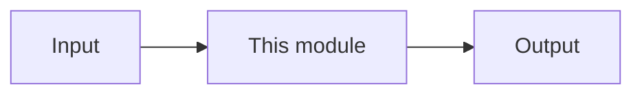

# Chapter NN — {Title}

| Field | Value |
|-------|-------|
| **Package** | vinu-stock-price |
| **Module** | `vinu_stock/...` |
| **Status** | DRAFT |
| **Verified** | YYYY-MM-DD |
| **Prerequisites** | Ch XX, YY |

## Learning objectives

- …

## 1. Problem this module solves

## 2. Position in pipeline

| Step | Input | Output |
|------|-------|--------|

## 3. File map

| File | Responsibility |
|------|----------------|

## 4. Data contracts

### Input

| Field | Type | Required | Example |
|-------|------|----------|---------|

### Output

| Field | Type | Example |
|-------|------|---------|

## 5. Logic (step by step)

## 6. Configuration

| Key | YAML/env | Default | Effect |
|-----|----------|---------|--------|

## 7. Worked examples

### Example A — happy path

### Example B — edge case

## 8. API / CLI (if applicable)

| Method | Path / Command | Params | Response |
|--------|----------------|--------|----------|

## 9. SQL / queries (if applicable)

## 10. Tests

| Test file | Asserts |
|-----------|---------|

## 11. Troubleshooting

## 12. Fincept / reference repo mapping

## 13. Related chapters
