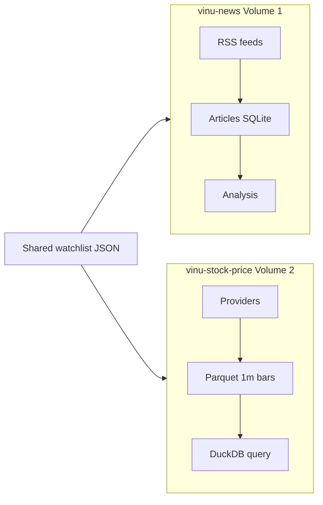

# Chapter 00 — Preface & Relation to vinu-news

| Field | Value |
|-------|-------|
| **Package** | vinu-stock-price |
| **Module** | — |
| **Status** | REVIEW |
| **Verified** | 2026-07-01 |
| **Prerequisites** | None |

## Learning objectives

- Understand what **vinu-stock-price** stores and serves versus **vinu-news**.
- Navigate this textbook by role (operator, researcher, contributor).
- Know where legacy guides live and how enhancement tasks map to chapters.

## 1. Problem this module solves

Researchers running news + price workflows need a **single, documented stack** for 1-minute OHLCV: ingest from pluggable vendors, persist in Parquet, catalog coverage in SQLite, and query via CLI or HTTP. This textbook is **Volume 2** of the Vinu documentation set; [vinu-news](../../vinu-news/docs/INDEX.md) is Volume 1 (RSS ingestion, NLP, ticker tagging). Together they form a sibling-package pattern: same installable layout, `service.py` facade, watchlist CRUD, FastAPI on a distinct port (news **8080**, stock **8081**).

## 2. Position in pipeline



| Step | Input | Output |
|------|-------|--------|
| News ingest | RSS URLs | Tagged articles per ticker |
| Stock backfill | Watchlist symbols | `archive/{YEAR}.parquet` |
| Stock live | Poll interval | `live/{YEAR}.parquet` append |
| Joint research | Event time + candles | Manual or future TASK-X02 API |

## 3. File map

| File | Responsibility |
|------|----------------|
| `docs/INDEX.md` | Chapter catalog, reading paths, TASK map |
| `docs/book/` | This textbook (27 chapters + 4 appendices) |
| `docs/complete_guide_stock_price.md` | Legacy monolith (redirect banner) |
| `vinu_stock/` | Installable package |
| `vinu-news-stock-price-enhancement/` | TASK-S* / TASK-X* specs (repo sibling) |

## 4. Data contracts

### Input

| Field | Type | Required | Example |
|-------|------|----------|---------|
| Reader goal | string | no | Operator vs researcher path |
| Python | 3.10+ | yes for hands-on | — |
| API keys | env | optional | `POLYGON_API_KEY` for primary backfill |

### Output

| Field | Type | Example |
|-------|------|---------|
| Mental model | — | 1m on disk; coarser intervals at query time |
| Entry chapter | link | [ch01](ch01-install-first-run.md) for first run |
| Cross-package link | link | Shared watchlist via `VINU_SHARED_WATCHLIST_PATH` |

## 5. Logic (step by step)

1. **Scope**: vinu-stock-price v1 stores **1-minute bars only** in Parquet; 5m/15m/1h/1d are computed in `query/aggregate.py`.
2. **Providers**: Polygon and Alpaca for backfill/live; Yahoo as keyless **fallback** (see [ch07](../part-1-providers/ch07-yahoo-fmp-fallback.md)). FMP is **not** in this package (vinu-news / future TASK-S06 only).
3. **Catalog**: `meta.db` tracks per-symbol range, backfill jobs, ingest log (see [ch10](../part-2-storage/ch10-catalog-schema.md)).
4. **Enhancements**: TASK-S01–S04 and TASK-X01 are implemented or partially implemented; see [apx-d](../part-6-appendices/apx-d-roadmap.md).
5. **Reading order**: Part 0 → pick path from [INDEX.md](../../INDEX.md) → deep-dive parts 1–5 as needed.

## 6. Configuration

| Key | YAML/env | Default | Effect |
|-----|----------|---------|--------|
| `VINU_STOCK_DATA_ROOT` | env | `./data` | Parquet + default meta.db parent |
| `VINU_SHARED_WATCHLIST_PATH` | env | unset | JSON file shared with vinu-news |
| Textbook status | — | per chapter | `REVIEW` = verified against code on date in header |

## 7. Worked examples

### Example A — happy path (operator quick start)

Follow [Chapter 01](ch01-install-first-run.md): install, add `AAPL` to watchlist, backfill one year, query 5m candles. Confirms the full pillar chain without reading provider internals.

### Example B — edge case (news-only developer)

You already run vinu-news on port 8080. Install stock package beside it, point both at the same shared watchlist:

```bash
# .env (both packages can read this path)
VINU_SHARED_WATCHLIST_PATH=/path/to/shared/watchlist.json
```

Then `POST /watchlist/sync` on stock API (see [ch25](../part-5-operations/ch25-watchlist-shared.md)) merges tickers without duplicating manual entry.

## 8. API / CLI (if applicable)

| Method | Path / Command | Params | Response |
|--------|----------------|--------|----------|
| — | `vinu-stock-serve` | — | API docs at `/docs` (port 8081) |
| — | `vinu-news-serve` | — | Sister API (port 8080) |
| GET | `/health` (stock) | — | data root, provider status |

This preface does not introduce new routes; see [ch21](../part-5-operations/ch21-http-api.md) and [ch22](../part-5-operations/ch22-cli-reference.md).

## 9. SQL / queries (if applicable)

No queries in this chapter. Stock research SQL patterns: [ch20](../part-4-query/ch20-sql-cookbook.md). News article SQL: vinu-news textbook.

## 10. Tests

| Test file | Asserts |
|-----------|---------|
| Full suite | `pytest tests/ -v` — see [apx-c](../part-6-appendices/apx-c-test-map.md) |
| `tests/test_api.py` | Health and candles on temp data dir |

## 11. Troubleshooting

| Symptom | Likely cause | Fix |
|---------|--------------|-----|
| Wrong port / 404 | Confused news vs stock server | News **8080**, stock **8081** |
| Empty candles | No backfill for symbol | Run `vinu-stock-backfill` |
| Chapter says DRAFT in INDEX | Stale INDEX row | Check chapter header `Status` field |

## 12. Fincept / reference repo mapping

| vinu-stock-price | Reference |
|------------------|-----------|
| Volume 2 textbook | Fincept OHLCV + DataHub concepts (v1 subset) |
| `BarRecord` | Fincept `BrokerCandle` shape |
| Sibling vinu-news | Fincept news / sentiment sidecar (separate package) |
| Enhancement TASKs | `vinu-news-stock-price-enhancement/enhancement-doc1.md` |

## 13. Related chapters

- [Chapter 01 — Install and First Run](ch01-install-first-run.md)
- [Chapter 02 — Concepts Glossary](ch02-concepts-glossary.md)
- [INDEX.md](../../INDEX.md) — full catalog
- [vinu-news Preface](../../../../vinu-news/docs/book/part-0-getting-started/ch00-preface.md) — Volume 1 entry (if present)
