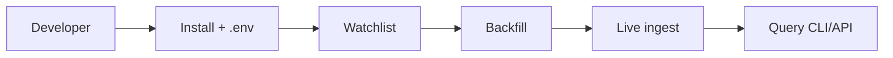

# Chapter 01 — Install and First Run

| Field | Value |
|-------|-------|
| **Package** | vinu-stock-price |
| **Module** | `vinu_stock/` (package root) |
| **Status** | REVIEW |
| **Verified** | 2026-07-01 |
| **Prerequisites** | Python 3.10+, optional Polygon/Alpaca API keys |

## Learning objectives

- Install the editable package and verify all four CLI entry points.
- Run the first-run workflow: watchlist → backfill → live ingest → query.
- Understand where on-disk data (`meta.db`, Parquet tree) is created.

## 1. Problem this module solves

Developers need a reproducible local setup for **vinu-stock-price** — historical and live **1-minute OHLCV** storage in Parquet, with a SQLite catalog and HTTP/CLI query API. This chapter walks through install, environment setup, and a minimal end-to-end run so you can confirm the stack works before diving into providers, storage, or ingest internals.

## 2. Position in pipeline



| Step | Input | Output |
|------|-------|--------|
| Install | `pyproject.toml`, Python 3.10+ | Four CLI commands on PATH |
| Configure | `.env.example` → `.env` | `data/` root, API keys |
| Watchlist | Ticker symbols | Rows in `meta.db` watchlist |
| Backfill | Symbol + year range | `archive/{YEAR}.parquet` |
| Live ingest | Watchlist symbols | `live/{YEAR}.parquet` append |
| Query | Symbol + interval | JSON candles |

## 3. File map

| File | Responsibility |
|------|----------------|
| `pyproject.toml` | Package metadata, dependencies, CLI script entry points |
| `.env.example` | Template for data root, host/port, provider API keys |
| `vinu_stock/cli.py` | `backfill_main`, `ingest_main`, `serve_main`, `query_main` |
| `vinu_stock/config.py` | `load_config()` — reads env vars and `.env` |
| `vinu_stock/service.py` | `StockService` facade used by CLI and HTTP API |
| `README.md` | Quick-start commands |
| `how-to/README.md` | Practical first-run workflow |

## 4. Data contracts

### Input

| Field | Type | Required | Example |
|-------|------|----------|---------|
| Python version | string | yes | `3.10` or newer |
| `VINU_STOCK_DATA_ROOT` | path | no (default `./data`) | `./data` |
| `POLYGON_API_KEY` | string | no | Set for deep history |
| Ticker symbols | list[str] | yes for ingest | `AAPL`, `NVDA` |

### Output

| Field | Type | Example |
|-------|------|---------|
| `data/meta.db` | SQLite file | Catalog + watchlist + settings |
| `data/prices/1m/{SYMBOL}/archive/` | Parquet dir | `2024.parquet` after backfill |
| `data/prices/1m/{SYMBOL}/live/` | Parquet dir | `2026.parquet` after live ingest |
| CLI JSON / text | stdout | Candle rows or catalog entries |

## 5. Logic (step by step)

1. **Clone or open** the `vinu-stock-price` directory (sibling to `vinu-news`).
2. **Copy environment file**: `cp .env.example .env` and optionally add `POLYGON_API_KEY`, `ALPACA_API_KEY`, `ALPACA_API_SECRET`.
3. **Install editable package with dev extras**: `pip install -e ".[dev]"` — registers `vinu-stock-backfill`, `vinu-stock-ingest`, `vinu-stock-serve`, `vinu-stock-query`.
4. **Verify install**: `vinu-stock-query catalog` — should print `[]` on first run (empty catalog).
5. **Add symbols**: `vinu-stock-query watchlist AAPL NVDA`.
6. **Backfill one year** (good first test): `vinu-stock-backfill AAPL --from-year 2024 --to-year 2024`.
7. **Run one live cycle**: `vinu-stock-ingest --once`.
8. **Query candles**: `vinu-stock-query candles AAPL --interval 5m --days 7`.
9. **Optional — start API**: `vinu-stock-serve` → http://127.0.0.1:8081/docs and http://127.0.0.1:8081/ui.

Without API keys, Yahoo is used as fallback (`roles: [fallback]` in `providers.yaml`); history depth is limited but sufficient for smoke testing.

## 6. Configuration

| Key | YAML/env | Default | Effect |
|-----|----------|---------|--------|
| `VINU_STOCK_DATA_ROOT` | env | `./data` | Root for Parquet tree |
| `VINU_STOCK_META_DB_PATH` | env | `{data_root}/meta.db` | SQLite catalog path |
| `VINU_STOCK_POLL_INTERVAL_SEC` | env | `60` | Live ingest sleep interval |
| `VINU_STOCK_HOST` | env | `127.0.0.1` | API bind host |
| `VINU_STOCK_PORT` | env | `8081` | API port (vinu-news uses 8080) |
| `VINU_STOCK_DEFAULT_PROVIDER` | env | `polygon` | Settings default provider |
| `POLYGON_API_KEY` | env | — | Polygon.io authentication |
| `ALPACA_API_KEY` / `ALPACA_API_SECRET` | env | — | Alpaca market data |

## 7. Worked examples

### Example A — happy path (local install)

```bash
cd vinu-stock-price
cp .env.example .env
pip install -e ".[dev]"

vinu-stock-query watchlist AAPL
vinu-stock-backfill AAPL --from-year 2024 --to-year 2024
vinu-stock-ingest --once
vinu-stock-query candles AAPL --interval 1m --days 7 --limit 10
```

Expected: last command prints JSON array of candle dicts with `bar_ts`, `open`, `high`, `low`, `close`, `volume`.

### Example B — edge case (no API keys, Yahoo fallback)

```bash
# Leave POLYGON_API_KEY and ALPACA keys empty in .env
vinu-stock-backfill AAPL --from-year 2024 --to-year 2024 --verbose
```

Yahoo (`priority: 99`, `roles: [fallback]`) is tried when Polygon/Alpaca are unconfigured. Backfill may return fewer 1m bars than a paid provider; use a recent year and verify with `vinu-stock-query catalog`.

### Example C — HTTP first run

```bash
vinu-stock-serve &
curl -X POST http://127.0.0.1:8081/watchlist/tickers \
  -H "Content-Type: application/json" \
  -d '{"tickers":["AAPL"]}'
curl -X POST http://127.0.0.1:8081/backfill/trigger
curl "http://127.0.0.1:8081/candles/AAPL?interval=5m&days=7"
```

## 8. API / CLI (if applicable)

| Method | Path / Command | Params | Response |
|--------|----------------|--------|----------|
| — | `vinu-stock-query catalog` | — | JSON catalog list |
| — | `vinu-stock-query watchlist TICKER...` | tickers | `{"added": [...], "watchlist": [...]}` |
| — | `vinu-stock-backfill SYMBOL` | `--from-year`, `--to-year` | Text summary report |
| — | `vinu-stock-ingest --once` | — | Text ingest summary |
| — | `vinu-stock-serve` | `--host`, `--port` | Uvicorn on 8081 |
| GET | `/health` | — | `meta_db`, `data_root`, `symbol_count` |

## 9. SQL / queries (if applicable)

After first backfill, inspect catalog:

```sql
SELECT symbol, first_bar_ts, last_bar_ts, backfill_status
FROM symbol_catalog;
```

Run against `data/meta.db` with `sqlite3` or any SQLite client.

## 10. Tests

| Test file | Asserts |
|-----------|---------|
| `tests/test_api.py` | HTTP routes with temp data dir |
| `tests/test_catalog.py` | Catalog CRUD on in-memory/temp DB |
| `tests/test_parquet_io.py` | Parquet write/read round-trip |

Run full suite: `pytest tests/ -v` from `vinu-stock-price/`.

## 11. Troubleshooting

| Symptom | Likely cause | Fix |
|---------|--------------|-----|
| `command not found: vinu-stock-query` | Package not installed editable | `pip install -e ".[dev]"` |
| `count: 0` on candles | No Parquet for symbol | Run backfill first |
| Backfill fails all years | No API keys, Yahoo shallow | Set Polygon/Alpaca keys or use recent year |
| Port in use | Another service on 8081 | Change `VINU_STOCK_PORT` or use `--port` |
| Empty watchlist on backfill with no args | No tickers added | `vinu-stock-query watchlist AAPL` |

## 12. Fincept / reference repo mapping

| vinu-stock-price | Analog |
|------------------|--------|
| Install pattern | Same as `vinu-news` (`pip install -e ".[dev]"`) |
| `StockService` | Mirrors `vinu_news.service.NewsService` |
| Port 8081 | vinu-news uses 8080 |
| `BarRecord` | Aligned with Fincept `BrokerCandle` shape |

## 13. Related chapters

- [Chapter 02 — Concepts and Glossary](ch02-concepts-glossary.md)
- [Chapter 13 — Backfill Flow](../part-3-ingest/ch13-backfill-flow.md)
- [Chapter 14 — Live Ingest](../part-3-ingest/ch14-live-ingest.md)
- [Chapter 22 — CLI Reference](../part-5-operations/ch22-cli-reference.md)
- [Chapter 26 — Config and Environment](../part-5-operations/ch26-config-env.md)
