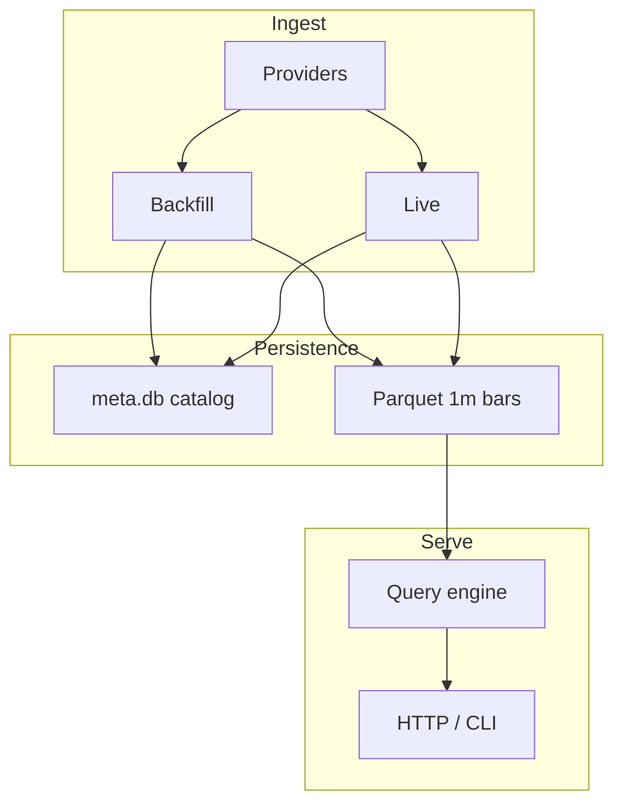

# Chapter 02 — Concepts and Glossary

| Field | Value |
|-------|-------|
| **Package** | vinu-stock-price |
| **Module** | cross-cutting (`vinu_stock/`) |
| **Status** | REVIEW |
| **Verified** | 2026-07-01 |
| **Prerequisites** | Chapter 01 |

## Learning objectives

- Define core terms: bar, archive vs live, catalog, provider role, aggregation.
- Map the six architectural pillars to package modules.
- Know what is in scope vs out of scope for v1.

## 1. Problem this module solves

Before reading provider, storage, or ingest chapters, you need a shared vocabulary. This chapter defines the domain concepts used throughout vinu-stock-price and relates them to on-disk artifacts and code modules.

## 2. Position in pipeline



| Step | Input | Output |
|------|-------|--------|
| Provider fetch | Symbol + time range | `BarRecord` list |
| Backfill | Historical years | `archive/{YEAR}.parquet` |
| Live ingest | Watchlist + last bar | `live/{YEAR}.parquet` append |
| Query | Interval + time window | Aggregated JSON candles |

## 3. File map

| File | Responsibility |
|------|----------------|
| `docs/complete_guide_stock_price.md` | Legacy end-to-end architecture reference |
| `vinu_stock/storage/models.py` | `BarRecord` dataclass |
| `vinu_stock/catalog/schema.sql` | `symbol_catalog`, `backfill_jobs`, `ingest_log` |
| `vinu_stock/providers/registry.py` | Provider priority and roles |
| `vinu_stock/query/aggregate.py` | 1m → higher timeframe aggregation |

## 4. Data contracts

### Input

| Field | Type | Required | Example |
|-------|------|----------|---------|
| Symbol | string | yes | `AAPL` (uppercased in storage) |
| Interval (query) | string | no (default `1m`) | `5m`, `1h`, `1d` |
| Provider role | enum | config | `backfill`, `live`, `fallback` |

### Output

| Field | Type | Example |
|-------|------|---------|
| Stored granularity | fixed | **1m only** on disk |
| Served granularity | configurable | `5m` aggregated at query time |
| Dedup key | tuple | `(symbol, provider, bar_ts)` |

## 5. Logic (step by step)

**Glossary (alphabetical):**

| Term | Definition |
|------|------------|
| **Archive** | Frozen yearly Parquet files under `prices/1m/{SYMBOL}/archive/{YYYY}.parquet`; written by backfill. |
| **Backfill** | Historical year-by-year fetch from providers into archive files; updates `symbol_catalog` and `backfill_jobs`. |
| **Bar / candle** | One OHLCV interval; stored as `BarRecord` with `bar_ts` = UTC epoch seconds at **bar open**. |
| **BarRecord** | Canonical row: `symbol`, `provider`, `bar_ts`, OHLCV, optional `vwap`, `trades`, `adj_factor`. |
| **Catalog** | SQLite `meta.db` tracking per-symbol coverage (`first_bar_ts`, `last_bar_ts`, `backfill_status`). |
| **Closed bar** | A 1m bar included in live ingest only when `bar_ts + 60 <= now` (minute fully elapsed). |
| **Data root** | `VINU_STOCK_DATA_ROOT` — parent of `meta.db` and `prices/`. |
| **Dedup** | On Parquet write, duplicate `(symbol, provider, bar_ts)` rows collapse to one. |
| **Fallback** | Provider role tried when primary `backfill` or `live` providers return empty/error. |
| **Live file** | Current-year append Parquet at `prices/1m/{SYMBOL}/live/{YYYY}.parquet`. |
| **Overlap window** | Live ingest re-fetches from `last_bar_ts - 180s` to avoid gaps. |
| **Provider** | Pluggable data source: `polygon`, `alpaca`, `yahoo`. |
| **Priority** | Lower number in `providers.yaml` = tried first. |
| **Watchlist** | Tickers polled by live ingest and default target for backfill when no symbols passed. |

**Design rules:**

1. Store **1m bars only**; never persist 5m/1h/1d on disk.
2. Aggregate higher intervals in `query/aggregate.py` at read time.
3. Credentials live in `.env`, not in YAML.
4. Provider order is configurable via `providers.yaml`, not hardcoded.

## 6. Configuration

| Key | YAML/env | Default | Effect |
|-----|----------|---------|--------|
| `providers.yaml` → `priority` | YAML | polygon=1, alpaca=2, yahoo=99 | Fetch order |
| `providers.yaml` → `roles` | YAML | per provider | Which flows may use provider |
| `VINU_STOCK_DATA_ROOT` | env | `./data` | All paths resolve under here |
| `backfill_status` | DB column | `pending` | `pending` \| `partial` \| `complete` |

## 7. Worked examples

### Example A — happy path (concepts in a query)

```bash
# Stored: 1m bars in Parquet. Requested: 5m (aggregated in memory).
vinu-stock-query candles AAPL --interval 5m --days 30 --limit 5
```

Each returned row has `bar_ts` aligned to 5-minute bucket: `(bar_ts // 300) * 300`.

### Example B — edge case (archive + live union)

```python
from pathlib import Path
from vinu_stock.storage.paths import parquet_globs

patterns = parquet_globs(Path("./data"), "AAPL")
print(patterns)
# ['./data/prices/1m/AAPL/archive/*.parquet',
#  './data/prices/1m/AAPL/live/*.parquet']
```

DuckDB `read_parquet([...])` unions both trees when querying.

### Example C — catalog vocabulary

```bash
curl http://127.0.0.1:8081/catalog/AAPL
```

Response `data[0]` includes `first_bar_ts`, `last_bar_ts`, `archive_through`, `backfill_status`, `gap_count`.

## 8. API / CLI (if applicable)

| Method | Path / Command | Params | Response |
|--------|----------------|--------|----------|
| GET | `/catalog` | — | All symbols with coverage metadata |
| GET | `/catalog/{symbol}` | symbol | Single symbol catalog row |
| — | `vinu-stock-query catalog` | — | Same data as `/catalog` |

## 9. SQL / queries (if applicable)

```sql
-- Backfill job states: queued, running, done, failed
SELECT symbol, year, status, rows_written FROM backfill_jobs ORDER BY symbol, year;

-- Recent live ingest activity
SELECT symbol, run_at, bars_added, ok FROM ingest_log ORDER BY id DESC LIMIT 10;
```

## 10. Tests

| Test file | Asserts |
|-----------|---------|
| `tests/test_aggregate.py` | 1m → 5m bucket alignment |
| `tests/test_providers_mock.py` | Registry fallback chain |
| `tests/test_catalog.py` | `backfill_status` transitions |

## 11. Troubleshooting

| Symptom | Likely cause | Fix |
|---------|--------------|-----|
| Confusion about missing 5m files | By design — only 1m stored | Use `interval=5m` on query |
| Multiple providers in same Parquet | Dedup is per `(symbol, provider, bar_ts)` | Filter `provider` on query |
| `partial` backfill_status | Year jobs still running or failed mid-run | Check `backfill_jobs` table |

## 12. Fincept / reference repo mapping

| Concept | Fincept / sibling |
|---------|-------------------|
| `BarRecord` | `BrokerCandle` in FinceptTerminal trading types |
| Provider registry | `vinu-news` `feeds.yaml` + fetch pattern |
| `meta.db` catalog | `vinu-news` `analysis/storage/schema.sql` analog |
| Watchlist CRUD | Same HTTP pattern as vinu-news |

**Out of scope for v1:** multi-broker WebSocket union, storing multiple intervals on disk, Postgres backend, automatic year-end archive rollover.

## 13. Related chapters

- [Chapter 01 — Install and First Run](ch01-install-first-run.md)
- [Chapter 08 — Data Layout](../part-2-storage/ch08-data-layout.md)
- [Chapter 09 — BarRecord Model](../part-2-storage/ch09-bar-record-model.md)
- [Chapter 03 — Provider Architecture](../part-1-providers/ch03-provider-architecture.md)
- [Chapter 18 — Aggregation](../part-4-query/ch18-aggregation.md)
