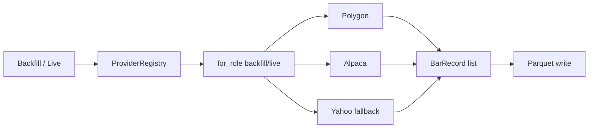

# Chapter 03 — Provider Architecture

| Field | Value |
|-------|-------|
| **Package** | vinu-stock-price |
| **Module** | `vinu_stock/providers/` |
| **Status** | REVIEW |
| **Verified** | 2026-07-01 |
| **Prerequisites** | Chapter 01, Chapter 02 |

## Learning objectives

- Explain the `PriceProvider` protocol and `FetchBarsResult` contract.
- Describe how `ProviderRegistry` selects providers by role and priority.
- Trace the fallback chain when a primary provider fails or returns empty data.

## 1. Problem this module solves

Market data comes from multiple vendors (Polygon, Alpaca, Yahoo) with different credentials, depth, and reliability. Hardcoding one vendor would block testing without keys and prevent reordering sources. The provider layer defines a **pluggable interface**, loads **priority and roles from YAML**, and implements **fallback** when primaries fail.

## 2. Position in pipeline



| Step | Input | Output |
|------|-------|--------|
| `for_role("backfill")` | Sorted `ProviderConfig` | Configured providers in priority order |
| `fetch_bars_with_fallback` | symbol, start_ts, end_ts, role | `FetchBarsResult` with bars or errors |
| `earliest_available` | symbol | `EarliestResult` for backfill start year |
| Provider impl | HTTP/API call | Normalized `BarRecord` rows |

## 3. File map

| File | Responsibility |
|------|----------------|
| `providers/base.py` | `PriceProvider` protocol, `FetchBarsResult`, `EarliestResult` |
| `providers/registry.py` | `ProviderRegistry`, `load_provider_configs`, fallback logic |
| `providers/polygon.py` | Polygon.io 1m bars |
| `providers/alpaca.py` | Alpaca market data API |
| `providers/yahoo.py` | Yahoo Finance fallback (no keys) |
| `providers/retry.py` | Retry helpers for HTTP providers |
| `providers/config/providers.yaml` | Enabled, priority, roles per provider |

## 4. Data contracts

### Input

| Field | Type | Required | Example |
|-------|------|----------|---------|
| `symbol` | string | yes | `AAPL` |
| `start_ts` | int | yes | `1704067200` (UTC epoch) |
| `end_ts` | int | yes | `1704153600` |
| `role` | `ProviderRole` | yes | `backfill`, `live`, `fallback` |
| `interval` | string | no | `1m` (default on protocol) |

### Output

| Field | Type | Example |
|-------|------|---------|
| `FetchBarsResult.success` | bool | `true` |
| `FetchBarsResult.bars` | `list[BarRecord]` | OHLCV rows with `provider` set |
| `FetchBarsResult.error` | string | Semicolon-joined errors if all fail |
| `EarliestResult.earliest_ts` | int \| null | First available bar timestamp |

## 5. Logic (step by step)

1. **`ProviderRegistry.__init__`** loads `VinuStockConfig` and parses `providers.yaml` into sorted `ProviderConfig` entries.
2. **Concrete providers** are registered in a dict: `polygon`, `alpaca`, `yahoo`.
3. **`for_role(role)`** iterates configs in priority order; skips disabled or wrong-role entries; returns provider instances.
4. **`fetch_bars_with_fallback(symbol, start_ts, end_ts, role)`**:
   - For each provider in `for_role(role)`:
     - Skip if `not is_configured()` unless `provider_id == "yahoo"`.
     - Call `fetch_bars()`; return first result with `success` and non-empty `bars`.
     - Append error to list on failure.
   - If `role != "fallback"`, also try `for_role("fallback")` providers.
   - Return `FetchBarsResult(False, [], joined_errors)` if all fail.
5. **Backfill orchestrator** calls `earliest_available()` on backfill-role providers to discover first year.
6. **Live ingest** calls `fetch_bars_with_fallback(..., role="live")`.

## 6. Configuration

| Key | YAML/env | Default | Effect |
|-----|----------|---------|--------|
| `providers[].id` | YAML | — | `polygon`, `alpaca`, `yahoo` |
| `providers[].enabled` | YAML | `true` | Skip when false |
| `providers[].priority` | YAML | `100` | Lower = tried first |
| `providers[].roles` | YAML | — | `backfill`, `live`, `fallback` |
| `POLYGON_API_KEY` | env | — | `PolygonProvider.is_configured()` |
| `ALPACA_API_KEY` / `ALPACA_API_SECRET` | env | — | Alpaca auth |
| `ALPACA_DATA_BASE_URL` | env | `https://data.alpaca.markets` | Alpaca endpoint |

## 7. Worked examples

### Example A — happy path (inspect provider status via health)

```bash
vinu-stock-serve &
curl http://127.0.0.1:8081/health | python -m json.tool
```

`providers` array shows `id`, `enabled`, `priority`, `configured` per entry from `registry.provider_status()`.

### Example B — edge case (unconfigured Polygon skipped)

```python
from vinu_stock.config import load_config
from vinu_stock.providers.registry import ProviderRegistry

registry = ProviderRegistry(load_config())
result = registry.fetch_bars_with_fallback(
    "AAPL", 1704067200, 1704153600, role="backfill"
)
print(result.success, len(result.bars), result.error[:80] if result.error else "")
```

With empty `POLYGON_API_KEY`, Polygon is skipped; Alpaca tried if configured; else Yahoo fallback.

### Example C — role filtering

```python
live_providers = registry.for_role("live")
print([p.provider_id for p in live_providers])
# ['polygon', 'alpaca']  # yahoo has roles: [fallback] only
```

## 8. API / CLI (if applicable)

| Method | Path / Command | Params | Response |
|--------|----------------|--------|----------|
| GET | `/health` | — | Includes `providers` status list |
| GET | `/candles/{symbol}` | `provider=polygon` | Filter query to one provider's bars |

Provider fetch is internal; no direct HTTP route to raw provider APIs.

## 9. SQL / queries (if applicable)

Backfill jobs record which provider succeeded:

```sql
SELECT symbol, year, provider, rows_written, status
FROM backfill_jobs
WHERE status = 'done';
```

## 10. Tests

| Test file | Asserts |
|-----------|---------|
| `tests/test_providers_mock.py` | Registry fallback with fixture JSON |
| `tests/test_provider_retry.py` | HTTP retry behavior |

## 11. Troubleshooting

| Symptom | Likely cause | Fix |
|---------|--------------|-----|
| `polygon: not configured` | Missing API key | Set `POLYGON_API_KEY` in `.env` |
| All providers empty | Bad symbol or date range | Verify symbol; use recent dates for Yahoo |
| Yahoo only on live | Polygon/Alpaca failed silently | Check `--verbose` backfill logs |
| Changes to yaml ignored | Registry loads at process start | Restart ingest/API process |

## 12. Fincept / reference repo mapping

| vinu-stock-price | Reference |
|------------------|-----------|
| `providers.yaml` | `vinu-news` `rss/config/feeds.yaml` |
| `PriceProvider` protocol | Fincept multi-broker abstraction (v1 uses 3 vendors only) |
| Global priority order | Fincept DataHub union — **not** implemented in v1 |

## 13. Related chapters

- [Chapter 04 — providers.yaml](../part-1-providers/ch04-providers-yaml.md)
- [Chapter 13 — Backfill Flow](../part-3-ingest/ch13-backfill-flow.md)
- [Chapter 14 — Live Ingest](../part-3-ingest/ch14-live-ingest.md)
- [Chapter 26 — Config and Environment](../part-5-operations/ch26-config-env.md)
