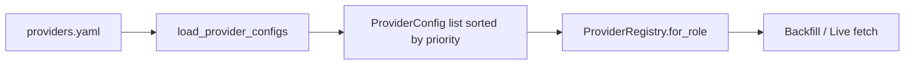

# Chapter 04 — providers.yaml

| Field | Value |
|-------|-------|
| **Package** | vinu-stock-price |
| **Module** | `vinu_stock/providers/config/providers.yaml` |
| **Status** | REVIEW |
| **Verified** | 2026-07-01 |
| **Prerequisites** | Chapter 03 |

## Learning objectives

- Read and edit the shipped `providers.yaml` priority and role assignments.
- Predict fetch order for backfill vs live vs fallback flows.
- Know when a process restart is required after YAML changes.

## 1. Problem this module solves

Operations teams need to **reorder data vendors** without code changes — e.g. prefer Alpaca for live, Polygon for backfill, Yahoo only as last resort. `providers.yaml` is the single configuration file for provider enablement, priority, and role membership. Secrets remain in `.env`.

## 2. Position in pipeline



| Step | Input | Output |
|------|-------|--------|
| Parse YAML | `providers:` list | `list[ProviderConfig]` |
| Sort | `priority` field | Ascending order |
| Filter | `enabled`, `roles` | Provider instances per flow |

## 3. File map

| File | Responsibility |
|------|----------------|
| `providers/config/providers.yaml` | Default provider order and roles |
| `providers/registry.py` | `load_provider_configs()`, `_CONFIG_PATH` |
| `providers/polygon.py` | Implements `provider_id = "polygon"` |
| `providers/alpaca.py` | Implements `provider_id = "alpaca"` |
| `providers/yahoo.py` | Implements `provider_id = "yahoo"` |

## 4. Data contracts

### Input

| Field | Type | Required | Example |
|-------|------|----------|---------|
| `providers` | list | yes | Top-level YAML key |
| `id` | string | yes | `polygon` |
| `enabled` | bool | no (default true) | `true` |
| `priority` | int | no (default 100) | `1` |
| `roles` | list[string] | yes | `[backfill, live]` |

### Output

| Field | Type | Example |
|-------|------|---------|
| Sorted configs | `list[ProviderConfig]` | polygon(1), alpaca(2), yahoo(99) |
| Runtime order | provider calls | Lower priority number first |

## 5. Logic (step by step)

**Shipped default** (`providers/config/providers.yaml`):

```yaml
providers:
  - id: polygon
    enabled: true
    priority: 1
    roles: [backfill, live]
  - id: alpaca
    enabled: true
    priority: 2
    roles: [live, backfill]
  - id: yahoo
    enabled: true
    priority: 99
    roles: [fallback]
```

1. **`load_provider_configs(path)`** reads YAML; builds `ProviderConfig` per item; sorts by `priority`.
2. **`roles`** gates which flows include the provider:
   - `backfill` — year jobs and `earliest_available()` discovery.
   - `live` — `ingest_cycle` polling.
   - `fallback` — tried after primary role providers fail (unless `role="fallback"` requested directly).
3. **`enabled: false`** removes provider from all role lists.
4. **Credentials** are never in YAML — Polygon/Alpaca read keys from `VinuStockConfig`.
5. **Yahoo** is always "configured" (no keys); used when paid providers fail or are unconfigured.
6. **Restart required**: `ProviderRegistry` loads YAML at init; edit file then restart `vinu-stock-ingest` / `vinu-stock-serve`.

## 6. Configuration

| Key | YAML/env | Default | Effect |
|-----|----------|---------|--------|
| `polygon.priority` | YAML | `1` | First for backfill+live when configured |
| `alpaca.priority` | YAML | `2` | Second for live+backfill |
| `yahoo.priority` | YAML | `99` | Fallback only |
| `yahoo.roles` | YAML | `[fallback]` | Not in `for_role("live")` unless fallback chain runs |
| `POLYGON_API_KEY` | env | — | Required for Polygon to be `configured` |

### Provider comparison

| Provider | priority | roles | Env vars | Notes |
|----------|----------|-------|----------|-------|
| polygon | 1 | backfill, live | `POLYGON_API_KEY` | Deepest history when keyed |
| alpaca | 2 | live, backfill | `ALPACA_API_KEY`, `ALPACA_API_SECRET` | Good live data |
| yahoo | 99 | fallback | none | Limited 1m depth; supplies `adj_factor` |

## 7. Worked examples

### Example A — happy path (default order)

Backfill for `AAPL` 2024:

1. Try Polygon (`priority 1`, role `backfill`) if `POLYGON_API_KEY` set.
2. Else try Alpaca (`priority 2`).
3. On empty/error, try Yahoo (`fallback` role).

### Example B — edge case (disable Polygon for local dev)

Edit `providers.yaml`:

```yaml
  - id: polygon
    enabled: false
    priority: 1
    roles: [backfill, live]
```

Restart ingest. Live cycle uses Alpaca first, then Yahoo fallback.

### Example C — verify loaded order in Python

```python
from vinu_stock.providers.registry import load_provider_configs

for cfg in load_provider_configs():
    print(cfg.id, cfg.priority, cfg.roles)
```

Output:

```
polygon 1 ('backfill', 'live')
alpaca 2 ('live', 'backfill')
yahoo 99 ('fallback',)
```

## 8. API / CLI (if applicable)

| Method | Path / Command | Params | Response |
|--------|----------------|--------|----------|
| GET | `/health` | — | `providers[].priority`, `configured` |
| GET | `/candles/{symbol}` | `provider=yahoo` | Query filter, not YAML override |

YAML is file-based; no HTTP PATCH for provider order in v1.

## 9. SQL / queries (if applicable)

```sql
SELECT symbol, provider FROM symbol_catalog;
```

`provider` column reflects last successful writer, not YAML priority.

## 10. Tests

| Test file | Asserts |
|-----------|---------|
| `tests/test_providers_mock.py` | Custom YAML path + fallback |
| `tests/test_provider_retry.py` | Provider HTTP with retries |

## 11. Troubleshooting

| Symptom | Likely cause | Fix |
|---------|--------------|-----|
| Still using old order | Process not restarted | Restart serve/ingest |
| Yahoo never used | Primaries always succeed | Temporarily disable polygon/alpaca |
| `POLYGON_API_KEY not set` log | Expected when unconfigured | Add key or rely on fallback |
| Invalid YAML | Parse error at startup | Validate YAML syntax |

## 12. Fincept / reference repo mapping

| vinu-stock-price | Reference |
|------------------|-----------|
| `providers.yaml` | `vinu-news` `feeds.yaml` reorder pattern |
| Per-symbol `preferred_provider` | Documented future column; v1 uses global YAML only |

## 13. Related chapters

- [Chapter 03 — Provider Architecture](ch03-provider-architecture.md)
- [Chapter 13 — Backfill Flow](../part-3-ingest/ch13-backfill-flow.md)
- [Chapter 26 — Config and Environment](../part-5-operations/ch26-config-env.md)
