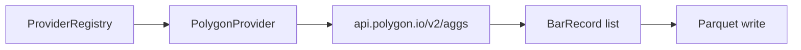

# Chapter 05 — Polygon Provider

| Field | Value |
|-------|-------|
| **Package** | vinu-stock-price |
| **Module** | `vinu_stock/providers/polygon.py` |
| **Status** | REVIEW |
| **Verified** | 2026-07-01 |
| **Prerequisites** | Chapter 03, Chapter 04 |

## Learning objectives

- Describe how `PolygonProvider` calls the Polygon aggregates API and paginates results.
- Map Polygon JSON fields to `BarRecord` columns.
- Use `earliest_available()` for backfill start-year discovery.

## 1. Problem this module solves

Polygon.io is the **default primary** vendor for US equities 1-minute bars (priority 1 in `providers.yaml`). The adapter hides URL construction, millisecond timestamps, pagination via `next_url`, and error handling behind the `PriceProvider` contract so backfill and live ingest can treat Polygon like any other source.

## 2. Position in pipeline



| Step | Input | Output |
|------|-------|--------|
| `is_configured()` | `POLYGON_API_KEY` | bool |
| `fetch_bars` | symbol, start_ts, end_ts | `FetchBarsResult` |
| Pagination | `next_url` in response | Merged bar list (limit 50k/page) |
| `earliest_available` | symbol | `list_date` or probe fallback |

## 3. File map

| File | Responsibility |
|------|----------------|
| `providers/polygon.py` | `PolygonProvider` class |
| `providers/base.py` | `FetchBarsResult`, `EarliestResult` |
| `providers/config/settings.py` | `REQUEST_TIMEOUT_SEC` |
| `storage/models.py` | `BarRecord` target shape |
| `config.py` | `polygon_api_key` from env |

## 4. Data contracts

### Input

| Field | Type | Required | Example |
|-------|------|----------|---------|
| `symbol` | string | yes | `AAPL` |
| `start_ts` | int | yes | UTC epoch seconds |
| `end_ts` | int | yes | UTC epoch seconds |
| `interval` | string | no | `1m` (only 1m used in URL) |
| `POLYGON_API_KEY` | env | yes for fetch | `pk_...` |

### Output

| Field | Type | Example |
|-------|------|---------|
| `BarRecord.bar_ts` | int | `row["t"] // 1000` |
| `BarRecord.open/high/low/close` | float | From `o`, `h`, `l`, `c` |
| `BarRecord.volume` | float | `v` (default 0) |
| `BarRecord.vwap` | float | `vw` |
| `BarRecord.trades` | int | `n` |
| `BarRecord.adj_factor` | float | `1.0` (Polygon returns adjusted OHLC; factor not stored separately) |
| `BarRecord.provider` | string | `"polygon"` |

## 5. Logic (step by step)

1. **`is_configured()`** — true when `config.polygon_api_key` is non-empty.
2. **`fetch_bars`** — if not configured, return `FetchBarsResult(False, [], "POLYGON_API_KEY not set")`.
3. Build URL: `https://api.polygon.io/v2/aggs/ticker/{SYM}/range/1/minute/{start_ms}/{end_ms}`.
4. Query params: `adjusted=true`, `sort=asc`, `limit=50000`, `apiKey=...`.
5. **GET** with `requests.get` and `REQUEST_TIMEOUT_SEC`.
6. Accept `status` in `OK`, `DELAYED`, or `None`; else return API error message.
7. For each `results[]` row, append `BarRecord` with `bar_ts = t // 1000`.
8. If `next_url` present, follow with params `{apiKey}` only until exhausted.
9. **`earliest_available`** — GET `v3/reference/tickers/{sym}` for `list_date`; on failure, probe wide 1m `fetch_bars` from 1990 and return min `bar_ts`.

## 6. Configuration

| Key | YAML/env | Default | Effect |
|-----|----------|---------|--------|
| `POLYGON_API_KEY` | env | empty | Required for Polygon fetch |
| `providers.yaml` priority | YAML | `1` | Tried first for backfill/live |
| `providers.yaml` roles | YAML | `[backfill, live]` | Included in both roles |
| `REQUEST_TIMEOUT_SEC` | code | 30 | HTTP timeout |

## 7. Worked examples

### Example A — happy path (backfill uses Polygon)

```bash
export POLYGON_API_KEY=your_key
vinu-stock-backfill AAPL --from-year 2024 --to-year 2024 --verbose
sqlite3 data/meta.db "SELECT symbol, year, provider, status FROM backfill_jobs WHERE symbol='AAPL'"
```

Expect `provider=polygon` when key is valid and data exists.

### Example B — edge case (unconfigured skip)

```python
import os
os.environ.pop("POLYGON_API_KEY", None)
from vinu_stock.config import load_config
from vinu_stock.providers.polygon import PolygonProvider

p = PolygonProvider(load_config())
r = p.fetch_bars("AAPL", 1704067200, 1704153600)
assert not r.success and "POLYGON_API_KEY" in r.error
```

Registry will try Alpaca next, then Yahoo fallback (see [ch03](ch03-provider-architecture.md)).

### Example C — pagination (many minutes)

A full trading year exceeds 50k bars. Polygon returns `next_url`; the `while url:` loop in `fetch_bars` concatenates all pages before returning one `FetchBarsResult`.

## 8. API / CLI (if applicable)

| Method | Path / Command | Params | Response |
|--------|----------------|--------|----------|
| GET | `/health` | — | `providers[].id=polygon`, `configured: true/false` |
| GET | `/candles/{symbol}` | `provider=polygon` | Only Polygon-sourced bars |
| — | `vinu-stock-backfill` | — | Uses registry; Polygon first if configured |

No direct HTTP proxy to Polygon; all calls are server-side.

## 9. SQL / queries (if applicable)

```sql
-- Which symbols were backfilled via Polygon?
SELECT symbol, year, provider, rows_written
FROM backfill_jobs
WHERE provider = 'polygon' AND status = 'done';
```

DuckDB over Parquet:

```sql
SELECT provider, COUNT(*) AS n
FROM read_parquet('data/prices/1m/AAPL/archive/*.parquet')
GROUP BY provider;
```

## 10. Tests

| Test file | Asserts |
|-----------|---------|
| `tests/test_providers_mock.py` | Registry fallback when Polygon unconfigured |
| `tests/test_api.py` | `test_health_providers` includes polygon entry |

Polygon HTTP is not hit in CI; use manual backfill with a real key for integration checks.

## 11. Troubleshooting

| Symptom | Likely cause | Fix |
|---------|--------------|-----|
| `POLYGON_API_KEY not set` | Missing env | Add to `.env`, restart process |
| `DELAYED` status | Free-tier delay | Bars still returned; expect 15m delay on some plans |
| Empty results | Symbol delisted or bad range | Verify ticker on Polygon dashboard |
| Rate limit / 429 | Too many requests | Backfill serializes per year; add delay or upgrade plan |

## 12. Fincept / reference repo mapping

| vinu-stock-price | Reference |
|------------------|-----------|
| Polygon aggs v2 | Common retail/pro API for US equities |
| `adjusted=true` | Split-adjusted prices at source (unlike raw Yahoo close) |
| Priority 1 provider | Fincept multi-broker hub — Polygon is one slot in v1 |

## 13. Related chapters

- [Chapter 03 — Provider Architecture](ch03-provider-architecture.md)
- [Chapter 04 — providers.yaml](ch04-providers-yaml.md)
- [Chapter 06 — Alpaca Provider](ch06-alpaca-provider.md)
- [Chapter 13 — Backfill Flow](../part-3-ingest/ch13-backfill-flow.md)
- [Chapter 26 — Config and Environment](../part-5-operations/ch26-config-env.md)
