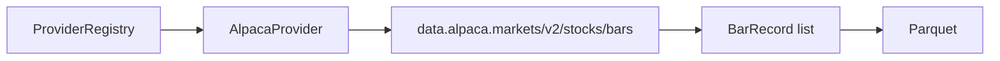

# Chapter 06 — Alpaca Provider

| Field | Value |
|-------|-------|
| **Package** | vinu-stock-price |
| **Module** | `vinu_stock/providers/alpaca.py` |
| **Status** | REVIEW |
| **Verified** | 2026-07-01 |
| **Prerequisites** | Chapter 03, Chapter 04 |

## Learning objectives

- Explain Alpaca authentication headers and the `/v2/stocks/bars` request shape.
- Handle `next_page_token` pagination and ISO timestamp parsing.
- Understand Alpaca's role as priority-2 backfill/live provider with shorter history probe.

## 1. Problem this module solves

Alpaca Market Data offers an alternative **authenticated** source for 1-minute US stock bars. When Polygon is unavailable or returns errors, the registry tries Alpaca (priority 2). The adapter normalizes Alpaca's nested `bars.{SYMBOL}[]` JSON and RFC3339 timestamps into `BarRecord` rows compatible with Parquet and DuckDB query.

## 2. Position in pipeline



| Step | Input | Output |
|------|-------|--------|
| `is_configured()` | API key + secret | bool |
| `fetch_bars` | symbol, UTC range | Paginated bar list |
| `earliest_available` | symbol | Min bar in last 365 days (probe) |

## 3. File map

| File | Responsibility |
|------|----------------|
| `providers/alpaca.py` | `AlpacaProvider` |
| `config.py` | `alpaca_api_key`, `alpaca_api_secret`, `alpaca_data_base_url` |
| `providers/config/settings.py` | `REQUEST_TIMEOUT_SEC` |
| `providers/registry.py` | Fallback order after Polygon |

## 4. Data contracts

### Input

| Field | Type | Required | Example |
|-------|------|----------|---------|
| `symbol` | string | yes | `MSFT` |
| `start_ts` / `end_ts` | int | yes | UTC epoch seconds |
| `ALPACA_API_KEY` | env | yes | Key ID |
| `ALPACA_API_SECRET` | env | yes | Secret |
| `ALPACA_DATA_BASE_URL` | env | no | `https://data.alpaca.markets` |

### Output

| Field | Type | Example |
|-------|------|---------|
| `BarRecord.bar_ts` | int | Parsed from `t` ISO string |
| OHLCV | float | `o`, `h`, `l`, `c`, `v` |
| `BarRecord.trades` | int | `n` |
| `BarRecord.vwap` | float | `0.0` (not set by Alpaca adapter) |
| `BarRecord.provider` | string | `"alpaca"` |

## 5. Logic (step by step)

1. **`is_configured()`** — both `alpaca_api_key` and `alpaca_api_secret` must be non-empty.
2. Convert `start_ts`/`end_ts` to ISO UTC strings (`%Y-%m-%dT%H:%M:%SZ`).
3. **GET** `{base_url}/v2/stocks/bars` with headers `APCA-API-KEY-ID` and `APCA-API-SECRET-KEY`.
4. Params: `symbols`, `timeframe=1Min`, `start`, `end`, `limit=10000`.
5. Parse `data["bars"][sym][]`; handle `Z` suffix in timestamp via `fromisoformat`.
6. Loop while `next_page_token` is set; pass token on subsequent requests.
7. Return `FetchBarsResult(True, all_bars)` or catch `RequestException`.
8. **`earliest_available`** — fetch last 365 days only; return min `bar_ts` or error (Alpaca 1m history is plan-limited).

## 6. Configuration

| Key | YAML/env | Default | Effect |
|-----|----------|---------|--------|
| `ALPACA_API_KEY` | env | — | Header `APCA-API-KEY-ID` |
| `ALPACA_API_SECRET` | env | — | Header `APCA-API-SECRET-KEY` |
| `ALPACA_DATA_BASE_URL` | env | `https://data.alpaca.markets` | Sandbox vs production data host |
| `providers.yaml` priority | YAML | `2` | After Polygon |
| `providers.yaml` roles | YAML | `[live, backfill]` | Both ingest paths |

## 7. Worked examples

### Example A — happy path (Alpaca as secondary)

```bash
export ALPACA_API_KEY=...
export ALPACA_API_SECRET=...
# Polygon unset or disabled in providers.yaml
vinu-stock-backfill NVDA --from-year 2024 --to-year 2024
```

Check job row: `provider=alpaca` when Polygon did not succeed.

### Example B — edge case (missing secret)

```python
from vinu_stock.providers.alpaca import AlpacaProvider
from vinu_stock.config import VinuStockConfig
from pathlib import Path

cfg = VinuStockConfig(
    data_root=Path("data"), meta_db_path=Path("data/meta.db"),
    default_poll_interval_sec=60, host="127.0.0.1", port=8081,
    default_provider="alpaca", polygon_api_key="",
    alpaca_api_key="KEY_ONLY", alpaca_api_secret="",
    alpaca_data_base_url="https://data.alpaca.markets",
    shared_watchlist_path=None,
)
assert not AlpacaProvider(cfg).is_configured()
```

### Example C — filter candles by provider

```bash
curl "http://127.0.0.1:8081/candles/AAPL?interval=1m&days=1&provider=alpaca"
```

Returns only rows where `provider='alpaca'` in Parquet.

## 8. API / CLI (if applicable)

| Method | Path / Command | Params | Response |
|--------|----------------|--------|----------|
| GET | `/health` | — | `alpaca` entry with `configured` |
| GET | `/candles/{symbol}` | `provider=alpaca` | Filtered OHLCV |
| — | `vinu-stock-ingest --once` | — | Live role tries Polygon then Alpaca |

## 9. SQL / queries (if applicable)

```sql
SELECT symbol, provider, bar_ts, close
FROM read_parquet(['data/prices/1m/AAPL/archive/2024.parquet'])
WHERE provider = 'alpaca'
ORDER BY bar_ts DESC
LIMIT 5;
```

## 10. Tests

| Test file | Asserts |
|-----------|---------|
| `tests/test_providers_mock.py` | Registry behavior with mocked providers |
| `tests/test_api.py` | Health lists alpaca provider status |

No live Alpaca calls in default pytest run.

## 11. Troubleshooting

| Symptom | Likely cause | Fix |
|---------|--------------|-----|
| `ALPACA_API_KEY/SECRET not set` | Partial credentials | Set both env vars |
| 403 Forbidden | Wrong data URL or revoked keys | Check Alpaca dashboard; verify `ALPACA_DATA_BASE_URL` |
| Shallow `earliest_available` | 1-year probe only | Use Polygon/Yahoo for deep history start |
| Mixed providers in one year | Fallback mid-backfill | Filter by `provider` in query or re-backfill |

## 12. Fincept / reference repo mapping

| vinu-stock-price | Reference |
|------------------|-----------|
| Alpaca bars API | Common paper-trading + data broker |
| Priority 2 slot | Fincept broker list — second vendor in v1 |
| No vwap field | Fincept `BrokerCandle` optional fields differ by vendor |

## 13. Related chapters

- [Chapter 05 — Polygon Provider](ch05-polygon-provider.md)
- [Chapter 07 — Yahoo Fallback](ch07-yahoo-fmp-fallback.md)
- [Chapter 03 — Provider Architecture](ch03-provider-architecture.md)
- [Chapter 14 — Live Ingest](../part-3-ingest/ch14-live-ingest.md)
