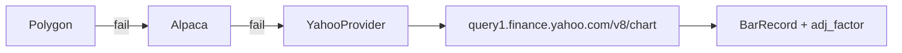

# Chapter 07 — Yahoo Fallback Provider

| Field | Value |
|-------|-------|
| **Package** | vinu-stock-price |
| **Module** | `vinu_stock/providers/yahoo.py` |
| **Status** | REVIEW |
| **Verified** | 2026-07-01 |
| **Prerequisites** | Chapter 03, Chapter 04 |

## Learning objectives

- Describe Yahoo Finance chart API usage as the **keyless fallback** provider.
- Parse `adjclose` into `BarRecord.adj_factor` for TASK-S02.
- Distinguish Yahoo in vinu-stock-price from **FMP** (not implemented here).

## 1. Problem this module solves

CI and local dev cannot depend on paid API keys. **YahooProvider** is always `is_configured() == True`, has `roles: [fallback]` only, and is invoked when Polygon and Alpaca fail or return empty data. It also supplies **adjustment factors** derived from Yahoo's `adjclose` series — the only v1 provider that populates `adj_factor` on ingest.

> **FMP note:** Financial Modeling Prep (`fmp.py`) is **not** part of vinu-stock-price. TASK-S06 proposes optional FMP; today FMP appears in **vinu-news** / FinRL-Trading references only. This chapter documents **Yahoo only**.

## 2. Position in pipeline



| Step | Input | Output |
|------|-------|--------|
| Registry `role=backfill/live` | Primary providers fail | Tries `for_role("fallback")` |
| `http_get_with_retry` | chart URL | JSON with retry (TASK-S03) |
| `_parse_yahoo_chart` | chart JSON | `BarRecord` list |
| `earliest_available` | daily probe from 1990 | Min timestamp |

## 3. File map

| File | Responsibility |
|------|----------------|
| `providers/yahoo.py` | `YahooProvider`, `_parse_yahoo_chart`, `_symbol_to_yahoo` |
| `providers/retry.py` | `http_get_with_retry` used by Yahoo |
| `providers/config/settings.py` | `USER_AGENT`, `REQUEST_TIMEOUT_SEC` |
| `backfill/year_job.py` | Sets `has_adj_data=1` when Yahoo bars have `adj_factor != 1` |

## 4. Data contracts

### Input

| Field | Type | Required | Example |
|-------|------|----------|---------|
| `symbol` | string | yes | `AAPL`, `BRK.B` |
| `start_ts` / `end_ts` | int | yes | Unix seconds (`period1`/`period2`) |
| `interval` | string | no | `1m` or `1d` (for earliest probe) |
| User-Agent | header | yes | From `USER_AGENT` constant |

### Output

| Field | Type | Example |
|-------|------|---------|
| `BarRecord` OHLCV | float | From `indicators.quote` arrays |
| `BarRecord.adj_factor` | float | `adjclose[i] / close[i]` when present, else `1.0` |
| `FetchBarsResult.success` | bool | `True` even if zero bars (empty chart) |
| `provider` | string | `"yahoo"` |

## 5. Logic (step by step)

1. **`is_configured()`** always returns `True` (no API key).
2. **`_symbol_to_yahoo`** — uppercase strip; passes through symbols with `.`, `/`, `-`.
3. Build URL: `https://query1.finance.yahoo.com/v8/finance/chart/{yahoo_sym}`.
4. Params: `interval` (`1m` or `1d`), `period1`, `period2`, `includePrePost=false`.
5. **`http_get_with_retry`** — GET with User-Agent; retries transient errors (see [ch16](../part-3-ingest/ch16-retry-gap-validation.md)).
6. **`_parse_yahoo_chart`** — skip on `chart.error`; align `timestamp` with parallel `open/high/low/close/volume` arrays; compute `adj_factor` per bar.
7. Registry: Yahoo is **never** skipped for `not is_configured()` (special case in `fetch_bars_with_fallback`).
8. **`earliest_available`** — daily `fetch_bars` from 1990-01-01; return min `bar_ts`.

## 6. Configuration

| Key | YAML/env | Default | Effect |
|-----|----------|---------|--------|
| `providers.yaml` id | YAML | `yahoo` | Provider id |
| `priority` | YAML | `99` | Last in fallback role |
| `roles` | YAML | `[fallback]` | Not used for primary live/backfill |
| `USER_AGENT` | code | browser-like string | Reduces empty/blocked responses |

## 7. Worked examples

### Example A — happy path (forced fallback in tests)

```python
# tests/test_providers_mock.py pattern
from vinu_stock.providers.yahoo import _parse_yahoo_chart

fixture = {"chart": {"result": [{
    "timestamp": [1704067200],
    "indicators": {"quote": [{"open": [100], "high": [101], "low": [99], "close": [100.5], "volume": [1e6]}],
                   "adjclose": [{"adjclose": [50.25]}]}
}]}}
bars = _parse_yahoo_chart("AAPL", "yahoo", fixture)
assert bars[0].adj_factor == pytest.approx(0.5)
```

### Example B — edge case (no API keys — backfill still works)

```bash
unset POLYGON_API_KEY ALPACA_API_KEY ALPACA_API_SECRET
vinu-stock-backfill AAPL --from-year 2024 --to-year 2024
```

Yahoo serves data for liquid symbols; `symbol_catalog.has_adj_data` may become `1`.

### Example C — FMP is out of scope here

```text
# NOT in vinu_stock/providers/:
# fmp.py  →  see TASK-S06 in enhancement-doc1.md (future)
# vinu-news may use other HTTP sources; do not expect FMP in stock registry.
```

## 8. API / CLI (if applicable)

| Method | Path / Command | Params | Response |
|--------|----------------|--------|----------|
| GET | `/candles/{symbol}` | `provider=yahoo` | Yahoo-sourced bars only |
| GET | `/candles/{symbol}` | `adjusted=true` | Scales OHLC by `adj_factor` at query time |
| — | `vinu-stock-query candles` | `--adjusted` | Same adjustment pipeline |

## 9. SQL / queries (if applicable)

```sql
-- Symbols with Yahoo adjustment data ingested
SELECT symbol, has_adj_data, provider
FROM symbol_catalog
WHERE has_adj_data = 1;

-- Adj factors in Parquet (Yahoo backfill)
SELECT bar_ts, close, adj_factor
FROM read_parquet('data/prices/1m/AAPL/archive/2024.parquet')
WHERE provider = 'yahoo' AND adj_factor != 1.0
LIMIT 10;
```

## 10. Tests

| Test file | Asserts |
|-----------|---------|
| `tests/test_providers_mock.py` | `test_parse_yahoo_chart`, `test_registry_fallback_to_yahoo`, `test_yahoo_provider_configured` |
| `tests/test_provider_retry.py` | Retry used by Yahoo HTTP path |
| `tests/test_indicators.py` | `apply_adjusted_prices` with adj_factor |

## 11. Troubleshooting

| Symptom | Likely cause | Fix |
|---------|--------------|-----|
| Empty bars from Yahoo | Rate limit, bad symbol, or range too old for 1m | Narrow date range; retry later |
| `has_adj_data=0` after Yahoo backfill | All `adj_factor==1` in window | Normal if no splits in range |
| Expecting FMP | Wrong package | Implement TASK-S06 or use Polygon/Alpaca |
| 429 from Yahoo | Too many requests | Rely on retry; reduce parallel backfill |

## 12. Fincept / reference repo mapping

| vinu-stock-price | Reference |
|------------------|-----------|
| Yahoo chart v8 | Informal fallback in many research repos |
| `adj_factor` | Split adjustment sidecar (TASK-S02) |
| FMP (FinRL-Trading) | **Not** in vinu-stock v1 — vinu-news / future TASK-S06 |

## 13. Related chapters

- [Chapter 12 — Adjusted Close](../part-2-storage/ch12-adjusted-close.md)
- [Chapter 16 — Retry and Gap Validation](../part-3-ingest/ch16-retry-gap-validation.md)
- [Chapter 05 — Polygon Provider](ch05-polygon-provider.md)
- [Chapter 03 — Provider Architecture](ch03-provider-architecture.md)
